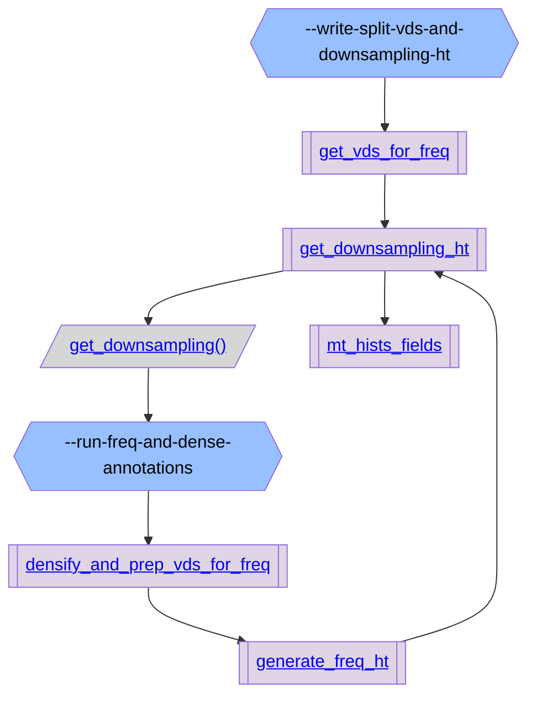
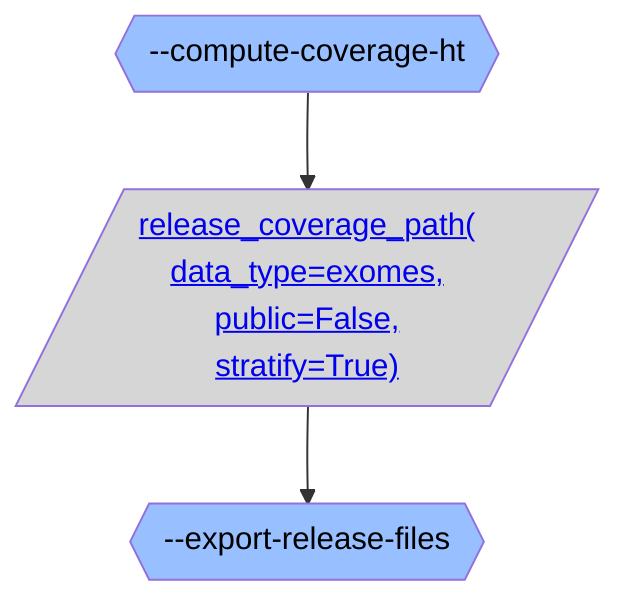

# gnomAD v4 annotations overview:

```mermaid
flowchart TB;
  classDef script_color fill:#2C5D4A,color:#000000
  classDef step_color fill:#98BFFF,color:#000000
  classDef func_color fill:#E0D5E6,color:#000000
  classDef gnomad_methods_color fill:#F9F2CE,color:#000000
  classDef hail_color fill:#FAEACE,color:#000000
  classDef resource_color fill:#D6D6D6,color:#000000
  classDef validity_check_color fill:#2C5D4A,color:#000000

  step_compute_info{{"generate_variant_qc_annotations.py
--compute-info"}}:::step_color;
  resource_get_info_split_False[/"<a href='https://github.com/broadinstitute/gnomad_qc/tree/main/gnomad_qc/v4/resources/annotations.py#L47'>get_info(split=False)</a>"/]:::resource_color;
  step_split_info{{"generate_variant_qc_annotations.py
--split-info"}}:::step_color;
  resource_get_info_split_True[/"<a href='https://github.com/broadinstitute/gnomad_qc/tree/main/gnomad_qc/v4/resources/annotations.py#L47'>get_info(split=True)</a>"/]:::resource_color;
  step_create_variant_qc_annotation_ht{{"generate_variant_qc_annotations.py
--create-variant-qc-annotation-ht"}}:::step_color;
  step_generate_trio_stats{{"generate_variant_qc_annotations.py
--generate-trio-stats"}}:::step_color;
  resource_get_trio_stats_[/"<a href='https://github.com/broadinstitute/gnomad_qc/tree/main/gnomad_qc/v4/resources/annotations.py#L113'>get_trio_stats()</a>"/]:::resource_color;
  step_generate_sib_stats{{"generate_variant_qc_annotations.py
--generate-sib-stats"}}:::step_color;
  resource_get_sib_stats_[/"<a href='https://github.com/broadinstitute/gnomad_qc/tree/main/gnomad_qc/v4/resources/annotations.py#L131'>get_sib_stats()</a>"/]:::resource_color;
  step_export_info_vcf{{"generate_variant_qc_annotations.py
--export-info-vcf"}}:::step_color;
  step_export_split_info_vcf{{"generate_variant_qc_annotations.py
--export-split-info-vcf"}}:::step_color;
  step_run_vep{{"generate_variant_qc_annotations.py
--run-vep"}}:::step_color;
  resource_get_vep_data_type_exomes[/"<a href='https://github.com/broadinstitute/gnomad_qc/tree/main/gnomad_qc/v4/resources/annotations.py#L69'>get_vep(data_type=exomes)</a>"/]:::resource_color;
  step_validate_vep{{"generate_variant_qc_annotations.py
--validate-vep"}}:::step_color;
  step_finalize_ped{{"identify_trios.py
--finalize-ped"}}:::step_color;
  resource_pedigree_finalized_True_fake_False[/"<a href='https://github.com/broadinstitute/gnomad_qc/tree/main/gnomad_qc/v4/resources/sample_qc.py#L913'>pedigree(
finalized=True,
fake=False)</a>"/]:::resource_color;
  step_finalize_relatedness_ht{{"relatedness.py
--finalize-relatedness-ht"}}:::step_color;
  resource_relatedness_method_None[/"<a href='https://github.com/broadinstitute/gnomad_qc/tree/main/gnomad_qc/v4/resources/sample_qc.py#L473'>relatedness(method=None)</a>"/]:::resource_color;
  step_write_split_vds_and_downsampling_ht{{"generate_freq.py
--write-split-vds-and-downsampling-ht"}}:::step_color;
  resource_get_downsampling_[/"<a href='https://github.com/broadinstitute/gnomad_qc/tree/main/gnomad_qc/v4/resources/annotations.py#L262'>get_downsampling()</a>"/]:::resource_color;
  step_run_freq_and_dense_annotations{{"generate_freq.py
--run-freq-and-dense-annotations"}}:::step_color;
  step_get_duplicated_to_exomes{{"generate_freq_genomes.py
--get-duplicated-to-exomes"}}:::step_color;
  step_update_annotations{{"generate_freq_genomes.py
--update-annotations"}}:::step_color;
  resource_hgdp_tgp_meta_updated[/"<a href=''>hgdp_tgp_meta_updated</a>"/]:::resource_color;
  step_get_callstats_for_updated_samples{{"generate_freq_genomes.py
--get-callstats-for-updated-samples"}}:::step_color;
  resource_hgdp_tgp_updated_callstats_subset_added[/"<a href='https://github.com/broadinstitute/gnomad_qc/tree/main/gnomad_qc/v4/resources/annotations.py#L441'>hgdp_tgp_updated_callstats(subset=added)</a>"/]:::resource_color;
  step_join_callstats_for_update{{"generate_freq_genomes.py
--join-callstats-for-update"}}:::step_color;
  resource_hgdp_tgp_updated_callstats_subset_subtracted[/"<a href='https://github.com/broadinstitute/gnomad_qc/tree/main/gnomad_qc/v4/resources/annotations.py#L441'>hgdp_tgp_updated_callstats(subset=subtracted)</a>"/]:::resource_color;
  resource_hgdp_tgp_updated_callstats_subset_pop_diff[/"<a href='https://github.com/broadinstitute/gnomad_qc/tree/main/gnomad_qc/v4/resources/annotations.py#L441'>hgdp_tgp_updated_callstats(subset=pop_diff)</a>"/]:::resource_color;
  step_compute_allele_number_for_new_variants{{"generate_freq_genomes.py
--compute-allele-number-for-new-variants"}}:::step_color;
  resource_hgdp_tgp_updated_callstats_subset_join[/"<a href='https://github.com/broadinstitute/gnomad_qc/tree/main/gnomad_qc/v4/resources/annotations.py#L441'>hgdp_tgp_updated_callstats(subset=join)</a>"/]:::resource_color;
  step_update_release_callstats{{"generate_freq_genomes.py
--update-release-callstats"}}:::step_color;
  resource_hgdp_tgp_updated_callstats_subset_v3_release_an[/"<a href='https://github.com/broadinstitute/gnomad_qc/tree/main/gnomad_qc/v4/resources/annotations.py#L441'>hgdp_tgp_updated_callstats(subset=v3_release_an)</a>"/]:::resource_color;
  step_compute_allele_number_for_pop_diff{{"generate_freq_genomes.py
--compute-allele-number-for-pop-diff"}}:::step_color;
  resource_hgdp_tgp_updated_callstats_subset_v3_pop_diff_an[/"<a href='https://github.com/broadinstitute/gnomad_qc/tree/main/gnomad_qc/v4/resources/annotations.py#L441'>hgdp_tgp_updated_callstats(subset=v3_pop_diff_an)</a>"/]:::resource_color;
  step_apply_patch_to_freq_ht{{"generate_freq_genomes.py
--apply-patch-to-freq-ht"}}:::step_color;
  resource_hgdp_tgp_updated_callstats_subset_pre_validity_check[/"<a href='https://github.com/broadinstitute/gnomad_qc/tree/main/gnomad_qc/v4/resources/annotations.py#L441'>hgdp_tgp_updated_callstats(subset=pre_validity_check)</a>"/]:::resource_color;
  step_compute_coverage_ht{{"compute_coverage.py
--compute-coverage-ht"}}:::step_color;
  resource_release_coverage_path_data_type_exomes_public_False_stratify_True[/"<a href='https://github.com/broadinstitute/gnomad_qc/tree/main/gnomad_qc/v4/resources/release.py#L268'>release_coverage_path(
data_type=exomes,
public=False,
stratify=True)</a>"/]:::resource_color;
  step_export_release_files{{"compute_coverage.py
--export-release-files"}}:::step_color;
  step_compute_info --> resource_get_info_split_False;
  resource_get_info_split_False --> step_split_info;
  step_split_info --> resource_get_info_split_True;
  resource_get_info_split_True --> step_create_variant_qc_annotation_ht;
  step_generate_trio_stats --> resource_get_trio_stats_;
  resource_get_trio_stats_ --> step_create_variant_qc_annotation_ht;
  step_generate_sib_stats --> resource_get_sib_stats_;
  resource_get_sib_stats_ --> step_create_variant_qc_annotation_ht;
  resource_get_info_split_False --> step_export_info_vcf;
  resource_get_info_split_False --> step_export_split_info_vcf;
  step_run_vep --> resource_get_vep_data_type_exomes;
  resource_get_vep_data_type_exomes --> step_validate_vep;
  step_finalize_ped --> resource_pedigree_finalized_True_fake_False;
  resource_pedigree_finalized_True_fake_False --> step_generate_trio_stats;
  step_finalize_relatedness_ht --> resource_relatedness_method_None;
  resource_relatedness_method_None --> step_generate_sib_stats;
  step_write_split_vds_and_downsampling_ht --> resource_get_downsampling_;
  resource_get_downsampling_ --> step_run_freq_and_dense_annotations;
  resource_relatedness_method_None --> step_get_duplicated_to_exomes;
  step_update_annotations --> resource_hgdp_tgp_meta_updated;
  resource_hgdp_tgp_meta_updated --> step_get_callstats_for_updated_samples;
  step_get_callstats_for_updated_samples --> resource_hgdp_tgp_updated_callstats_subset_added;
  resource_hgdp_tgp_updated_callstats_subset_added --> step_join_callstats_for_update;
  step_get_callstats_for_updated_samples --> resource_hgdp_tgp_updated_callstats_subset_subtracted;
  resource_hgdp_tgp_updated_callstats_subset_subtracted --> step_join_callstats_for_update;
  step_get_callstats_for_updated_samples --> resource_hgdp_tgp_updated_callstats_subset_pop_diff;
  resource_hgdp_tgp_updated_callstats_subset_pop_diff --> step_join_callstats_for_update;
  resource_hgdp_tgp_meta_updated --> step_compute_allele_number_for_new_variants;
  step_join_callstats_for_update --> resource_hgdp_tgp_updated_callstats_subset_join;
  resource_hgdp_tgp_updated_callstats_subset_join --> step_compute_allele_number_for_new_variants;
  resource_hgdp_tgp_meta_updated --> step_update_release_callstats;
  resource_hgdp_tgp_updated_callstats_subset_join --> step_update_release_callstats;
  step_compute_allele_number_for_new_variants --> resource_hgdp_tgp_updated_callstats_subset_v3_release_an;
  resource_hgdp_tgp_updated_callstats_subset_v3_release_an --> step_update_release_callstats;
  step_compute_allele_number_for_pop_diff --> resource_hgdp_tgp_updated_callstats_subset_v3_pop_diff_an;
  resource_hgdp_tgp_updated_callstats_subset_v3_pop_diff_an --> step_update_release_callstats;
  resource_hgdp_tgp_meta_updated --> step_apply_patch_to_freq_ht;
  step_update_release_callstats --> resource_hgdp_tgp_updated_callstats_subset_pre_validity_check;
  resource_hgdp_tgp_updated_callstats_subset_pre_validity_check --> step_apply_patch_to_freq_ht;
  resource_hgdp_tgp_meta_updated --> step_compute_allele_number_for_pop_diff;
  resource_hgdp_tgp_updated_callstats_subset_join --> step_compute_allele_number_for_pop_diff;
  step_compute_coverage_ht --> resource_release_coverage_path_data_type_exomes_public_False_stratify_True;
  resource_release_coverage_path_data_type_exomes_public_False_stratify_True --> step_export_release_files;
```

### [generate_variant_qc_annotations.py](https://github.com/broadinstitute/gnomad_qc/tree/main/gnomad_qc/v4/annotations/generate_variant_qc_annotations.py): Script to generate annotations for variant QC on gnomAD v4.

```mermaid
flowchart TB;
  classDef script_color fill:#2C5D4A,color:#000000
  classDef step_color fill:#98BFFF,color:#000000
  classDef func_color fill:#E0D5E6,color:#000000
  classDef gnomad_methods_color fill:#F9F2CE,color:#000000
  classDef hail_color fill:#FAEACE,color:#000000
  classDef resource_color fill:#D6D6D6,color:#000000
  classDef validity_check_color fill:#2C5D4A,color:#000000

  step_compute_info{{"--compute-info"}}:::step_color;
  func_run_compute_info[["<a href='https://github.com/broadinstitute/gnomad_qc/tree/main/gnomad_qc/v4/annotations/generate_variant_qc_annotations.py#L221'>run_compute_info</a>"]]:::func_color;
  resource_get_info_split_False[/"<a href='https://github.com/broadinstitute/gnomad_qc/tree/main/gnomad_qc/v4/resources/annotations.py#L47'>get_info(split=False)</a>"/]:::resource_color;
  step_split_info{{"--split-info"}}:::step_color;
  func_split_info[["<a href='https://github.com/broadinstitute/gnomad_qc/tree/main/gnomad_qc/v4/annotations/generate_variant_qc_annotations.py#L399'>split_info</a>"]]:::func_color;
  get_info_split_True[/"<a href='https://github.com/broadinstitute/gnomad_qc/tree/main/gnomad_qc/v4/resources/annotations.py#L47'>get_info(split=True)</a>"/]:::resource_color;
  resource_get_info_split_True[/"<a href='https://github.com/broadinstitute/gnomad_qc/tree/main/gnomad_qc/v4/resources/annotations.py#L47'>get_info(split=True)</a>"/]:::resource_color;
  step_create_variant_qc_annotation_ht{{"--create-variant-qc-annotation-ht"}}:::step_color;
  func_create_variant_qc_annotation_ht[["<a href='https://github.com/broadinstitute/gnomad_qc/tree/main/gnomad_qc/v4/annotations/generate_variant_qc_annotations.py#L478'>create_variant_qc_annotation_ht</a>"]]:::func_color;
  step_generate_trio_stats{{"--generate-trio-stats"}}:::step_color;
  func_run_generate_trio_stats[["<a href='https://github.com/broadinstitute/gnomad_qc/tree/main/gnomad_qc/v4/annotations/generate_variant_qc_annotations.py#L427'>run_generate_trio_stats</a>"]]:::func_color;
  resource_get_trio_stats_[/"<a href='https://github.com/broadinstitute/gnomad_qc/tree/main/gnomad_qc/v4/resources/annotations.py#L113'>get_trio_stats()</a>"/]:::resource_color;
  step_generate_sib_stats{{"--generate-sib-stats"}}:::step_color;
  resource_get_sib_stats_[/"<a href='https://github.com/broadinstitute/gnomad_qc/tree/main/gnomad_qc/v4/resources/annotations.py#L131'>get_sib_stats()</a>"/]:::resource_color;
  step_export_info_vcf{{"--export-info-vcf"}}:::step_color;
  info_vcf_path_split_False[/"<a href='https://github.com/broadinstitute/gnomad_qc/tree/main/gnomad_qc/v4/resources/annotations.py#L185'>info_vcf_path(split=False)</a>"/]:::resource_color;
  step_export_split_info_vcf{{"--export-split-info-vcf"}}:::step_color;
  info_vcf_path_split_True[/"<a href='https://github.com/broadinstitute/gnomad_qc/tree/main/gnomad_qc/v4/resources/annotations.py#L185'>info_vcf_path(split=True)</a>"/]:::resource_color;
  step_run_vep{{"--run-vep"}}:::step_color;
  resource_get_vep_data_type_exomes[/"<a href='https://github.com/broadinstitute/gnomad_qc/tree/main/gnomad_qc/v4/resources/annotations.py#L69'>get_vep(data_type=exomes)</a>"/]:::resource_color;
  step_validate_vep{{"--validate-vep"}}:::step_color;
  validate_vep_path_data_type_exomes[/"<a href='https://github.com/broadinstitute/gnomad_qc/tree/main/gnomad_qc/v4/resources/annotations.py#L90'>validate_vep_path(data_type=exomes)</a>"/]:::resource_color;
  step_finalize_ped{{"identify_trios.py
--finalize-ped"}}:::step_color;
  resource_pedigree_finalized_True_fake_False[/"<a href='https://github.com/broadinstitute/gnomad_qc/tree/main/gnomad_qc/v4/resources/sample_qc.py#L913'>pedigree(
finalized=True,
fake=False)</a>"/]:::resource_color;
  get_trio_stats_[/"<a href='https://github.com/broadinstitute/gnomad_qc/tree/main/gnomad_qc/v4/resources/annotations.py#L113'>get_trio_stats()</a>"/]:::resource_color;
  step_finalize_relatedness_ht{{"relatedness.py
--finalize-relatedness-ht"}}:::step_color;
  resource_relatedness_method_None[/"<a href='https://github.com/broadinstitute/gnomad_qc/tree/main/gnomad_qc/v4/resources/sample_qc.py#L473'>relatedness(method=None)</a>"/]:::resource_color;
  get_sib_stats_[/"<a href='https://github.com/broadinstitute/gnomad_qc/tree/main/gnomad_qc/v4/resources/annotations.py#L131'>get_sib_stats()</a>"/]:::resource_color;
  step_compute_info --> func_run_compute_info;
  func_run_compute_info --> resource_get_info_split_False;
  resource_get_info_split_False --> step_split_info;
  step_split_info --> func_split_info;
  func_split_info --> get_info_split_True;
  func_split_info --> resource_get_info_split_True;
  resource_get_info_split_True --> step_create_variant_qc_annotation_ht;
  step_create_variant_qc_annotation_ht --> func_create_variant_qc_annotation_ht;
  step_generate_trio_stats --> func_run_generate_trio_stats;
  func_run_generate_trio_stats --> resource_get_trio_stats_;
  resource_get_trio_stats_ --> step_create_variant_qc_annotation_ht;
  step_generate_sib_stats --> resource_get_sib_stats_;
  resource_get_sib_stats_ --> step_create_variant_qc_annotation_ht;
  resource_get_info_split_False --> step_export_info_vcf;
  step_export_info_vcf --> info_vcf_path_split_False;
  resource_get_info_split_False --> step_export_split_info_vcf;
  step_export_split_info_vcf --> info_vcf_path_split_True;
  step_run_vep --> resource_get_vep_data_type_exomes;
  resource_get_vep_data_type_exomes --> step_validate_vep;
  step_validate_vep --> validate_vep_path_data_type_exomes;
  step_finalize_ped --> resource_pedigree_finalized_True_fake_False;
  resource_pedigree_finalized_True_fake_False --> step_generate_trio_stats;
  func_run_generate_trio_stats --> get_trio_stats_;
  step_finalize_relatedness_ht --> resource_relatedness_method_None;
  resource_relatedness_method_None --> step_generate_sib_stats;
  step_generate_sib_stats --> get_sib_stats_;
```

### [generate_freq.py](https://github.com/broadinstitute/gnomad_qc/tree/main/gnomad_qc/v4/annotations/generate_freq.py): Script to generate the frequency data annotations across v4 exomes.

### [generate_freq_genomes.py](https://github.com/broadinstitute/gnomad_qc/tree/main/gnomad_qc/v4/annotations/generate_freq_genomes.py): Script to create frequencies HT for v4.0 genomes.

```mermaid
flowchart TB;
  classDef script_color fill:#2C5D4A,color:#000000
  classDef step_color fill:#98BFFF,color:#000000
  classDef func_color fill:#E0D5E6,color:#000000
  classDef gnomad_methods_color fill:#F9F2CE,color:#000000
  classDef hail_color fill:#FAEACE,color:#000000
  classDef resource_color fill:#D6D6D6,color:#000000
  classDef validity_check_color fill:#2C5D4A,color:#000000

  step_finalize_relatedness_ht{{"relatedness.py
--finalize-relatedness-ht"}}:::step_color;
  resource_relatedness_method_None[/"<a href='https://github.com/broadinstitute/gnomad_qc/tree/main/gnomad_qc/v4/resources/sample_qc.py#L473'>relatedness(method=None)</a>"/]:::resource_color;
  step_get_duplicated_to_exomes{{"--get-duplicated-to-exomes"}}:::step_color;
  step_update_annotations{{"--update-annotations"}}:::step_color;
  func_add_updated_sample_qc_annotations[["<a href='https://github.com/broadinstitute/gnomad_qc/tree/main/gnomad_qc/v4/annotations/generate_freq_genomes.py#L253'>add_updated_sample_qc_annotations</a>"]]:::func_color;
  resource_hgdp_tgp_meta_updated[/"<a href=''>hgdp_tgp_meta_updated</a>"/]:::resource_color;
  step_get_callstats_for_updated_samples{{"--get-callstats-for-updated-samples"}}:::step_color;
  func_get_updated_release_samples[["<a href='https://github.com/broadinstitute/gnomad_qc/tree/main/gnomad_qc/v4/annotations/generate_freq_genomes.py#L398'>get_updated_release_samples</a>"]]:::func_color;
  func_get_hgdp_tgp_callstats_for_selected_samples[["<a href='https://github.com/broadinstitute/gnomad_qc/tree/main/gnomad_qc/v4/annotations/generate_freq_genomes.py#L518'>get_hgdp_tgp_callstats_for_selected_samples</a>"]]:::func_color;
  func_filter_freq_arrays[["<a href='https://github.com/broadinstitute/gnomad_qc/tree/main/gnomad_qc/v4/annotations/generate_freq_genomes.py#L566'>filter_freq_arrays</a>"]]:::func_color;
  hgdp_tgp_updated_callstats_subset_added[/"<a href='https://github.com/broadinstitute/gnomad_qc/tree/main/gnomad_qc/v4/resources/annotations.py#L441'>hgdp_tgp_updated_callstats(subset=added)</a>"/]:::resource_color;
  hgdp_tgp_updated_callstats_subset_pop_diff[/"<a href='https://github.com/broadinstitute/gnomad_qc/tree/main/gnomad_qc/v4/resources/annotations.py#L441'>hgdp_tgp_updated_callstats(subset=pop_diff)</a>"/]:::resource_color;
  hgdp_tgp_updated_callstats_subset_subtracted[/"<a href='https://github.com/broadinstitute/gnomad_qc/tree/main/gnomad_qc/v4/resources/annotations.py#L441'>hgdp_tgp_updated_callstats(subset=subtracted)</a>"/]:::resource_color;
  resource_hgdp_tgp_updated_callstats_subset_added[/"<a href='https://github.com/broadinstitute/gnomad_qc/tree/main/gnomad_qc/v4/resources/annotations.py#L441'>hgdp_tgp_updated_callstats(subset=added)</a>"/]:::resource_color;
  step_join_callstats_for_update{{"--join-callstats-for-update"}}:::step_color;
  func_join_release_ht_with_subsets[["<a href='https://github.com/broadinstitute/gnomad_qc/tree/main/gnomad_qc/v4/annotations/generate_freq_genomes.py#L652'>join_release_ht_with_subsets</a>"]]:::func_color;
  hgdp_tgp_updated_callstats_subset_join[/"<a href='https://github.com/broadinstitute/gnomad_qc/tree/main/gnomad_qc/v4/resources/annotations.py#L441'>hgdp_tgp_updated_callstats(subset=join)</a>"/]:::resource_color;
  resource_hgdp_tgp_updated_callstats_subset_subtracted[/"<a href='https://github.com/broadinstitute/gnomad_qc/tree/main/gnomad_qc/v4/resources/annotations.py#L441'>hgdp_tgp_updated_callstats(subset=subtracted)</a>"/]:::resource_color;
  resource_hgdp_tgp_updated_callstats_subset_pop_diff[/"<a href='https://github.com/broadinstitute/gnomad_qc/tree/main/gnomad_qc/v4/resources/annotations.py#L441'>hgdp_tgp_updated_callstats(subset=pop_diff)</a>"/]:::resource_color;
  step_compute_allele_number_for_new_variants{{"--compute-allele-number-for-new-variants"}}:::step_color;
  func_get_group_membership_ht_for_an[["<a href='https://github.com/broadinstitute/gnomad_qc/tree/main/gnomad_qc/v4/annotations/generate_freq_genomes.py#L688'>get_group_membership_ht_for_an</a>"]]:::func_color;
  func_compute_an_by_group_membership[["<a href='https://github.com/broadinstitute/gnomad_qc/tree/main/gnomad_qc/v4/annotations/generate_freq_genomes.py#L814'>compute_an_by_group_membership</a>"]]:::func_color;
  resource_hgdp_tgp_updated_callstats_subset_join[/"<a href='https://github.com/broadinstitute/gnomad_qc/tree/main/gnomad_qc/v4/resources/annotations.py#L441'>hgdp_tgp_updated_callstats(subset=join)</a>"/]:::resource_color;
  step_update_release_callstats{{"--update-release-callstats"}}:::step_color;
  func_generate_v4_genomes_callstats[["<a href='https://github.com/broadinstitute/gnomad_qc/tree/main/gnomad_qc/v4/annotations/generate_freq_genomes.py#L948'>generate_v4_genomes_callstats</a>"]]:::func_color;
  func_finalize_v4_genomes_callstats[["<a href='https://github.com/broadinstitute/gnomad_qc/tree/main/gnomad_qc/v4/annotations/generate_freq_genomes.py#L1046'>finalize_v4_genomes_callstats</a>"]]:::func_color;
  hgdp_tgp_updated_callstats_subset_pre_validity_check[/"<a href='https://github.com/broadinstitute/gnomad_qc/tree/main/gnomad_qc/v4/resources/annotations.py#L441'>hgdp_tgp_updated_callstats(subset=pre_validity_check)</a>"/]:::resource_color;
  resource_hgdp_tgp_updated_callstats_subset_v3_release_an[/"<a href='https://github.com/broadinstitute/gnomad_qc/tree/main/gnomad_qc/v4/resources/annotations.py#L441'>hgdp_tgp_updated_callstats(subset=v3_release_an)</a>"/]:::resource_color;
  step_compute_allele_number_for_pop_diff{{"--compute-allele-number-for-pop-diff"}}:::step_color;
  func_get_pop_diff_v3_vds_group_membership[["<a href='https://github.com/broadinstitute/gnomad_qc/tree/main/gnomad_qc/v4/annotations/generate_freq_genomes.py#L1221'>get_pop_diff_v3_vds_group_membership</a>"]]:::func_color;
  resource_hgdp_tgp_updated_callstats_subset_v3_pop_diff_an[/"<a href='https://github.com/broadinstitute/gnomad_qc/tree/main/gnomad_qc/v4/resources/annotations.py#L441'>hgdp_tgp_updated_callstats(subset=v3_pop_diff_an)</a>"/]:::resource_color;
  step_apply_patch_to_freq_ht{{"--apply-patch-to-freq-ht"}}:::step_color;
  func_patch_v4_genomes_callstats[["<a href='https://github.com/broadinstitute/gnomad_qc/tree/main/gnomad_qc/v4/annotations/generate_freq_genomes.py#L1259'>patch_v4_genomes_callstats</a>"]]:::func_color;
  resource_hgdp_tgp_updated_callstats_subset_pre_validity_check[/"<a href='https://github.com/broadinstitute/gnomad_qc/tree/main/gnomad_qc/v4/resources/annotations.py#L441'>hgdp_tgp_updated_callstats(subset=pre_validity_check)</a>"/]:::resource_color;
  step_finalize_relatedness_ht --> resource_relatedness_method_None;
  resource_relatedness_method_None --> step_get_duplicated_to_exomes;
  step_update_annotations --> func_add_updated_sample_qc_annotations;
  func_add_updated_sample_qc_annotations --> resource_hgdp_tgp_meta_updated;
  resource_hgdp_tgp_meta_updated --> step_get_callstats_for_updated_samples;
  step_get_callstats_for_updated_samples --> func_get_updated_release_samples;
  func_get_updated_release_samples --> func_get_hgdp_tgp_callstats_for_selected_samples;
  func_get_hgdp_tgp_callstats_for_selected_samples --> func_filter_freq_arrays;
  func_filter_freq_arrays --> hgdp_tgp_updated_callstats_subset_added;
  func_filter_freq_arrays --> hgdp_tgp_updated_callstats_subset_pop_diff;
  func_filter_freq_arrays --> hgdp_tgp_updated_callstats_subset_subtracted;
  func_filter_freq_arrays --> resource_hgdp_tgp_updated_callstats_subset_added;
  resource_hgdp_tgp_updated_callstats_subset_added --> step_join_callstats_for_update;
  step_join_callstats_for_update --> func_join_release_ht_with_subsets;
  func_join_release_ht_with_subsets --> hgdp_tgp_updated_callstats_subset_join;
  func_filter_freq_arrays --> resource_hgdp_tgp_updated_callstats_subset_subtracted;
  resource_hgdp_tgp_updated_callstats_subset_subtracted --> step_join_callstats_for_update;
  func_filter_freq_arrays --> resource_hgdp_tgp_updated_callstats_subset_pop_diff;
  resource_hgdp_tgp_updated_callstats_subset_pop_diff --> step_join_callstats_for_update;
  resource_hgdp_tgp_meta_updated --> step_compute_allele_number_for_new_variants;
  step_compute_allele_number_for_new_variants --> func_get_group_membership_ht_for_an;
  func_get_group_membership_ht_for_an --> func_compute_an_by_group_membership;
  func_join_release_ht_with_subsets --> resource_hgdp_tgp_updated_callstats_subset_join;
  resource_hgdp_tgp_updated_callstats_subset_join --> step_compute_allele_number_for_new_variants;
  resource_hgdp_tgp_meta_updated --> step_update_release_callstats;
  step_update_release_callstats --> func_generate_v4_genomes_callstats;
  func_generate_v4_genomes_callstats --> func_finalize_v4_genomes_callstats;
  func_finalize_v4_genomes_callstats --> hgdp_tgp_updated_callstats_subset_pre_validity_check;
  resource_hgdp_tgp_updated_callstats_subset_join --> step_update_release_callstats;
  func_compute_an_by_group_membership --> resource_hgdp_tgp_updated_callstats_subset_v3_release_an;
  resource_hgdp_tgp_updated_callstats_subset_v3_release_an --> step_update_release_callstats;
  step_compute_allele_number_for_pop_diff --> func_compute_an_by_group_membership;
  func_compute_an_by_group_membership --> func_get_pop_diff_v3_vds_group_membership;
  func_get_pop_diff_v3_vds_group_membership --> resource_hgdp_tgp_updated_callstats_subset_v3_pop_diff_an;
  resource_hgdp_tgp_updated_callstats_subset_v3_pop_diff_an --> step_update_release_callstats;
  resource_hgdp_tgp_meta_updated --> step_apply_patch_to_freq_ht;
  step_apply_patch_to_freq_ht --> func_patch_v4_genomes_callstats;
  func_patch_v4_genomes_callstats --> func_finalize_v4_genomes_callstats;
  func_finalize_v4_genomes_callstats --> resource_hgdp_tgp_updated_callstats_subset_pre_validity_check;
  resource_hgdp_tgp_updated_callstats_subset_pre_validity_check --> step_apply_patch_to_freq_ht;
  resource_hgdp_tgp_meta_updated --> step_compute_allele_number_for_pop_diff;
  resource_hgdp_tgp_updated_callstats_subset_join --> step_compute_allele_number_for_pop_diff;
```

### [compute_coverage.py](https://github.com/broadinstitute/gnomad_qc/tree/main/gnomad_qc/v4/annotations/compute_coverage.py): Script to compute coverage statistics on gnomAD v4 exomes.

