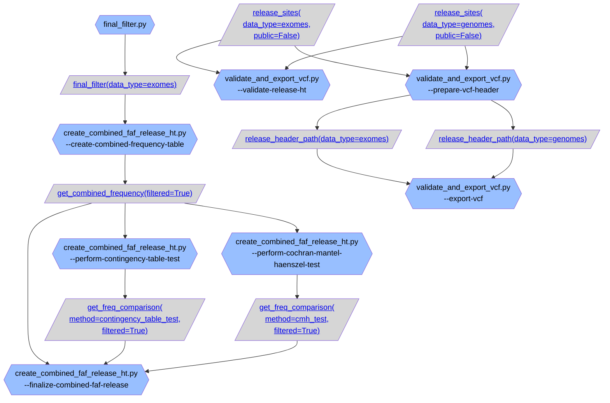
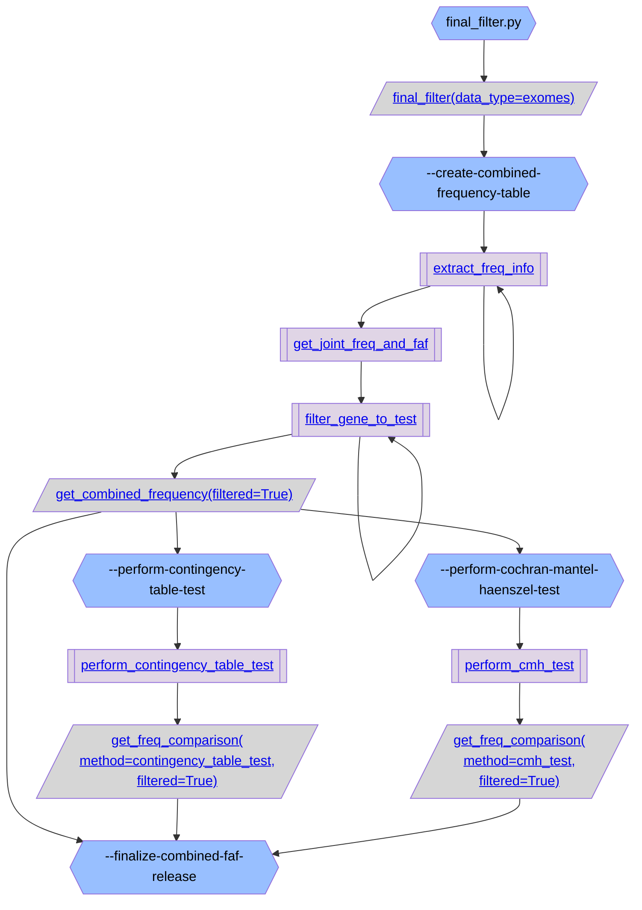

# gnomAD v4 create release overview:

### [create_combined_faf_release_ht.py](https://github.com/broadinstitute/gnomad_qc/tree/main/gnomad_qc/v4/create_release/create_combined_faf_release_ht.py): Create a joint gnomAD v4 exome and genome frequency and FAF.

### [validate_and_export_vcf.py](https://github.com/broadinstitute/gnomad_qc/tree/main/gnomad_qc/v4/create_release/validate_and_export_vcf.py):

```mermaid
flowchart TB;
  classDef script_color fill:#2C5D4A,color:#000000
  classDef step_color fill:#98BFFF,color:#000000
  classDef func_color fill:#E0D5E6,color:#000000
  classDef gnomad_methods_color fill:#F9F2CE,color:#000000
  classDef hail_color fill:#FAEACE,color:#000000
  classDef resource_color fill:#D6D6D6,color:#000000
  classDef validity_check_color fill:#2C5D4A,color:#000000

  resource_release_sites_data_type_exomes_public_False[/"<a href='https://github.com/broadinstitute/gnomad_qc/tree/main/gnomad_qc/v4/resources/release.py#L172'>release_sites(
data_type=exomes,
public=False)</a>"/]:::resource_color;
  step_validate_release_ht{{"--validate-release-ht"}}:::step_color;
  func_check_globals_for_retired_terms[["<a href='https://github.com/broadinstitute/gnomad_qc/tree/main/gnomad_qc/v4/create_release/validate_and_export_vcf.py#L892'>check_globals_for_retired_terms</a>"]]:::func_color;
  func_prepare_ht_for_validation[["<a href='https://github.com/broadinstitute/gnomad_qc/tree/main/gnomad_qc/v4/create_release/validate_and_export_vcf.py#L481'>prepare_ht_for_validation</a>"]]:::func_color;
  func_filter_to_test[["<a href='https://github.com/broadinstitute/gnomad_qc/tree/main/gnomad_qc/v4/sample_qc/interval_qc.py#L92'>filter_to_test</a>"]]:::func_color;
  resource_release_sites_data_type_genomes_public_False[/"<a href='https://github.com/broadinstitute/gnomad_qc/tree/main/gnomad_qc/v4/resources/release.py#L172'>release_sites(
data_type=genomes,
public=False)</a>"/]:::resource_color;
  step_prepare_vcf_header{{"--prepare-vcf-header"}}:::step_color;
  func_prepare_vcf_header_dict[["<a href='https://github.com/broadinstitute/gnomad_qc/tree/main/gnomad_qc/v4/create_release/validate_and_export_vcf.py#L730'>prepare_vcf_header_dict</a>"]]:::func_color;
  release_header_path_data_type_genomes[/"<a href='https://github.com/broadinstitute/gnomad_qc/tree/main/gnomad_qc/v4/resources/release.py#L229'>release_header_path(data_type=genomes)</a>"/]:::resource_color;
  release_header_path_data_type_exomes[/"<a href='https://github.com/broadinstitute/gnomad_qc/tree/main/gnomad_qc/v4/resources/release.py#L229'>release_header_path(data_type=exomes)</a>"/]:::resource_color;
  resource_release_header_path_data_type_exomes[/"<a href='https://github.com/broadinstitute/gnomad_qc/tree/main/gnomad_qc/v4/resources/release.py#L229'>release_header_path(data_type=exomes)</a>"/]:::resource_color;
  step_export_vcf{{"--export-vcf"}}:::step_color;
  func_format_validated_ht_for_export[["<a href='https://github.com/broadinstitute/gnomad_qc/tree/main/gnomad_qc/v4/create_release/validate_and_export_vcf.py#L808'>format_validated_ht_for_export</a>"]]:::func_color;
  resource_release_header_path_data_type_genomes[/"<a href='https://github.com/broadinstitute/gnomad_qc/tree/main/gnomad_qc/v4/resources/release.py#L229'>release_header_path(data_type=genomes)</a>"/]:::resource_color;
  resource_release_sites_data_type_exomes_public_False --> step_validate_release_ht;
  step_validate_release_ht --> func_check_globals_for_retired_terms;
  func_check_globals_for_retired_terms --> func_prepare_ht_for_validation;
  func_prepare_ht_for_validation --> func_filter_to_test;
  resource_release_sites_data_type_genomes_public_False --> step_validate_release_ht;
  resource_release_sites_data_type_exomes_public_False --> step_prepare_vcf_header;
  step_prepare_vcf_header --> func_prepare_vcf_header_dict;
  func_prepare_vcf_header_dict --> release_header_path_data_type_genomes;
  func_prepare_vcf_header_dict --> release_header_path_data_type_exomes;
  resource_release_sites_data_type_genomes_public_False --> step_prepare_vcf_header;
  func_prepare_vcf_header_dict --> resource_release_header_path_data_type_exomes;
  resource_release_header_path_data_type_exomes --> step_export_vcf;
  step_export_vcf --> func_format_validated_ht_for_export;
  func_prepare_vcf_header_dict --> resource_release_header_path_data_type_genomes;
  resource_release_header_path_data_type_genomes --> step_export_vcf;
```

