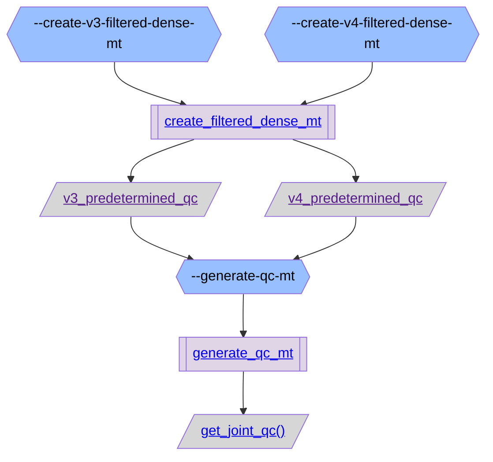
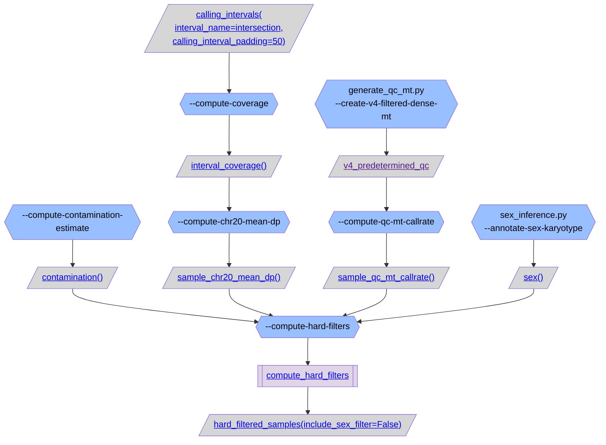
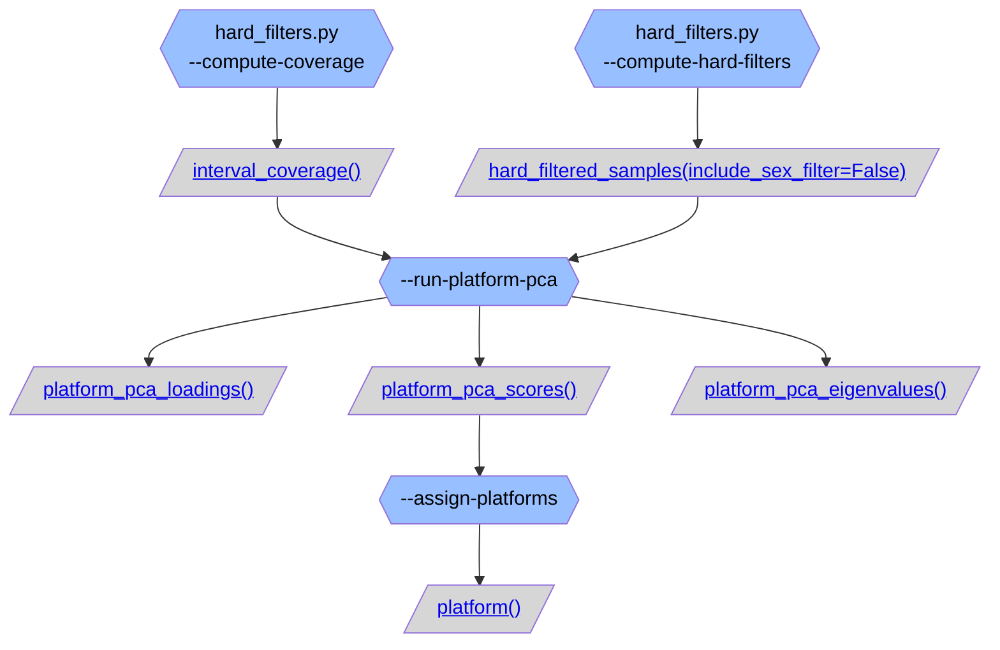
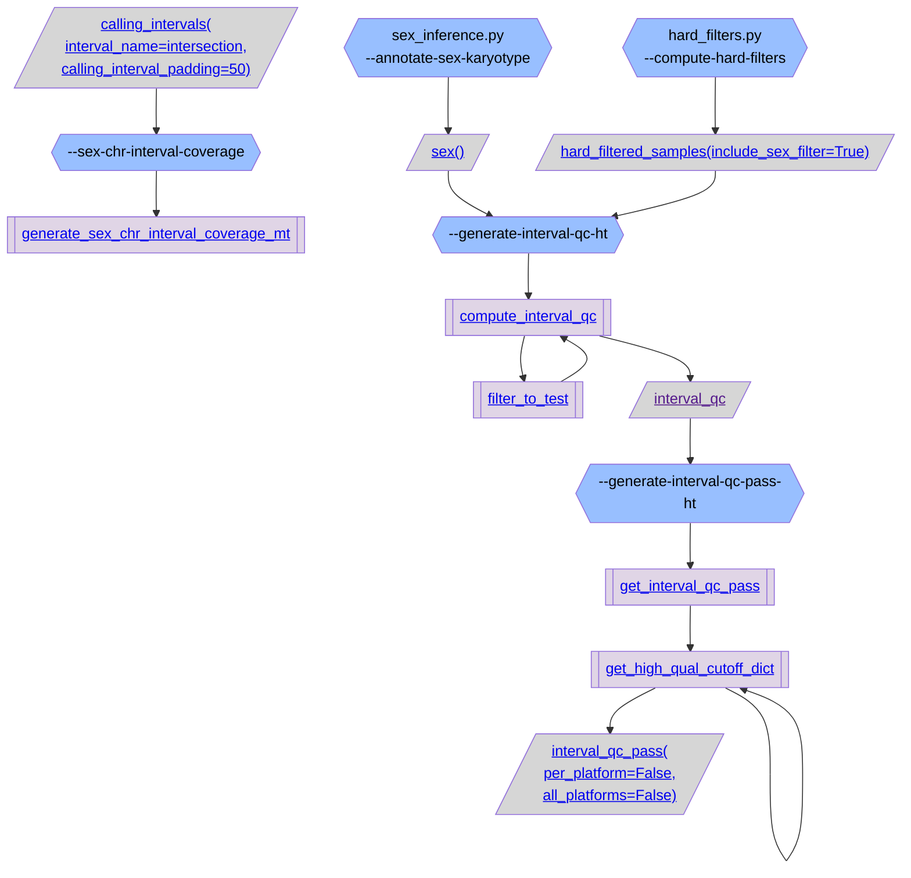
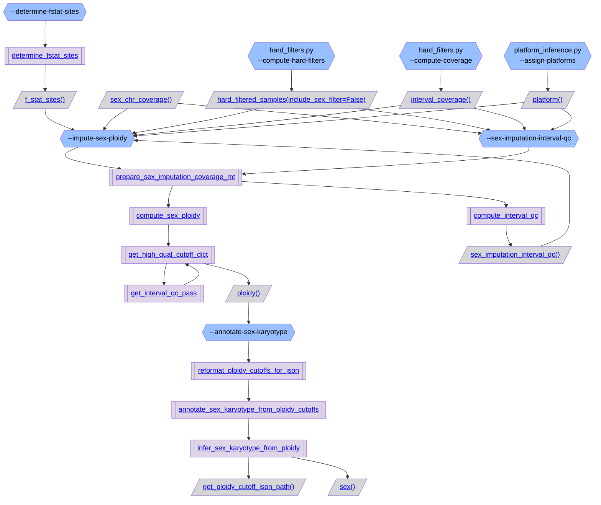
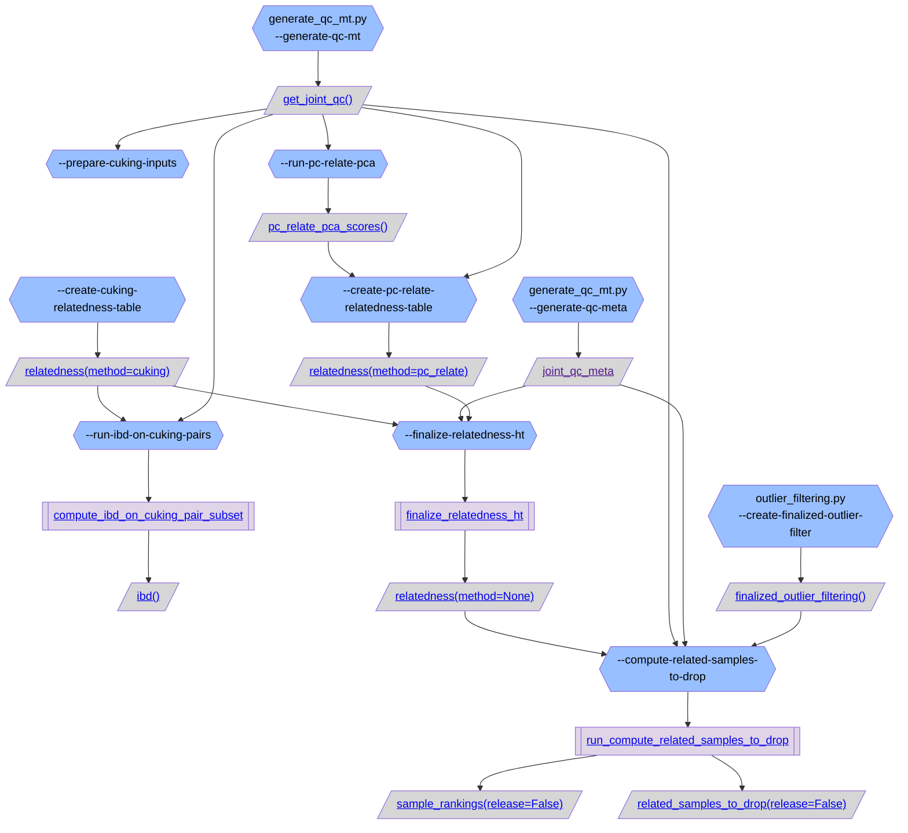
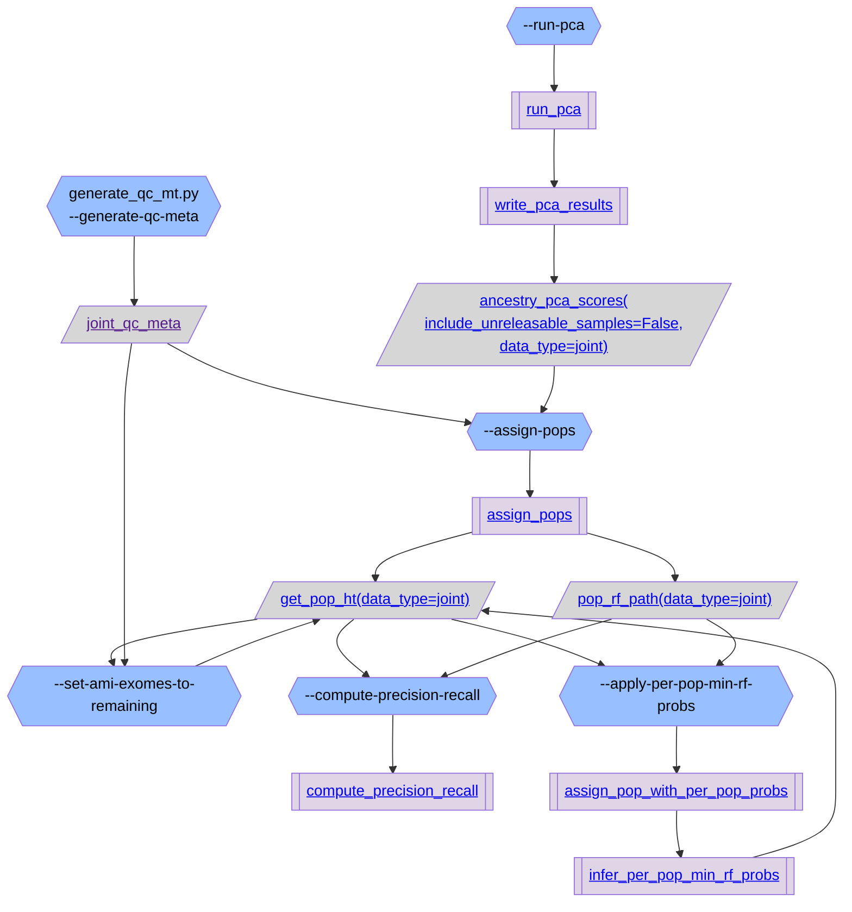
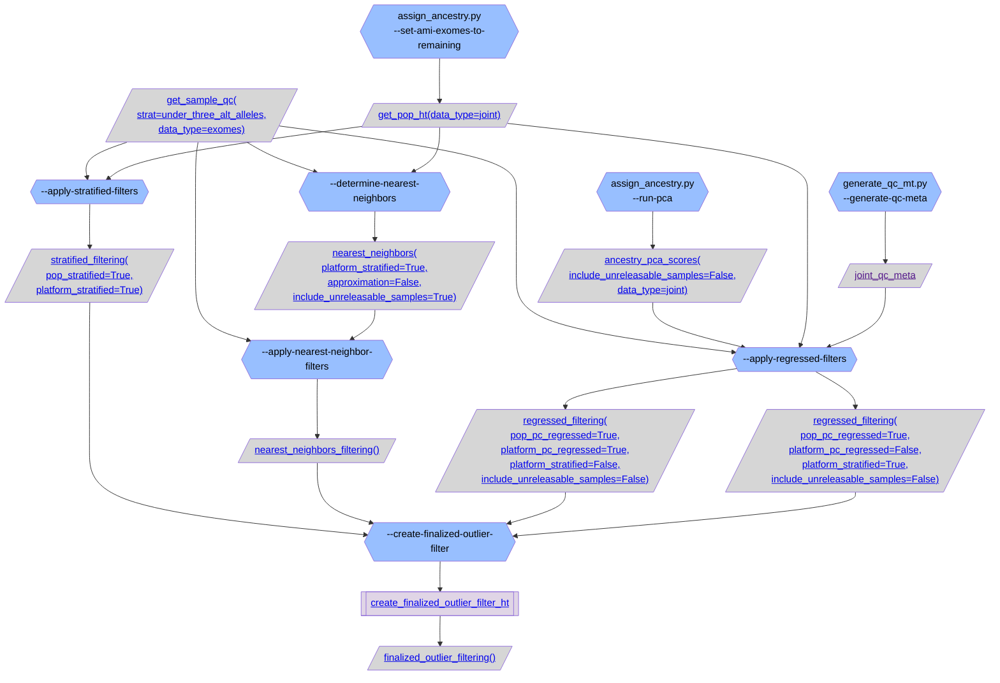

# gnomAD v4 sample QC overview:
```mermaid
flowchart TB;
  classDef script_color fill:#2C5D4A,color:#000000
  classDef step_color fill:#98BFFF,color:#000000
  classDef func_color fill:#E0D5E6,color:#000000
  classDef gnomad_methods_color fill:#F9F2CE,color:#000000
  classDef hail_color fill:#FAEACE,color:#000000
  classDef resource_color fill:#D6D6D6,color:#000000
  classDef validity_check_color fill:#2C5D4A,color:#000000
  classDef subgraph_padding fill:none,stroke:none,margin-top:100

  step_create_v3_filtered_dense_mt{{"generate_qc_mt.py
--create-v3-filtered-dense-mt"}}:::step_color;
  resource_v3_predetermined_qc[/"<a href=''>v3_predetermined_qc</a>"/]:::resource_color;
  step_generate_qc_mt{{"generate_qc_mt.py
--generate-qc-mt"}}:::step_color;
  step_create_v4_filtered_dense_mt{{"generate_qc_mt.py
--create-v4-filtered-dense-mt"}}:::step_color;
  resource_v4_predetermined_qc[/"<a href=''>v4_predetermined_qc</a>"/]:::resource_color;
  resource_get_joint_qc[/"<a href='https://github.com/broadinstitute/gnomad_qc/tree/main/gnomad_qc/v4/resources/sample_qc.py#L478'>get_joint_qc()</a>"/]:::resource_color;
  step_compute_contamination_estimate{{"hard_filters.py
--compute-contamination-estimate"}}:::step_color;
  resource_contamination[/"<a href='https://github.com/broadinstitute/gnomad_qc/tree/main/gnomad_qc/v4/resources/sample_qc.py#L120'>contamination()</a>"/]:::resource_color;
  step_compute_hard_filters{{"hard_filters.py
--compute-hard-filters"}}:::step_color;
  step_compute_chr20_mean_dp{{"hard_filters.py
--compute-chr20-mean-dp"}}:::step_color;
  resource_sample_chr20_mean_dp[/"<a href='https://github.com/broadinstitute/gnomad_qc/tree/main/gnomad_qc/v4/resources/sample_qc.py#L83'>sample_chr20_mean_dp()</a>"/]:::resource_color;
  step_compute_qc_mt_callrate{{"hard_filters.py
--compute-qc-mt-callrate"}}:::step_color;
  resource_sample_qc_mt_callrate[/"<a href='https://github.com/broadinstitute/gnomad_qc/tree/main/gnomad_qc/v4/resources/sample_qc.py#L101'>sample_qc_mt_callrate()</a>"/]:::resource_color;
  step_annotate_sex_karyotype{{"sex_inference.py
--annotate-sex-karyotype"}}:::step_color;
  resource_sex[/"<a href='https://github.com/broadinstitute/gnomad_qc/tree/main/gnomad_qc/v4/resources/sample_qc.py#L362'>sex()</a>"/]:::resource_color;
  resource_calling_intervals_interval_name_intersection_calling_interval_padding_50[/"<a href='https://github.com/broadinstitute/gnomad_qc/tree/main/gnomad_qc/v4/resources/basics.py#L407'>calling_intervals(
interval_name=intersection,
calling_interval_padding=50)</a>"/]:::resource_color;
  step_compute_coverage{{"hard_filters.py
--compute-coverage"}}:::step_color;
  resource_interval_coverage[/"<a href='https://github.com/broadinstitute/gnomad_qc/tree/main/gnomad_qc/v4/resources/sample_qc.py#L165'>interval_coverage()</a>"/]:::resource_color;
  step_run_platform_pca{{"platform_inference.py
--run-platform-pca"}}:::step_color;
  resource_hard_filtered_samples_include_sex_filter_False[/"<a href='https://github.com/broadinstitute/gnomad_qc/tree/main/gnomad_qc/v4/resources/sample_qc.py#L138'>hard_filtered_samples(include_sex_filter=False)</a>"/]:::resource_color;
  resource_platform_pca_scores[/"<a href='https://github.com/broadinstitute/gnomad_qc/tree/main/gnomad_qc/v4/resources/sample_qc.py#L234'>platform_pca_scores()</a>"/]:::resource_color;
  step_assign_platforms{{"platform_inference.py
--assign-platforms"}}:::step_color;
  resource_platform[/"<a href='https://github.com/broadinstitute/gnomad_qc/tree/main/gnomad_qc/v4/resources/sample_qc.py#L250'>platform()</a>"/]:::resource_color;
  step_sex_chr_interval_coverage{{"interval_qc.py
--sex-chr-interval-coverage"}}:::step_color;
  step_generate_interval_qc_ht{{"interval_qc.py
--generate-interval-qc-ht"}}:::step_color;
  resource_hard_filtered_samples_include_sex_filter_True[/"<a href='https://github.com/broadinstitute/gnomad_qc/tree/main/gnomad_qc/v4/resources/sample_qc.py#L138'>hard_filtered_samples(include_sex_filter=True)</a>"/]:::resource_color;
  resource_interval_qc[/"<a href=''>interval_qc</a>"/]:::resource_color;
  step_generate_interval_qc_pass_ht{{"interval_qc.py
--generate-interval-qc-pass-ht"}}:::step_color;
  resource_interval_qc_pass_per_platform_False_all_platforms_False[/"<a href='https://github.com/broadinstitute/gnomad_qc/tree/main/gnomad_qc/v4/resources/sample_qc.py#L396'>interval_qc_pass(
per_platform=False,
all_platforms=False)</a>"/]:::resource_color;
  step_determine_fstat_sites{{"sex_inference.py
--determine-fstat-sites"}}:::step_color;
  resource_f_stat_sites[/"<a href='https://github.com/broadinstitute/gnomad_qc/tree/main/gnomad_qc/v4/resources/sample_qc.py#L273'>f_stat_sites()</a>"/]:::resource_color;
  step_impute_sex_ploidy{{"sex_inference.py
--impute-sex-ploidy"}}:::step_color;
  step_sex_imputation_interval_qc{{"sex_inference.py
--sex-imputation-interval-qc"}}:::step_color;
  resource_sex_imputation_interval_qc[/"<a href='https://github.com/broadinstitute/gnomad_qc/tree/main/gnomad_qc/v4/resources/sample_qc.py#L309'>sex_imputation_interval_qc()</a>"/]:::resource_color;
  resource_sex_chr_coverage[/"<a href='https://github.com/broadinstitute/gnomad_qc/tree/main/gnomad_qc/v4/resources/sample_qc.py#L291'>sex_chr_coverage()</a>"/]:::resource_color;
  resource_ploidy[/"<a href='https://github.com/broadinstitute/gnomad_qc/tree/main/gnomad_qc/v4/resources/sample_qc.py#L327'>ploidy()</a>"/]:::resource_color;
  step_prepare_cuking_inputs{{"relatedness.py
--prepare-cuking-inputs"}}:::step_color;
  step_create_cuking_relatedness_table{{"relatedness.py
--create-cuking-relatedness-table"}}:::step_color;
  resource_relatedness_method_cuking[/"<a href='https://github.com/broadinstitute/gnomad_qc/tree/main/gnomad_qc/v4/resources/sample_qc.py#L563'>relatedness(method=cuking)</a>"/]:::resource_color;
  step_run_ibd_on_cuking_pairs{{"relatedness.py
--run-ibd-on-cuking-pairs"}}:::step_color;
  step_finalize_relatedness_ht{{"relatedness.py
--finalize-relatedness-ht"}}:::step_color;
  step_generate_qc_meta{{"generate_qc_mt.py
--generate-qc-meta"}}:::step_color;
  resource_joint_qc_meta[/"<a href=''>joint_qc_meta</a>"/]:::resource_color;
  step_create_pc_relate_relatedness_table{{"relatedness.py
--create-pc-relate-relatedness-table"}}:::step_color;
  resource_relatedness_method_pc_relate[/"<a href='https://github.com/broadinstitute/gnomad_qc/tree/main/gnomad_qc/v4/resources/sample_qc.py#L563'>relatedness(method=pc_relate)</a>"/]:::resource_color;
  resource_relatedness_method_None[/"<a href='https://github.com/broadinstitute/gnomad_qc/tree/main/gnomad_qc/v4/resources/sample_qc.py#L563'>relatedness(method=None)</a>"/]:::resource_color;
  step_compute_related_samples_to_drop{{"relatedness.py
--compute-related-samples-to-drop"}}:::step_color;
  step_create_finalized_outlier_filter{{"outlier_filtering.py
--create-finalized-outlier-filter"}}:::step_color;
  resource_finalized_outlier_filtering[/"<a href='https://github.com/broadinstitute/gnomad_qc/tree/main/gnomad_qc/v4/resources/sample_qc.py#L964'>finalized_outlier_filtering()</a>"/]:::resource_color;
  step_run_pc_relate_pca{{"relatedness.py
--run-pc-relate-pca"}}:::step_color;
  resource_pc_relate_pca_scores[/"<a href='https://github.com/broadinstitute/gnomad_qc/tree/main/gnomad_qc/v4/resources/sample_qc.py#L545'>pc_relate_pca_scores()</a>"/]:::resource_color;
  step_assign_pops{{"assign_ancestry.py
--assign-pops"}}:::step_color;
  step_run_pca{{"assign_ancestry.py
--run-pca"}}:::step_color;
  resource_ancestry_pca_scores_include_unreleasable_samples_False_data_type_joint[/"<a href='https://github.com/broadinstitute/gnomad_qc/tree/main/gnomad_qc/v4/resources/sample_qc.py#L714'>ancestry_pca_scores(
include_unreleasable_samples=False,
data_type=joint)</a>"/]:::resource_color;
  step_set_ami_exomes_to_remaining{{"assign_ancestry.py
--set-ami-exomes-to-remaining"}}:::step_color;
  resource_get_pop_ht_data_type_joint[/"<a href='https://github.com/broadinstitute/gnomad_qc/tree/main/gnomad_qc/v4/resources/sample_qc.py#L788'>get_pop_ht(data_type=joint)</a>"/]:::resource_color;
  step_compute_precision_recall{{"assign_ancestry.py
--compute-precision-recall"}}:::step_color;
  resource_pop_rf_path_data_type_joint[/"<a href='https://github.com/broadinstitute/gnomad_qc/tree/main/gnomad_qc/v4/resources/sample_qc.py#L770'>pop_rf_path(data_type=joint)</a>"/]:::resource_color;
  step_apply_per_pop_min_rf_probs{{"assign_ancestry.py
--apply-per-pop-min-rf-probs"}}:::step_color;
  resource_get_sample_qc_strat_under_three_alt_alleles_data_type_exomes[/"<a href='https://github.com/broadinstitute/gnomad_qc/tree/main/gnomad_qc/v4/resources/sample_qc.py#L44'>get_sample_qc(
strat=under_three_alt_alleles,
data_type=exomes)</a>"/]:::resource_color;
  step_apply_regressed_filters{{"outlier_filtering.py
--apply-regressed-filters"}}:::step_color;
  step_apply_stratified_filters{{"outlier_filtering.py
--apply-stratified-filters"}}:::step_color;
  resource_stratified_filtering_pop_stratified_True_platform_stratified_True[/"<a href='https://github.com/broadinstitute/gnomad_qc/tree/main/gnomad_qc/v4/resources/sample_qc.py#L839'>stratified_filtering(
pop_stratified=True,
platform_stratified=True)</a>"/]:::resource_color;
  step_apply_nearest_neighbor_filters{{"outlier_filtering.py
--apply-nearest-neighbor-filters"}}:::step_color;
  resource_nearest_neighbors_filtering[/"<a href='https://github.com/broadinstitute/gnomad_qc/tree/main/gnomad_qc/v4/resources/sample_qc.py#L946'>nearest_neighbors_filtering()</a>"/]:::resource_color;
  resource_regressed_filtering_pop_pc_regressed_True_platform_pc_regressed_True_platform_stratified_False_include_unreleasable_samples_False[/"<a href='https://github.com/broadinstitute/gnomad_qc/tree/main/gnomad_qc/v4/resources/sample_qc.py#L870'>regressed_filtering(
pop_pc_regressed=True,
platform_pc_regressed=True,
platform_stratified=False,
include_unreleasable_samples=False)</a>"/]:::resource_color;
  resource_regressed_filtering_pop_pc_regressed_True_platform_pc_regressed_False_platform_stratified_True_include_unreleasable_samples_False[/"<a href='https://github.com/broadinstitute/gnomad_qc/tree/main/gnomad_qc/v4/resources/sample_qc.py#L870'>regressed_filtering(
pop_pc_regressed=True,
platform_pc_regressed=False,
platform_stratified=True,
include_unreleasable_samples=False)</a>"/]:::resource_color;
  step_determine_nearest_neighbors{{"outlier_filtering.py
--determine-nearest-neighbors"}}:::step_color;
  resource_nearest_neighbors_platform_stratified_True_approximation_False_include_unreleasable_samples_True[/"<a href='https://github.com/broadinstitute/gnomad_qc/tree/main/gnomad_qc/v4/resources/sample_qc.py#L910'>nearest_neighbors(
platform_stratified=True,
approximation=False,
include_unreleasable_samples=True)</a>"/]:::resource_color;
  resource_sample_rankings_release_True[/"<a href='https://github.com/broadinstitute/gnomad_qc/tree/main/gnomad_qc/v4/resources/sample_qc.py#L637'>sample_rankings(release=True)</a>"/]:::resource_color;
  step_identify_duplicates{{"identify_trios.py
--identify-duplicates"}}:::step_color;
  resource_duplicates[/"<a href='https://github.com/broadinstitute/gnomad_qc/tree/main/gnomad_qc/v4/resources/sample_qc.py#L985'>duplicates()</a>"/]:::resource_color;
  step_infer_families{{"identify_trios.py
--infer-families"}}:::step_color;
  resource_pedigree_finalized_False_fake_False[/"<a href='https://github.com/broadinstitute/gnomad_qc/tree/main/gnomad_qc/v4/resources/sample_qc.py#L1003'>pedigree(
finalized=False,
fake=False)</a>"/]:::resource_color;
  step_create_fake_pedigree{{"identify_trios.py
--create-fake-pedigree"}}:::step_color;
  step_run_mendel_errors{{"identify_trios.py
--run-mendel-errors"}}:::step_color;
  resource_pedigree_finalized_False_fake_True[/"<a href='https://github.com/broadinstitute/gnomad_qc/tree/main/gnomad_qc/v4/resources/sample_qc.py#L1003'>pedigree(
finalized=False,
fake=True)</a>"/]:::resource_color;
  resource_interval_qc_pass_per_platform_False_all_platforms_True[/"<a href='https://github.com/broadinstitute/gnomad_qc/tree/main/gnomad_qc/v4/resources/sample_qc.py#L396'>interval_qc_pass(
per_platform=False,
all_platforms=True)</a>"/]:::resource_color;
  step_finalize_ped{{"identify_trios.py
--finalize-ped"}}:::step_color;
  resource_ped_mendel_errors[/"<a href='https://github.com/broadinstitute/gnomad_qc/tree/main/gnomad_qc/v4/resources/sample_qc.py#L1056'>ped_mendel_errors()</a>"/]:::resource_color;
  resource_pedigree_finalized_True_fake_False[/"<a href='https://github.com/broadinstitute/gnomad_qc/tree/main/gnomad_qc/v4/resources/sample_qc.py#L1003'>pedigree(
finalized=True,
fake=False)</a>"/]:::resource_color;
  resource_trios_fake_False[/"<a href='https://github.com/broadinstitute/gnomad_qc/tree/main/gnomad_qc/v4/resources/sample_qc.py#L1035'>trios(fake=False)</a>"/]:::resource_color;
   subgraph final_outputs[<font size=72>testing final outputs]
     direction LR;
     resource_get_joint_qc;
     resource_interval_coverage;
     resource_hard_filtered_samples_include_sex_filter_False;
     resource_platform;
     resource_sex_chr_coverage;
     resource_sex;
     resource_hard_filtered_samples_include_sex_filter_True;
     resource_relatedness_method_None;
     resource_get_pop_ht_data_type_joint;
     resource_finalized_outlier_filtering;
  end
  subgraph cluster_generate_qc_mt[<font size=72>generate_qc_mt.py]
    direction LR;
    subgraph cluster_generate_qc_mt_padding [ ]
      direction LR;
      step_create_v3_filtered_dense_mt --> resource_v3_predetermined_qc --> step_generate_qc_mt;
      step_create_v4_filtered_dense_mt --> resource_v4_predetermined_qc --> step_generate_qc_mt;
      step_generate_qc_mt --> resource_get_joint_qc;
    end
  end
  class cluster_generate_qc_mt_padding subgraph_padding
  subgraph cluster_hard_filters_no_sex[<font size=72>Identify samples to hard filter]
    direction TB;
    style cluster_hard_filters_padding fill:none,stroke:none,boxMargin:100,padding:100;
    subgraph cluster_hard_filters_padding [ ]
      direction TB;
      style cluster_hard_filters_padding fill:none,stroke:none,boxMargin:100,padding:100;
      step_compute_contamination_estimate --> resource_contamination --> step_compute_hard_filters;
      resource_calling_intervals_interval_name_intersection_calling_interval_padding_50 --> step_compute_coverage --> resource_interval_coverage --> step_compute_chr20_mean_dp --> resource_sample_chr20_mean_dp --> step_compute_hard_filters;
      resource_v4_predetermined_qc --> step_compute_qc_mt_callrate --> resource_sample_qc_mt_callrate --> step_compute_hard_filters;
      step_compute_hard_filters --> resource_hard_filtered_samples_include_sex_filter_False;
      resource_sex --> step_compute_hard_filterss --> resource_hard_filtered_samples_include_sex_filter_False;
    end
  end
  subgraph cluster_platform_inference[<font size=72>platform_inference.py]
    direction TB;
    subgraph cluster_platform_inference_padding [ ]
      direction TB;
      resource_interval_coverage --> step_run_platform_pca;
      resource_hard_filtered_samples_include_sex_filter_False --> step_run_platform_pca;
      step_run_platform_pca --> resource_platform_pca_scores --> step_assign_platforms --> resource_platform;
    end
  end
  class cluster_platform_inference_padding subgraph_padding
  subgraph cluster_sex_inference[<font size=72>sex_inference.py]
    direction TB;
    subgraph cluster_sex_inference_padding [ ]
      direction TB;
      step_determine_fstat_sites --> resource_f_stat_sites --> step_impute_sex_ploidy;
      resource_sex_chr_coverage --> step_impute_sex_ploidy;
      resource_sex_chr_coverage --> step_sex_imputation_interval_qc --> resource_sex_imputation_interval_qc --> step_impute_sex_ploidy;
      resource_hard_filtered_samples_include_sex_filter_False --> step_impute_sex_ploidy;
      resource_interval_coverage --> step_impute_sex_ploidy;
      resource_platform --> step_impute_sex_ploidy;
      step_impute_sex_ploidy --> resource_ploidy --> step_annotate_sex_karyotype;
      resource_hard_filtered_samples_include_sex_filter_False --> step_sex_imputation_interval_qc;
      resource_interval_coverage --> step_sex_imputation_interval_qc;
      resource_platform --> step_sex_imputation_interval_qc;
    end
  end
  class cluster_sex_inference_padding subgraph_padding
    subgraph cluster_interval_qc[<font size=72>interval_qc.py]
    direction TB;
    subgraph cluster_interval_qc_padding [ ]
      direction TB;
      resource_calling_intervals_interval_name_intersection_calling_interval_padding_50 --> step_sex_chr_interval_coverage;
      step_compute_hard_filters --> resource_hard_filtered_samples_include_sex_filter_True;
      resource_hard_filtered_samples_include_sex_filter_True --> step_generate_interval_qc_ht;
      step_generate_interval_qc_ht --> resource_interval_qc;
      resource_interval_qc --> step_generate_interval_qc_pass_ht;
      step_generate_interval_qc_pass_ht --> resource_interval_qc_pass_per_platform_False_all_platforms_False;
      resource_sex --> step_generate_interval_qc_ht;
    end
  end
  class cluster_interval_qc_padding subgraph_padding
  subgraph cluster_relatedness[<font size=72>relatedness.py]
    direction TB;
    subgraph cluster_relatedness_padding [ ]
      direction TB;
      resource_get_joint_qc --> step_prepare_cuking_inputs;
      step_create_cuking_relatedness_table --> resource_relatedness_method_cuking;
      resource_relatedness_method_cuking --> step_run_ibd_on_cuking_pairs;
      resource_get_joint_qc --> step_run_ibd_on_cuking_pairs;
      resource_relatedness_method_cuking --> step_finalize_relatedness_ht;
      step_generate_qc_meta --> resource_joint_qc_meta;
      resource_joint_qc_meta --> step_finalize_relatedness_ht;
      step_create_pc_relate_relatedness_table --> resource_relatedness_method_pc_relate;
      resource_relatedness_method_pc_relate --> step_finalize_relatedness_ht;
      step_finalize_relatedness_ht --> resource_relatedness_method_None;
      resource_relatedness_method_None --> step_compute_related_samples_to_drop;
      resource_get_joint_qc --> step_compute_related_samples_to_drop;
      resource_joint_qc_meta --> step_compute_related_samples_to_drop;
      step_create_finalized_outlier_filter --> resource_finalized_outlier_filtering;
      resource_finalized_outlier_filtering --> step_compute_related_samples_to_drop;
      resource_get_joint_qc --> step_run_pc_relate_pca;
      step_run_pc_relate_pca --> resource_pc_relate_pca_scores;
      resource_pc_relate_pca_scores --> step_create_pc_relate_relatedness_table;
      resource_get_joint_qc --> step_create_pc_relate_relatedness_table;
      step_annotate_sex_karyotype --> resource_sex;
    end
  end
  class cluster_relatedness_padding subgraph_padding
  subgraph cluster_assign_ancestry[<font size=72>assign_ancestry.py]
    direction TB;
    subgraph cluster_assign_ancestry_padding [ ]
      direction TB;
      resource_joint_qc_meta --> step_assign_pops;
      step_run_pca --> resource_ancestry_pca_scores_include_unreleasable_samples_False_data_type_joint;
      resource_ancestry_pca_scores_include_unreleasable_samples_False_data_type_joint --> step_assign_pops;
      step_set_ami_exomes_to_remaining --> resource_get_pop_ht_data_type_joint;
      resource_get_pop_ht_data_type_joint --> step_compute_precision_recall;
      step_assign_pops --> resource_pop_rf_path_data_type_joint;
      resource_pop_rf_path_data_type_joint --> step_compute_precision_recall;
      resource_get_pop_ht_data_type_joint --> step_apply_per_pop_min_rf_probs;
      resource_pop_rf_path_data_type_joint --> step_apply_per_pop_min_rf_probs;
      resource_get_pop_ht_data_type_joint --> step_set_ami_exomes_to_remaining;
      resource_joint_qc_meta --> step_set_ami_exomes_to_remaining;
    end
  end
  class cluster_assign_ancestry_padding subgraph_padding
  subgraph cluster_outlier_filtering[<font size=72>outlier_filtering.py]
    direction TB;
    subgraph cluster_outlier_filtering_padding [ ]
      direction TB;
      resource_get_sample_qc_strat_under_three_alt_alleles_data_type_exomes --> step_apply_regressed_filters;
      resource_ancestry_pca_scores_include_unreleasable_samples_False_data_type_joint --> step_apply_regressed_filters;
      resource_get_pop_ht_data_type_joint --> step_apply_regressed_filters;
      resource_joint_qc_meta --> step_apply_regressed_filters;
      step_apply_stratified_filters --> resource_stratified_filtering_pop_stratified_True_platform_stratified_True;
      resource_stratified_filtering_pop_stratified_True_platform_stratified_True --> step_create_finalized_outlier_filter;
      step_apply_nearest_neighbor_filters --> resource_nearest_neighbors_filtering;
      resource_nearest_neighbors_filtering --> step_create_finalized_outlier_filter;
      step_apply_regressed_filters --> resource_regressed_filtering_pop_pc_regressed_True_platform_pc_regressed_True_platform_stratified_False_include_unreleasable_samples_False;
      resource_regressed_filtering_pop_pc_regressed_True_platform_pc_regressed_True_platform_stratified_False_include_unreleasable_samples_False --> step_create_finalized_outlier_filter;
      step_apply_regressed_filters --> resource_regressed_filtering_pop_pc_regressed_True_platform_pc_regressed_False_platform_stratified_True_include_unreleasable_samples_False;
      resource_regressed_filtering_pop_pc_regressed_True_platform_pc_regressed_False_platform_stratified_True_include_unreleasable_samples_False --> step_create_finalized_outlier_filter;
      resource_get_sample_qc_strat_under_three_alt_alleles_data_type_exomes --> step_apply_stratified_filters;
      resource_get_pop_ht_data_type_joint --> step_apply_stratified_filters;
      resource_get_sample_qc_strat_under_three_alt_alleles_data_type_exomes --> step_determine_nearest_neighbors;
      resource_get_pop_ht_data_type_joint --> step_determine_nearest_neighbors;
      resource_get_sample_qc_strat_under_three_alt_alleles_data_type_exomes --> step_apply_nearest_neighbor_filters;
      step_determine_nearest_neighbors --> resource_nearest_neighbors_platform_stratified_True_approximation_False_include_unreleasable_samples_True;
      resource_nearest_neighbors_platform_stratified_True_approximation_False_include_unreleasable_samples_True --> step_apply_nearest_neighbor_filters;
    end
  end
  class cluster_outlier_filtering_padding subgraph_padding
  subgraph cluster_identify_trios[<font size=72>identify_trios.py]
    direction TB;
    subgraph cluster_identify_trios_padding [ ]
      direction TB;
      step_compute_related_samples_to_drop --> resource_sample_rankings_release_True;
      resource_sample_rankings_release_True --> step_identify_duplicates;
      step_identify_duplicates --> resource_duplicates;
      resource_duplicates --> step_infer_families;
      step_infer_families --> resource_pedigree_finalized_False_fake_False;
      resource_pedigree_finalized_False_fake_False --> step_create_fake_pedigree;
      resource_pedigree_finalized_False_fake_False --> step_run_mendel_errors;
      step_create_fake_pedigree --> resource_pedigree_finalized_False_fake_True;
      resource_pedigree_finalized_False_fake_True --> step_run_mendel_errors;
      step_generate_interval_qc_pass_ht --> resource_interval_qc_pass_per_platform_False_all_platforms_True;
      resource_interval_qc_pass_per_platform_False_all_platforms_True --> step_run_mendel_errors;
      resource_pedigree_finalized_False_fake_False --> step_finalize_ped;
      step_run_mendel_errors --> resource_ped_mendel_errors;
      resource_ped_mendel_errors --> step_finalize_ped;
      step_finalize_ped --> resource_pedigree_finalized_True_fake_False;
      step_finalize_ped --> resource_trios_fake_False;
    end
  end
  class cluster_identify_trios_padding subgraph_padding
```
### [generate_qc_mt.py](https://github.com/broadinstitute/gnomad_qc/tree/main/gnomad_qc/v4/sample_qc/generate_qc_mt.py):     Generate combined gnomAD v3 and v4 QC MatrixTable for use in relatedness and ancestry inference.

### [hard_filters.py](https://github.com/broadinstitute/gnomad_qc/tree/main/gnomad_qc/v4/sample_qc/hard_filters.py): Script to determine samples that fail hard filtering thresholds.

### [platform_inference.py](https://github.com/broadinstitute/gnomad_qc/tree/main/gnomad_qc/v4/sample_qc/platform_inference.py): Script to assign platforms based on per interval fraction of bases over DP 0 PCA results using HDBSCAN.

### [interval_qc.py](https://github.com/broadinstitute/gnomad_qc/tree/main/gnomad_qc/v4/sample_qc/interval_qc.py): Script to define high quality intervals based on per interval aggregate statistics over samples.

### [sex_inference.py](https://github.com/broadinstitute/gnomad_qc/tree/main/gnomad_qc/v4/sample_qc/sex_inference.py): Script to impute chromosomal sex karyotype annotation.

### [hard_filters.py](https://github.com/broadinstitute/gnomad_qc/tree/main/gnomad_qc/v4/sample_qc/hard_filters.py): Script to determine samples that fail hard filtering thresholds.

### [relatedness.py](https://github.com/broadinstitute/gnomad_qc/tree/main/gnomad_qc/v4/sample_qc/relatedness.py): Script to compute relatedness estimates among pairs of samples in the callset.


## Relatedness

We use [`cuKING`](https://github.com/populationgenomics/cuKING) for pruning related samples for v4. Make sure that you've cloned the `cuKING` git submodule in this directory (`git submodule update --init`). Then follow these steps:

### Preparing the production environment

Below, `$PROJECT_ID` refers to the GCP project ID for gnomAD production.

```sh
gcloud config set project $PROJECT_ID
```

Enable the necessary services:

```sh
gcloud services enable \
    artifactregistry.googleapis.com \
    batch.googleapis.com \
    cloudbuild.googleapis.com
```

Create an Artifact Registry repository for Docker images:

```sh
gcloud artifacts repositories create images --location=us-central1 --repository-format=docker
```

Build the Docker image:

```sh
cd cuKING
gcloud builds submit --region=us-central1 --config cloudbuild.yaml --substitutions=TAG_NAME=$(git describe --tags) .
```

This should take about half an hour.

Create a service account for running `cuKING`:

```sh
gcloud iam service-accounts create cuking
```

Grant the service account access permissions for:

* the Artifact Registry repository,

  ```sh
  gcloud artifacts repositories add-iam-policy-binding images \
      --location=us-central1 \
      --member=serviceAccount:cuking@$PROJECT_ID.iam.gserviceaccount.com \
      --role=roles/artifactregistry.reader
  ```

* Cloud Batch related roles on the project level, and

  ```sh
  for role in role=roles/batch.agentReporter roles/serviceusage.serviceUsageConsumer roles/logging.logWriter roles/monitoring.metricWriter
  do
      gcloud projects add-iam-policy-binding $PROJECT_ID --member=serviceAccount:cuking@$PROJECT_ID.iam.gserviceaccount.com --role=$role
  done
  ```

* the `gnomad` and `gnomad-tmp` buckets.

  ```sh
  for bucket in gnomad gnomad-tmp
  do
      gsutil iam ch serviceAccount:cuking@$PROJECT_ID.iam.gserviceaccount.com:objectAdmin gs://$bucket
  done
  ```

Create a VM instance template:

```sh
gcloud compute instance-templates create cuking-instance-template \
    --project=$PROJECT_ID \
    --machine-type=a2-highgpu-1g \
    --network-interface=network=default,network-tier=PREMIUM,address="" \
    --metadata-from-file=startup-script=instance_startup_script.sh \
    --maintenance-policy=TERMINATE \
    --provisioning-model=STANDARD \
    --service-account=cuking@$PROJECT_ID.iam.gserviceaccount.com \
    --scopes=https://www.googleapis.com/auth/cloud-platform \
    --accelerator=count=1,type=nvidia-tesla-a100 \
    --create-disk=auto-delete=yes,boot=yes,device-name=cuking-instance-template,image=projects/ubuntu-os-cloud/global/images/ubuntu-1804-bionic-v20220712,mode=rw,size=10,type=pd-balanced \
    --no-shielded-secure-boot \
    --shielded-vtpm \
    --shielded-integrity-monitoring \
    --reservation-affinity=any
```

The above instance template uses A2 machines with NVIDIA A100 GPUs. Make sure that your [quotas](https://console.cloud.google.com/iam-admin/quotas) are set sufficiently high for `NVIDIA_A100_GPUS` and `A2_CPUS` (e.g. 16 and 192, respectively).

Make sure that the [firewall configuration](https://console.cloud.google.com/networking/firewalls/list) contains a rule to allow internal traffic (like [`default-allow-internal`](https://cloud.google.com/vpc/docs/firewalls#default_firewall_rules) for the default network).

### Prepare inputs

Start an autoscaling Hail Dataproc cluster with 20 secondary workers and submit `relatedness.py --prepare-inputs`. This should take about an hour.

### Run `cuKING`

This step doesn't need a Dataproc cluster. Run the command printed by `relatedness.py --print-cuking-command` to submit a Cloud Batch job. This should take about two hours.

### Convert outputs

`cuKING` writes Parquet files. To convert these to a standard Hail Table, run `relatedness.py --create-relatedness-table` on a small Dataproc cluster. This should only take a minute.

### Determine samples to drop

To prune samples up to second degree relatedness, run `relatedness.py --compute-related-samples-to-drop` on a small Dataproc cluster. This should only take a few minutes.

### Inferring relationships for closely related samples

`get_relatedness_annotated_ht()` annotates the relatedness Table for closely related samples based on the kinship and IBS values computed by cuKING.

### [assign_ancestry.py](https://github.com/broadinstitute/gnomad_qc/tree/main/gnomad_qc/v4/sample_qc/assign_ancestry.py): Script to assign global ancestry labels to samples using known v3 population labels or TGP and HGDP labels.

### [outlier_filtering.py](https://github.com/broadinstitute/gnomad_qc/tree/main/gnomad_qc/v4/sample_qc/outlier_filtering.py): Script to determine sample QC metric outliers that should be filtered.

### [identify_trios.py](https://github.com/broadinstitute/gnomad_qc/tree/main/gnomad_qc/v4/sample_qc/identify_trios.py): Script to identify trios from relatedness data and filter based on Mendel errors and de novos.

```mermaid
flowchart TB;
  classDef script_color fill:#2C5D4A,color:#000000
  classDef step_color fill:#98BFFF,color:#000000
  classDef func_color fill:#E0D5E6,color:#000000
  classDef gnomad_methods_color fill:#F9F2CE,color:#000000
  classDef hail_color fill:#FAEACE,color:#000000
  classDef resource_color fill:#D6D6D6,color:#000000
  classDef validity_check_color fill:#2C5D4A,color:#000000

  step_compute_related_samples_to_drop{{"relatedness.py
--compute-related-samples-to-drop"}}:::step_color;
  resource_sample_rankings_release_True[/"<a href='https://github.com/broadinstitute/gnomad_qc/tree/main/gnomad_qc/v4/resources/sample_qc.py#L637'>sample_rankings(release=True)</a>"/]:::resource_color;
  step_identify_duplicates{{"--identify-duplicates"}}:::step_color;
  resource_duplicates[/"<a href='https://github.com/broadinstitute/gnomad_qc/tree/main/gnomad_qc/v4/resources/sample_qc.py#L985'>duplicates()</a>"/]:::resource_color;
  step_infer_families{{"--infer-families"}}:::step_color;
  func_filter_ped_to_same_platform[["<a href='https://github.com/broadinstitute/gnomad_qc/tree/main/gnomad_qc/v4/sample_qc/identify_trios.py#L188'>filter_ped_to_same_platform</a>"]]:::func_color;
  resource_pedigree_finalized_False_fake_False[/"<a href='https://github.com/broadinstitute/gnomad_qc/tree/main/gnomad_qc/v4/resources/sample_qc.py#L1003'>pedigree(
finalized=False,
fake=False)</a>"/]:::resource_color;
  step_create_fake_pedigree{{"--create-fake-pedigree"}}:::step_color;
  func_run_create_fake_pedigree[["<a href='https://github.com/broadinstitute/gnomad_qc/tree/main/gnomad_qc/v4/sample_qc/identify_trios.py#L105'>run_create_fake_pedigree</a>"]]:::func_color;
  resource_pedigree_finalized_False_fake_True[/"<a href='https://github.com/broadinstitute/gnomad_qc/tree/main/gnomad_qc/v4/resources/sample_qc.py#L1003'>pedigree(
finalized=False,
fake=True)</a>"/]:::resource_color;
  step_run_mendel_errors{{"--run-mendel-errors"}}:::step_color;
  func_run_mendel_errors[["<a href='https://github.com/broadinstitute/gnomad_qc/tree/main/gnomad_qc/v4/sample_qc/identify_trios.py#L140'>run_mendel_errors</a>"]]:::func_color;
  resource_ped_mendel_errors[/"<a href='https://github.com/broadinstitute/gnomad_qc/tree/main/gnomad_qc/v4/resources/sample_qc.py#L1056'>ped_mendel_errors()</a>"/]:::resource_color;
  step_generate_interval_qc_pass_ht{{"interval_qc.py
--generate-interval-qc-pass-ht"}}:::step_color;
  resource_interval_qc_pass_per_platform_False_all_platforms_True[/"<a href='https://github.com/broadinstitute/gnomad_qc/tree/main/gnomad_qc/v4/resources/sample_qc.py#L396'>interval_qc_pass(
per_platform=False,
all_platforms=True)</a>"/]:::resource_color;
  step_finalize_ped{{"--finalize-ped"}}:::step_color;
  func_filter_ped[["<a href='https://github.com/broadinstitute/gnomad_qc/tree/main/gnomad_qc/v4/sample_qc/identify_trios.py#L218'>filter_ped</a>"]]:::func_color;
  func_families_to_trios[["<a href='https://github.com/broadinstitute/gnomad_qc/tree/main/gnomad_qc/v4/sample_qc/identify_trios.py#L46'>families_to_trios</a>"]]:::func_color;
  resource_pedigree_finalized_True_fake_False[/"<a href='https://github.com/broadinstitute/gnomad_qc/tree/main/gnomad_qc/v4/resources/sample_qc.py#L1003'>pedigree(
finalized=True,
fake=False)</a>"/]:::resource_color;
  resource_trios_fake_False[/"<a href='https://github.com/broadinstitute/gnomad_qc/tree/main/gnomad_qc/v4/resources/sample_qc.py#L1035'>trios(fake=False)</a>"/]:::resource_color;
  step_compute_related_samples_to_drop --> resource_sample_rankings_release_True;
  resource_sample_rankings_release_True --> step_identify_duplicates;
  step_identify_duplicates --> resource_duplicates;
  resource_duplicates --> step_infer_families;
  step_infer_families --> func_filter_ped_to_same_platform;
  func_filter_ped_to_same_platform --> resource_pedigree_finalized_False_fake_False;
  resource_pedigree_finalized_False_fake_False --> step_create_fake_pedigree;
  step_create_fake_pedigree --> func_run_create_fake_pedigree;
  func_run_create_fake_pedigree --> resource_pedigree_finalized_False_fake_True;
  resource_pedigree_finalized_False_fake_False --> step_run_mendel_errors;
  step_run_mendel_errors --> func_run_mendel_errors;
  func_run_mendel_errors --> resource_ped_mendel_errors;
  resource_pedigree_finalized_False_fake_True --> step_run_mendel_errors;
  step_generate_interval_qc_pass_ht --> resource_interval_qc_pass_per_platform_False_all_platforms_True;
  resource_interval_qc_pass_per_platform_False_all_platforms_True --> step_run_mendel_errors;
  resource_pedigree_finalized_False_fake_False --> step_finalize_ped;
  step_finalize_ped --> func_filter_ped;
  func_filter_ped --> func_families_to_trios;
  func_families_to_trios --> resource_pedigree_finalized_True_fake_False;
  func_families_to_trios --> resource_trios_fake_False;
  resource_ped_mendel_errors --> step_finalize_ped;
```

