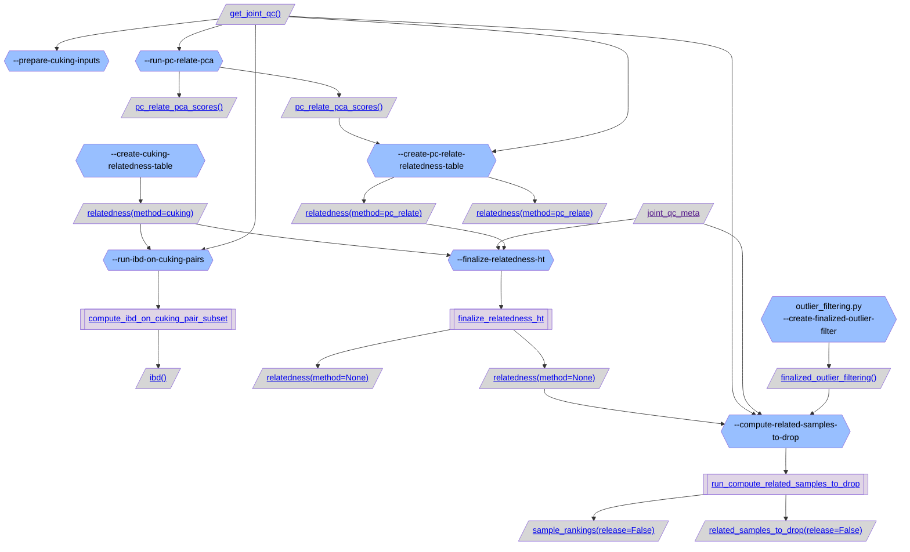
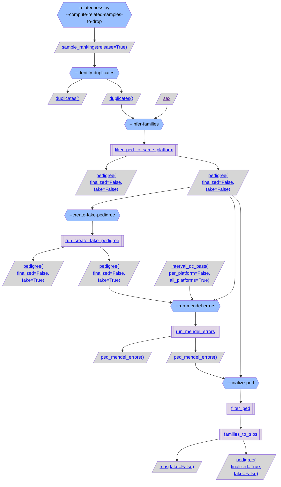

# gnomAD v4 sample QC overview:

```mermaid
flowchart TB;
  classDef script_color fill:#2C5D4A,color:#000000
  classDef step_color fill:#98BFFF,color:#000000
  classDef func_color fill:#E0D5E6,color:#000000
  classDef gnomad_methods_color fill:#F9F2CE,color:#000000
  classDef hail_color fill:#FAEACE,color:#000000
  classDef resource_color fill:#D6D6D6,color:#000000
  classDef validity_check_color fill:#2C5D4A,color:#000000

  resource_get_joint_qc_[/"<a href='https://github.com/broadinstitute/gnomad_qc/tree/main/gnomad_qc/v4/resources/sample_qc.py#L388'>get_joint_qc()</a>"/]:::resource_color;
  step_prepare_cuking_inputs{{"relatedness.py
--prepare-cuking-inputs"}}:::step_color;
  step_create_cuking_relatedness_table{{"relatedness.py
--create-cuking-relatedness-table"}}:::step_color;
  resource_relatedness_method_cuking[/"<a href='https://github.com/broadinstitute/gnomad_qc/tree/main/gnomad_qc/v4/resources/sample_qc.py#L473'>relatedness(method=cuking)</a>"/]:::resource_color;
  step_run_ibd_on_cuking_pairs{{"relatedness.py
--run-ibd-on-cuking-pairs"}}:::step_color;
  step_finalize_relatedness_ht{{"relatedness.py
--finalize-relatedness-ht"}}:::step_color;
  resource_joint_qc_meta[/"<a href=''>joint_qc_meta</a>"/]:::resource_color;
  step_create_pc_relate_relatedness_table{{"relatedness.py
--create-pc-relate-relatedness-table"}}:::step_color;
  resource_relatedness_method_pc_relate[/"<a href='https://github.com/broadinstitute/gnomad_qc/tree/main/gnomad_qc/v4/resources/sample_qc.py#L473'>relatedness(method=pc_relate)</a>"/]:::resource_color;
  resource_relatedness_method_None[/"<a href='https://github.com/broadinstitute/gnomad_qc/tree/main/gnomad_qc/v4/resources/sample_qc.py#L473'>relatedness(method=None)</a>"/]:::resource_color;
  step_compute_related_samples_to_drop{{"relatedness.py
--compute-related-samples-to-drop"}}:::step_color;
  step_create_finalized_outlier_filter{{"outlier_filtering.py
--create-finalized-outlier-filter"}}:::step_color;
  resource_finalized_outlier_filtering_[/"<a href='https://github.com/broadinstitute/gnomad_qc/tree/main/gnomad_qc/v4/resources/sample_qc.py#L874'>finalized_outlier_filtering()</a>"/]:::resource_color;
  step_run_pc_relate_pca{{"relatedness.py
--run-pc-relate-pca"}}:::step_color;
  resource_pc_relate_pca_scores_[/"<a href='https://github.com/broadinstitute/gnomad_qc/tree/main/gnomad_qc/v4/resources/sample_qc.py#L455'>pc_relate_pca_scores()</a>"/]:::resource_color;
  relatedness_method_pc_relate[/"<a href='https://github.com/broadinstitute/gnomad_qc/tree/main/gnomad_qc/v4/resources/sample_qc.py#L473'>relatedness(method=pc_relate)</a>"/]:::resource_color;
  resource_get_sample_qc_strat_under_three_alt_alleles_data_type_exomes[/"<a href='https://github.com/broadinstitute/gnomad_qc/tree/main/gnomad_qc/v4/resources/sample_qc.py#L44'>get_sample_qc(
strat=under_three_alt_alleles,
data_type=exomes)</a>"/]:::resource_color;
  step_apply_regressed_filters{{"outlier_filtering.py
--apply-regressed-filters"}}:::step_color;
  resource_ancestry_pca_scores_include_unreleasable_samples_False_data_type_joint[/"<a href='https://github.com/broadinstitute/gnomad_qc/tree/main/gnomad_qc/v4/resources/sample_qc.py#L624'>ancestry_pca_scores(
include_unreleasable_samples=False,
data_type=joint)</a>"/]:::resource_color;
  resource_get_pop_ht_data_type_joint[/"<a href='https://github.com/broadinstitute/gnomad_qc/tree/main/gnomad_qc/v4/resources/sample_qc.py#L698'>get_pop_ht(data_type=joint)</a>"/]:::resource_color;
  resource_platform[/"<a href=''>platform</a>"/]:::resource_color;
  step_apply_stratified_filters{{"outlier_filtering.py
--apply-stratified-filters"}}:::step_color;
  resource_stratified_filtering_pop_stratified_True_platform_stratified_True[/"<a href='https://github.com/broadinstitute/gnomad_qc/tree/main/gnomad_qc/v4/resources/sample_qc.py#L749'>stratified_filtering(
pop_stratified=True,
platform_stratified=True)</a>"/]:::resource_color;
  step_apply_nearest_neighbor_filters{{"outlier_filtering.py
--apply-nearest-neighbor-filters"}}:::step_color;
  resource_nearest_neighbors_filtering_[/"<a href='https://github.com/broadinstitute/gnomad_qc/tree/main/gnomad_qc/v4/resources/sample_qc.py#L856'>nearest_neighbors_filtering()</a>"/]:::resource_color;
  resource_regressed_filtering_pop_pc_regressed_True_platform_pc_regressed_True_platform_stratified_False_include_unreleasable_samples_False[/"<a href='https://github.com/broadinstitute/gnomad_qc/tree/main/gnomad_qc/v4/resources/sample_qc.py#L780'>regressed_filtering(
pop_pc_regressed=True,
platform_pc_regressed=True,
platform_stratified=False,
include_unreleasable_samples=False)</a>"/]:::resource_color;
  resource_regressed_filtering_pop_pc_regressed_True_platform_pc_regressed_False_platform_stratified_True_include_unreleasable_samples_False[/"<a href='https://github.com/broadinstitute/gnomad_qc/tree/main/gnomad_qc/v4/resources/sample_qc.py#L780'>regressed_filtering(
pop_pc_regressed=True,
platform_pc_regressed=False,
platform_stratified=True,
include_unreleasable_samples=False)</a>"/]:::resource_color;
  step_determine_nearest_neighbors{{"outlier_filtering.py
--determine-nearest-neighbors"}}:::step_color;
  resource_nearest_neighbors_platform_stratified_True_approximation_False_include_unreleasable_samples_True[/"<a href='https://github.com/broadinstitute/gnomad_qc/tree/main/gnomad_qc/v4/resources/sample_qc.py#L820'>nearest_neighbors(
platform_stratified=True,
approximation=False,
include_unreleasable_samples=True)</a>"/]:::resource_color;
  nearest_neighbors_filtering_[/"<a href='https://github.com/broadinstitute/gnomad_qc/tree/main/gnomad_qc/v4/resources/sample_qc.py#L856'>nearest_neighbors_filtering()</a>"/]:::resource_color;
  resource_sample_rankings_release_True[/"<a href='https://github.com/broadinstitute/gnomad_qc/tree/main/gnomad_qc/v4/resources/sample_qc.py#L547'>sample_rankings(release=True)</a>"/]:::resource_color;
  step_identify_duplicates{{"identify_trios.py
--identify-duplicates"}}:::step_color;
  resource_duplicates_[/"<a href='https://github.com/broadinstitute/gnomad_qc/tree/main/gnomad_qc/v4/resources/sample_qc.py#L895'>duplicates()</a>"/]:::resource_color;
  step_infer_families{{"identify_trios.py
--infer-families"}}:::step_color;
  resource_sex[/"<a href=''>sex</a>"/]:::resource_color;
  resource_pedigree_finalized_False_fake_False[/"<a href='https://github.com/broadinstitute/gnomad_qc/tree/main/gnomad_qc/v4/resources/sample_qc.py#L913'>pedigree(
finalized=False,
fake=False)</a>"/]:::resource_color;
  step_create_fake_pedigree{{"identify_trios.py
--create-fake-pedigree"}}:::step_color;
  step_run_mendel_errors{{"identify_trios.py
--run-mendel-errors"}}:::step_color;
  resource_pedigree_finalized_False_fake_True[/"<a href='https://github.com/broadinstitute/gnomad_qc/tree/main/gnomad_qc/v4/resources/sample_qc.py#L913'>pedigree(
finalized=False,
fake=True)</a>"/]:::resource_color;
  resource_interval_qc_pass_per_platform_False_all_platforms_True[/"<a href='https://github.com/broadinstitute/gnomad_qc/tree/main/gnomad_qc/v4/resources/sample_qc.py#L306'>interval_qc_pass(
per_platform=False,
all_platforms=True)</a>"/]:::resource_color;
  step_finalize_ped{{"identify_trios.py
--finalize-ped"}}:::step_color;
  resource_ped_mendel_errors_[/"<a href='https://github.com/broadinstitute/gnomad_qc/tree/main/gnomad_qc/v4/resources/sample_qc.py#L966'>ped_mendel_errors()</a>"/]:::resource_color;
  trios_fake_False[/"<a href='https://github.com/broadinstitute/gnomad_qc/tree/main/gnomad_qc/v4/resources/sample_qc.py#L945'>trios(fake=False)</a>"/]:::resource_color;
  pedigree_finalized_True_fake_False[/"<a href='https://github.com/broadinstitute/gnomad_qc/tree/main/gnomad_qc/v4/resources/sample_qc.py#L913'>pedigree(
finalized=True,
fake=False)</a>"/]:::resource_color;
  resource_get_joint_qc_ --> step_prepare_cuking_inputs;
  step_create_cuking_relatedness_table --> resource_relatedness_method_cuking;
  resource_relatedness_method_cuking --> step_run_ibd_on_cuking_pairs;
  resource_get_joint_qc_ --> step_run_ibd_on_cuking_pairs;
  resource_relatedness_method_cuking --> step_finalize_relatedness_ht;
  resource_joint_qc_meta --> step_finalize_relatedness_ht;
  step_create_pc_relate_relatedness_table --> resource_relatedness_method_pc_relate;
  resource_relatedness_method_pc_relate --> step_finalize_relatedness_ht;
  step_finalize_relatedness_ht --> resource_relatedness_method_None;
  resource_relatedness_method_None --> step_compute_related_samples_to_drop;
  resource_get_joint_qc_ --> step_compute_related_samples_to_drop;
  resource_joint_qc_meta --> step_compute_related_samples_to_drop;
  step_create_finalized_outlier_filter --> resource_finalized_outlier_filtering_;
  resource_finalized_outlier_filtering_ --> step_compute_related_samples_to_drop;
  resource_get_joint_qc_ --> step_run_pc_relate_pca;
  step_run_pc_relate_pca --> resource_pc_relate_pca_scores_;
  resource_pc_relate_pca_scores_ --> step_create_pc_relate_relatedness_table;
  resource_get_joint_qc_ --> step_create_pc_relate_relatedness_table;
  step_create_pc_relate_relatedness_table --> relatedness_method_pc_relate;
  resource_get_sample_qc_strat_under_three_alt_alleles_data_type_exomes --> step_apply_regressed_filters;
  resource_ancestry_pca_scores_include_unreleasable_samples_False_data_type_joint --> step_apply_regressed_filters;
  resource_get_pop_ht_data_type_joint --> step_apply_regressed_filters;
  resource_platform --> step_apply_regressed_filters;
  resource_joint_qc_meta --> step_apply_regressed_filters;
  step_apply_stratified_filters --> resource_stratified_filtering_pop_stratified_True_platform_stratified_True;
  resource_stratified_filtering_pop_stratified_True_platform_stratified_True --> step_create_finalized_outlier_filter;
  step_apply_nearest_neighbor_filters --> resource_nearest_neighbors_filtering_;
  resource_nearest_neighbors_filtering_ --> step_create_finalized_outlier_filter;
  step_apply_regressed_filters --> resource_regressed_filtering_pop_pc_regressed_True_platform_pc_regressed_True_platform_stratified_False_include_unreleasable_samples_False;
  resource_regressed_filtering_pop_pc_regressed_True_platform_pc_regressed_True_platform_stratified_False_include_unreleasable_samples_False --> step_create_finalized_outlier_filter;
  step_apply_regressed_filters --> resource_regressed_filtering_pop_pc_regressed_True_platform_pc_regressed_False_platform_stratified_True_include_unreleasable_samples_False;
  resource_regressed_filtering_pop_pc_regressed_True_platform_pc_regressed_False_platform_stratified_True_include_unreleasable_samples_False --> step_create_finalized_outlier_filter;
  resource_get_sample_qc_strat_under_three_alt_alleles_data_type_exomes --> step_apply_stratified_filters;
  resource_get_pop_ht_data_type_joint --> step_apply_stratified_filters;
  resource_platform --> step_apply_stratified_filters;
  resource_get_sample_qc_strat_under_three_alt_alleles_data_type_exomes --> step_determine_nearest_neighbors;
  resource_get_pop_ht_data_type_joint --> step_determine_nearest_neighbors;
  resource_platform --> step_determine_nearest_neighbors;
  resource_get_sample_qc_strat_under_three_alt_alleles_data_type_exomes --> step_apply_nearest_neighbor_filters;
  step_determine_nearest_neighbors --> resource_nearest_neighbors_platform_stratified_True_approximation_False_include_unreleasable_samples_True;
  resource_nearest_neighbors_platform_stratified_True_approximation_False_include_unreleasable_samples_True --> step_apply_nearest_neighbor_filters;
  step_apply_nearest_neighbor_filters --> nearest_neighbors_filtering_;
  step_compute_related_samples_to_drop --> resource_sample_rankings_release_True;
  resource_sample_rankings_release_True --> step_identify_duplicates;
  step_identify_duplicates --> resource_duplicates_;
  resource_duplicates_ --> step_infer_families;
  resource_sex --> step_infer_families;
  step_infer_families --> resource_pedigree_finalized_False_fake_False;
  resource_pedigree_finalized_False_fake_False --> step_create_fake_pedigree;
  resource_pedigree_finalized_False_fake_False --> step_run_mendel_errors;
  step_create_fake_pedigree --> resource_pedigree_finalized_False_fake_True;
  resource_pedigree_finalized_False_fake_True --> step_run_mendel_errors;
  resource_interval_qc_pass_per_platform_False_all_platforms_True --> step_run_mendel_errors;
  resource_pedigree_finalized_False_fake_False --> step_finalize_ped;
  step_run_mendel_errors --> resource_ped_mendel_errors_;
  resource_ped_mendel_errors_ --> step_finalize_ped;
  step_finalize_ped --> trios_fake_False;
  step_finalize_ped --> pedigree_finalized_True_fake_False;
```

### [relatedness.py](https://github.com/broadinstitute/gnomad_qc/tree/main/gnomad_qc/v4/sample_qc/relatedness.py): Script to compute relatedness estimates among pairs of samples in the callset.


## Relatedness

We use [`cuKING`](https://github.com/populationgenomics/cuKING) for pruning related samples for v4. Make sure that you've cloned the `cuKING` git submodule in this directory (`git submodule update --init`). Then follow these steps:

### Preparing the production environment

Below, `$PROJECT_ID` refers to the GCP project ID for gnomAD production.

```sh
gcloud config set project $PROJECT_ID
```

Enable the necessary services:

```sh
gcloud services enable \
    artifactregistry.googleapis.com \
    batch.googleapis.com \
    cloudbuild.googleapis.com
```

Create an Artifact Registry repository for Docker images:

```sh
gcloud artifacts repositories create images --location=us-central1 --repository-format=docker
```

Build the Docker image:

```sh
cd cuKING
gcloud builds submit --region=us-central1 --config cloudbuild.yaml --substitutions=TAG_NAME=$(git describe --tags) .
```

This should take about half an hour.

Create a service account for running `cuKING`:

```sh
gcloud iam service-accounts create cuking
```

Grant the service account access permissions for:

* the Artifact Registry repository,

  ```sh
  gcloud artifacts repositories add-iam-policy-binding images \
      --location=us-central1 \
      --member=serviceAccount:cuking@$PROJECT_ID.iam.gserviceaccount.com \
      --role=roles/artifactregistry.reader
  ```

* Cloud Batch related roles on the project level, and

  ```sh
  for role in role=roles/batch.agentReporter roles/serviceusage.serviceUsageConsumer roles/logging.logWriter roles/monitoring.metricWriter
  do
      gcloud projects add-iam-policy-binding $PROJECT_ID --member=serviceAccount:cuking@$PROJECT_ID.iam.gserviceaccount.com --role=$role
  done
  ```

* the `gnomad` and `gnomad-tmp` buckets.

  ```sh
  for bucket in gnomad gnomad-tmp
  do
      gsutil iam ch serviceAccount:cuking@$PROJECT_ID.iam.gserviceaccount.com:objectAdmin gs://$bucket
  done
  ```

Create a VM instance template:

```sh
gcloud compute instance-templates create cuking-instance-template \
    --project=$PROJECT_ID \
    --machine-type=a2-highgpu-1g \
    --network-interface=network=default,network-tier=PREMIUM,address="" \
    --metadata-from-file=startup-script=instance_startup_script.sh \
    --maintenance-policy=TERMINATE \
    --provisioning-model=STANDARD \
    --service-account=cuking@$PROJECT_ID.iam.gserviceaccount.com \
    --scopes=https://www.googleapis.com/auth/cloud-platform \
    --accelerator=count=1,type=nvidia-tesla-a100 \
    --create-disk=auto-delete=yes,boot=yes,device-name=cuking-instance-template,image=projects/ubuntu-os-cloud/global/images/ubuntu-1804-bionic-v20220712,mode=rw,size=10,type=pd-balanced \
    --no-shielded-secure-boot \
    --shielded-vtpm \
    --shielded-integrity-monitoring \
    --reservation-affinity=any
```

The above instance template uses A2 machines with NVIDIA A100 GPUs. Make sure that your [quotas](https://console.cloud.google.com/iam-admin/quotas) are set sufficiently high for `NVIDIA_A100_GPUS` and `A2_CPUS` (e.g. 16 and 192, respectively).

Make sure that the [firewall configuration](https://console.cloud.google.com/networking/firewalls/list) contains a rule to allow internal traffic (like [`default-allow-internal`](https://cloud.google.com/vpc/docs/firewalls#default_firewall_rules) for the default network).

### Prepare inputs

Start an autoscaling Hail Dataproc cluster with 20 secondary workers and submit `relatedness.py --prepare-inputs`. This should take about an hour.

### Run `cuKING`

This step doesn't need a Dataproc cluster. Run the command printed by `relatedness.py --print-cuking-command` to submit a Cloud Batch job. This should take about two hours.

### Convert outputs

`cuKING` writes Parquet files. To convert these to a standard Hail Table, run `relatedness.py --create-relatedness-table` on a small Dataproc cluster. This should only take a minute.

### Determine samples to drop

To prune samples up to second degree relatedness, run `relatedness.py --compute-related-samples-to-drop` on a small Dataproc cluster. This should only take a few minutes.

### Inferring relationships for closely related samples

`get_relatedness_annotated_ht()` annotates the relatedness Table for closely related samples based on the kinship and IBS values computed by cuKING.

### [outlier_filtering.py](https://github.com/broadinstitute/gnomad_qc/tree/main/gnomad_qc/v4/sample_qc/outlier_filtering.py): Script to determine sample QC metric outliers that should be filtered.

```mermaid
flowchart TB;
  classDef script_color fill:#2C5D4A,color:#000000
  classDef step_color fill:#98BFFF,color:#000000
  classDef func_color fill:#E0D5E6,color:#000000
  classDef gnomad_methods_color fill:#F9F2CE,color:#000000
  classDef hail_color fill:#FAEACE,color:#000000
  classDef resource_color fill:#D6D6D6,color:#000000
  classDef validity_check_color fill:#2C5D4A,color:#000000

  resource_get_sample_qc_strat_under_three_alt_alleles_data_type_exomes[/"<a href='https://github.com/broadinstitute/gnomad_qc/tree/main/gnomad_qc/v4/resources/sample_qc.py#L44'>get_sample_qc(
strat=under_three_alt_alleles,
data_type=exomes)</a>"/]:::resource_color;
  step_apply_regressed_filters{{"--apply-regressed-filters"}}:::step_color;
  resource_ancestry_pca_scores_include_unreleasable_samples_False_data_type_joint[/"<a href='https://github.com/broadinstitute/gnomad_qc/tree/main/gnomad_qc/v4/resources/sample_qc.py#L624'>ancestry_pca_scores(
include_unreleasable_samples=False,
data_type=joint)</a>"/]:::resource_color;
  resource_get_pop_ht_data_type_joint[/"<a href='https://github.com/broadinstitute/gnomad_qc/tree/main/gnomad_qc/v4/resources/sample_qc.py#L698'>get_pop_ht(data_type=joint)</a>"/]:::resource_color;
  resource_platform[/"<a href=''>platform</a>"/]:::resource_color;
  resource_joint_qc_meta[/"<a href=''>joint_qc_meta</a>"/]:::resource_color;
  step_apply_stratified_filters{{"--apply-stratified-filters"}}:::step_color;
  resource_stratified_filtering_pop_stratified_True_platform_stratified_True[/"<a href='https://github.com/broadinstitute/gnomad_qc/tree/main/gnomad_qc/v4/resources/sample_qc.py#L749'>stratified_filtering(
pop_stratified=True,
platform_stratified=True)</a>"/]:::resource_color;
  step_create_finalized_outlier_filter{{"--create-finalized-outlier-filter"}}:::step_color;
  func_create_finalized_outlier_filter_ht[["<a href='https://github.com/broadinstitute/gnomad_qc/tree/main/gnomad_qc/v4/sample_qc/outlier_filtering.py#L587'>create_finalized_outlier_filter_ht</a>"]]:::func_color;
  finalized_outlier_filtering_[/"<a href='https://github.com/broadinstitute/gnomad_qc/tree/main/gnomad_qc/v4/resources/sample_qc.py#L874'>finalized_outlier_filtering()</a>"/]:::resource_color;
  step_apply_nearest_neighbor_filters{{"--apply-nearest-neighbor-filters"}}:::step_color;
  resource_nearest_neighbors_filtering_[/"<a href='https://github.com/broadinstitute/gnomad_qc/tree/main/gnomad_qc/v4/resources/sample_qc.py#L856'>nearest_neighbors_filtering()</a>"/]:::resource_color;
  resource_regressed_filtering_pop_pc_regressed_True_platform_pc_regressed_True_platform_stratified_False_include_unreleasable_samples_False[/"<a href='https://github.com/broadinstitute/gnomad_qc/tree/main/gnomad_qc/v4/resources/sample_qc.py#L780'>regressed_filtering(
pop_pc_regressed=True,
platform_pc_regressed=True,
platform_stratified=False,
include_unreleasable_samples=False)</a>"/]:::resource_color;
  resource_regressed_filtering_pop_pc_regressed_True_platform_pc_regressed_False_platform_stratified_True_include_unreleasable_samples_False[/"<a href='https://github.com/broadinstitute/gnomad_qc/tree/main/gnomad_qc/v4/resources/sample_qc.py#L780'>regressed_filtering(
pop_pc_regressed=True,
platform_pc_regressed=False,
platform_stratified=True,
include_unreleasable_samples=False)</a>"/]:::resource_color;
  step_determine_nearest_neighbors{{"--determine-nearest-neighbors"}}:::step_color;
  nearest_neighbors_filtering_[/"<a href='https://github.com/broadinstitute/gnomad_qc/tree/main/gnomad_qc/v4/resources/sample_qc.py#L856'>nearest_neighbors_filtering()</a>"/]:::resource_color;
  resource_nearest_neighbors_platform_stratified_True_approximation_False_include_unreleasable_samples_True[/"<a href='https://github.com/broadinstitute/gnomad_qc/tree/main/gnomad_qc/v4/resources/sample_qc.py#L820'>nearest_neighbors(
platform_stratified=True,
approximation=False,
include_unreleasable_samples=True)</a>"/]:::resource_color;
  resource_get_sample_qc_strat_under_three_alt_alleles_data_type_exomes --> step_apply_regressed_filters;
  resource_ancestry_pca_scores_include_unreleasable_samples_False_data_type_joint --> step_apply_regressed_filters;
  resource_get_pop_ht_data_type_joint --> step_apply_regressed_filters;
  resource_platform --> step_apply_regressed_filters;
  resource_joint_qc_meta --> step_apply_regressed_filters;
  step_apply_stratified_filters --> resource_stratified_filtering_pop_stratified_True_platform_stratified_True;
  resource_stratified_filtering_pop_stratified_True_platform_stratified_True --> step_create_finalized_outlier_filter;
  step_create_finalized_outlier_filter --> func_create_finalized_outlier_filter_ht;
  func_create_finalized_outlier_filter_ht --> finalized_outlier_filtering_;
  step_apply_nearest_neighbor_filters --> resource_nearest_neighbors_filtering_;
  resource_nearest_neighbors_filtering_ --> step_create_finalized_outlier_filter;
  step_apply_regressed_filters --> resource_regressed_filtering_pop_pc_regressed_True_platform_pc_regressed_True_platform_stratified_False_include_unreleasable_samples_False;
  resource_regressed_filtering_pop_pc_regressed_True_platform_pc_regressed_True_platform_stratified_False_include_unreleasable_samples_False --> step_create_finalized_outlier_filter;
  step_apply_regressed_filters --> resource_regressed_filtering_pop_pc_regressed_True_platform_pc_regressed_False_platform_stratified_True_include_unreleasable_samples_False;
  resource_regressed_filtering_pop_pc_regressed_True_platform_pc_regressed_False_platform_stratified_True_include_unreleasable_samples_False --> step_create_finalized_outlier_filter;
  resource_get_sample_qc_strat_under_three_alt_alleles_data_type_exomes --> step_apply_stratified_filters;
  resource_get_pop_ht_data_type_joint --> step_apply_stratified_filters;
  resource_platform --> step_apply_stratified_filters;
  resource_get_sample_qc_strat_under_three_alt_alleles_data_type_exomes --> step_determine_nearest_neighbors;
  resource_get_pop_ht_data_type_joint --> step_determine_nearest_neighbors;
  resource_platform --> step_determine_nearest_neighbors;
  resource_get_sample_qc_strat_under_three_alt_alleles_data_type_exomes --> step_apply_nearest_neighbor_filters;
  step_apply_nearest_neighbor_filters --> nearest_neighbors_filtering_;
  step_determine_nearest_neighbors --> resource_nearest_neighbors_platform_stratified_True_approximation_False_include_unreleasable_samples_True;
  resource_nearest_neighbors_platform_stratified_True_approximation_False_include_unreleasable_samples_True --> step_apply_nearest_neighbor_filters;
```

### [identify_trios.py](https://github.com/broadinstitute/gnomad_qc/tree/main/gnomad_qc/v4/sample_qc/identify_trios.py): Script to identify trios from relatedness data and filter based on Mendel errors and de novos.

