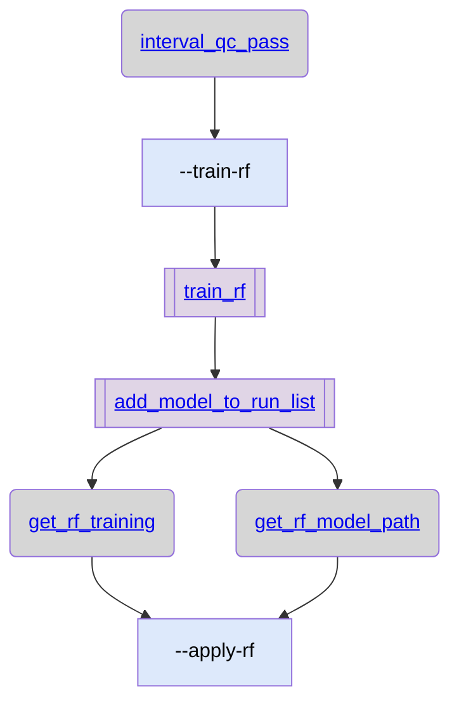
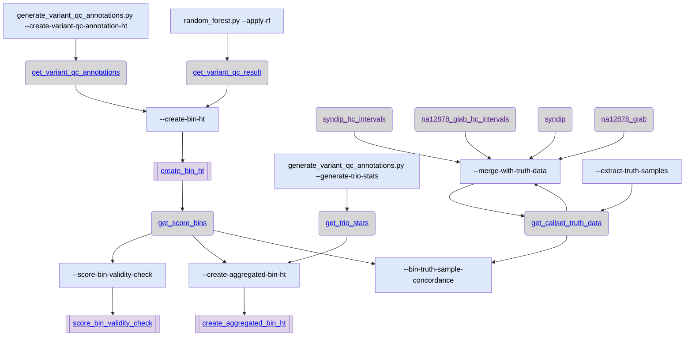
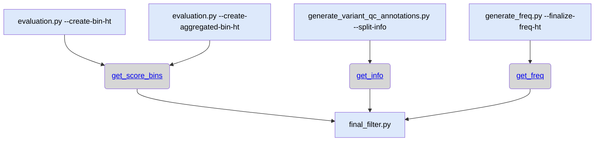
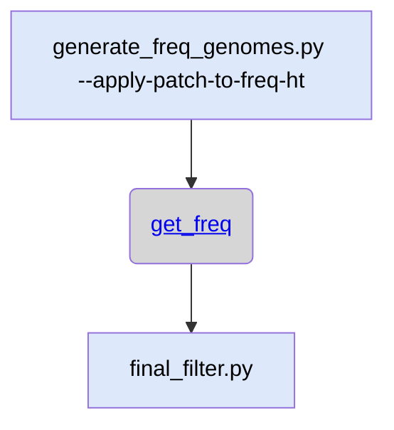

# gnomAD v4 variantQC overview:

```mermaid
flowchart TB;
  classDef script_color fill:#2C5D4A,color:#000000
  classDef step_color fill:#DDE9FB,color:#000000
  classDef func_color fill:#E0D5E6,color:#000000
  classDef gnomad_methods_color fill:#F9F2CE,color:#000000
  classDef hail_color fill:#FAEACE,color:#000000
  classDef resource_color fill:#D6D6D6,color:#000000
  classDef validity_check_color fill:#2C5D4A,color:#000000

  resource_interval_qc_pass("<a href='https://github.com/broadinstitute/gnomad_qc/tree/main/gnomad_qc/v4/resources/sample_qc.py#L306'>interval_qc_pass</a>"):::resource_color;
  step_train_rf["random_forest.py --train-rf"]:::step_color;
  resource_get_rf_training("<a href='https://github.com/broadinstitute/gnomad_qc/tree/main/gnomad_qc/v4/resources/variant_qc.py#L238'>get_rf_training</a>"):::resource_color;
  step_apply_rf["random_forest.py --apply-rf"]:::step_color;
  resource_get_rf_model_path("<a href='https://github.com/broadinstitute/gnomad_qc/tree/main/gnomad_qc/v4/resources/variant_qc.py#L222'>get_rf_model_path</a>"):::resource_color;
  step_create_variant_qc_annotation_ht["generate_variant_qc_annotations.py --create-variant-qc-annotation-ht"]:::step_color;
  resource_get_variant_qc_annotations("<a href='https://github.com/broadinstitute/gnomad_qc/tree/main/gnomad_qc/v4/resources/annotations.py#L149'>get_variant_qc_annotations</a>"):::resource_color;
  step_create_bin_ht["evaluation.py --create-bin-ht"]:::step_color;
  resource_get_variant_qc_result("<a href='https://github.com/broadinstitute/gnomad_qc/tree/main/gnomad_qc/v4/resources/variant_qc.py#L257'>get_variant_qc_result</a>"):::resource_color;
  resource_get_score_bins("<a href='https://github.com/broadinstitute/gnomad_qc/tree/main/gnomad_qc/v4/resources/variant_qc.py#L156'>get_score_bins</a>"):::resource_color;
  step_score_bin_validity_check["evaluation.py --score-bin-validity-check"]:::step_color;
  step_create_aggregated_bin_ht["evaluation.py --create-aggregated-bin-ht"]:::step_color;
  step_generate_trio_stats["generate_variant_qc_annotations.py --generate-trio-stats"]:::step_color;
  resource_get_trio_stats("<a href='https://github.com/broadinstitute/gnomad_qc/tree/main/gnomad_qc/v4/resources/annotations.py#L113'>get_trio_stats</a>"):::resource_color;
  step_bin_truth_sample_concordance["evaluation.py --bin-truth-sample-concordance"]:::step_color;
  step_merge_with_truth_data["evaluation.py --merge-with-truth-data"]:::step_color;
  resource_get_callset_truth_data("<a href='https://github.com/broadinstitute/gnomad_qc/tree/main/gnomad_qc/v4/resources/variant_qc.py#L119'>get_callset_truth_data</a>"):::resource_color;
  step_extract_truth_samples["evaluation.py --extract-truth-samples"]:::step_color;
  resource_syndip_hc_intervals("<a href=''>syndip_hc_intervals</a>"):::resource_color;
  resource_na12878_giab_hc_intervals("<a href=''>na12878_giab_hc_intervals</a>"):::resource_color;
  resource_syndip("<a href=''>syndip</a>"):::resource_color;
  resource_na12878_giab("<a href=''>na12878_giab</a>"):::resource_color;
  step_final_filter.py["final_filter.py"]:::step_color;
  step_split_info["generate_variant_qc_annotations.py --split-info"]:::step_color;
  resource_get_info("<a href='https://github.com/broadinstitute/gnomad_qc/tree/main/gnomad_qc/v4/resources/annotations.py#L47'>get_info</a>"):::resource_color;
  step_finalize_freq_ht["generate_freq.py --finalize-freq-ht"]:::step_color;
  resource_get_freq("<a href='https://github.com/broadinstitute/gnomad_qc/tree/main/gnomad_qc/v4/resources/annotations.py#L284'>get_freq</a>"):::resource_color;
  step_apply_patch_to_freq_ht["generate_freq_genomes.py --apply-patch-to-freq-ht"]:::step_color;
  resource_interval_qc_pass --> step_train_rf;
  step_train_rf --> resource_get_rf_training;
  resource_get_rf_training --> step_apply_rf;
  step_train_rf --> resource_get_rf_model_path;
  resource_get_rf_model_path --> step_apply_rf;
  step_create_variant_qc_annotation_ht --> resource_get_variant_qc_annotations;
  resource_get_variant_qc_annotations --> step_create_bin_ht;
  resource_get_variant_qc_result --> step_create_bin_ht;
  step_apply_rf --> resource_get_variant_qc_result;
  step_create_bin_ht --> resource_get_score_bins;
  resource_get_score_bins --> step_score_bin_validity_check;
  resource_get_score_bins --> step_create_aggregated_bin_ht;
  step_generate_trio_stats --> resource_get_trio_stats;
  resource_get_trio_stats --> step_create_aggregated_bin_ht;
  resource_get_score_bins --> step_bin_truth_sample_concordance;
  step_merge_with_truth_data --> resource_get_callset_truth_data;
  resource_get_callset_truth_data --> step_bin_truth_sample_concordance;
  step_extract_truth_samples --> resource_get_callset_truth_data;
  resource_get_callset_truth_data --> step_merge_with_truth_data;
  resource_syndip_hc_intervals --> step_merge_with_truth_data;
  resource_na12878_giab_hc_intervals --> step_merge_with_truth_data;
  resource_syndip --> step_merge_with_truth_data;
  resource_na12878_giab --> step_merge_with_truth_data;
  resource_get_score_bins --> step_final_filter.py;
  step_create_aggregated_bin_ht --> resource_get_score_bins;
  step_split_info --> resource_get_info;
  resource_get_info --> step_final_filter.py;
  step_finalize_freq_ht --> resource_get_freq;
  resource_get_freq --> step_final_filter.py;
  step_apply_patch_to_freq_ht --> resource_get_freq;
```

### [random_forest.py](https://github.com/broadinstitute/gnomad_qc/tree/main/gnomad_qc/v4/variant_qc/random_forest.py): Script for running random forest model on gnomAD v4 variant QC data.

### [evaluation.py](https://github.com/broadinstitute/gnomad_qc/tree/main/gnomad_qc/v4/variant_qc/evaluation.py): Script to create Tables with aggregate variant statistics by variant QC score bins needed for evaluation plots.

### [final_filter.py](https://github.com/broadinstitute/gnomad_qc/tree/main/gnomad_qc/v4/variant_qc/final_filter.py): Script to create final filter Table for release.

### [final_filter_genomes.py](https://github.com/broadinstitute/gnomad_qc/tree/main/gnomad_qc/v4/variant_qc/final_filter_genomes.py): Script to create final filter Table for v4 genomes release.

