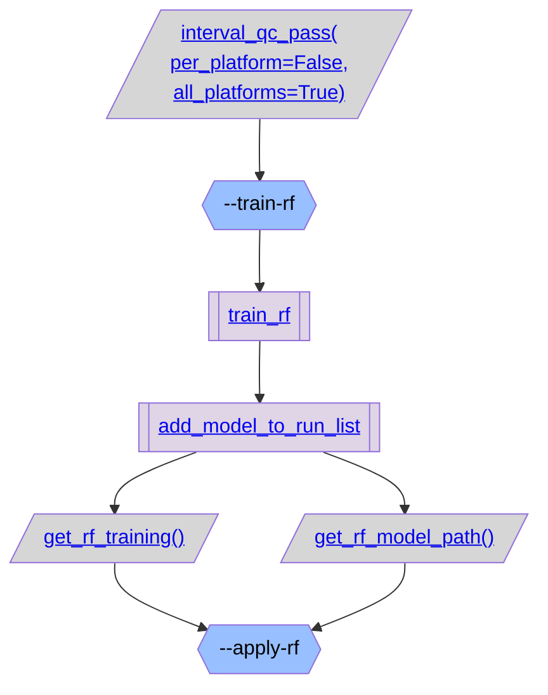
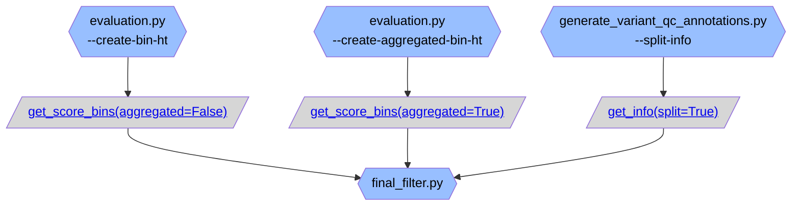

# gnomAD v4 variant QC overview:

```mermaid
flowchart TB;
  classDef script_color fill:#2C5D4A,color:#000000
  classDef step_color fill:#98BFFF,color:#000000
  classDef func_color fill:#E0D5E6,color:#000000
  classDef gnomad_methods_color fill:#F9F2CE,color:#000000
  classDef hail_color fill:#FAEACE,color:#000000
  classDef resource_color fill:#D6D6D6,color:#000000
  classDef validity_check_color fill:#2C5D4A,color:#000000

  resource_interval_qc_pass_per_platform_False_all_platforms_True[/"<a href='https://github.com/broadinstitute/gnomad_qc/tree/main/gnomad_qc/v4/resources/sample_qc.py#L306'>interval_qc_pass(
per_platform=False,
all_platforms=True)</a>"/]:::resource_color;
  step_train_rf{{"random_forest.py
--train-rf"}}:::step_color;
  resource_get_rf_training_[/"<a href='https://github.com/broadinstitute/gnomad_qc/tree/main/gnomad_qc/v4/resources/variant_qc.py#L238'>get_rf_training()</a>"/]:::resource_color;
  step_apply_rf{{"random_forest.py
--apply-rf"}}:::step_color;
  resource_get_rf_model_path_[/"<a href='https://github.com/broadinstitute/gnomad_qc/tree/main/gnomad_qc/v4/resources/variant_qc.py#L222'>get_rf_model_path()</a>"/]:::resource_color;
  step_create_variant_qc_annotation_ht{{"generate_variant_qc_annotations.py
--create-variant-qc-annotation-ht"}}:::step_color;
  resource_get_variant_qc_annotations_[/"<a href='https://github.com/broadinstitute/gnomad_qc/tree/main/gnomad_qc/v4/resources/annotations.py#L149'>get_variant_qc_annotations()</a>"/]:::resource_color;
  step_create_bin_ht{{"evaluation.py
--create-bin-ht"}}:::step_color;
  resource_get_variant_qc_result_split_True[/"<a href='https://github.com/broadinstitute/gnomad_qc/tree/main/gnomad_qc/v4/resources/variant_qc.py#L257'>get_variant_qc_result(split=True)</a>"/]:::resource_color;
  resource_get_score_bins_aggregated_False[/"<a href='https://github.com/broadinstitute/gnomad_qc/tree/main/gnomad_qc/v4/resources/variant_qc.py#L156'>get_score_bins(aggregated=False)</a>"/]:::resource_color;
  step_score_bin_validity_check{{"evaluation.py
--score-bin-validity-check"}}:::step_color;
  step_create_aggregated_bin_ht{{"evaluation.py
--create-aggregated-bin-ht"}}:::step_color;
  step_generate_trio_stats{{"generate_variant_qc_annotations.py
--generate-trio-stats"}}:::step_color;
  resource_get_trio_stats_[/"<a href='https://github.com/broadinstitute/gnomad_qc/tree/main/gnomad_qc/v4/resources/annotations.py#L113'>get_trio_stats()</a>"/]:::resource_color;
  step_bin_truth_sample_concordance{{"evaluation.py
--bin-truth-sample-concordance"}}:::step_color;
  step_merge_with_truth_data{{"evaluation.py
--merge-with-truth-data"}}:::step_color;
  resource_get_callset_truth_data_truth_sample_syndip_mt_False[/"<a href='https://github.com/broadinstitute/gnomad_qc/tree/main/gnomad_qc/v4/resources/variant_qc.py#L119'>get_callset_truth_data(
truth_sample=syndip,
mt=False)</a>"/]:::resource_color;
  resource_get_callset_truth_data_truth_sample_NA12878_mt_False[/"<a href='https://github.com/broadinstitute/gnomad_qc/tree/main/gnomad_qc/v4/resources/variant_qc.py#L119'>get_callset_truth_data(
truth_sample=NA12878,
mt=False)</a>"/]:::resource_color;
  resource_get_callset_truth_data_truth_sample_UKB_NA12878_mt_False[/"<a href='https://github.com/broadinstitute/gnomad_qc/tree/main/gnomad_qc/v4/resources/variant_qc.py#L119'>get_callset_truth_data(
truth_sample=UKB_NA12878,
mt=False)</a>"/]:::resource_color;
  step_extract_truth_samples{{"evaluation.py
--extract-truth-samples"}}:::step_color;
  resource_get_callset_truth_data_truth_sample_syndip_mt_True[/"<a href='https://github.com/broadinstitute/gnomad_qc/tree/main/gnomad_qc/v4/resources/variant_qc.py#L119'>get_callset_truth_data(
truth_sample=syndip,
mt=True)</a>"/]:::resource_color;
  resource_get_callset_truth_data_truth_sample_NA12878_mt_True[/"<a href='https://github.com/broadinstitute/gnomad_qc/tree/main/gnomad_qc/v4/resources/variant_qc.py#L119'>get_callset_truth_data(
truth_sample=NA12878,
mt=True)</a>"/]:::resource_color;
  resource_get_callset_truth_data_truth_sample_UKB_NA12878_mt_True[/"<a href='https://github.com/broadinstitute/gnomad_qc/tree/main/gnomad_qc/v4/resources/variant_qc.py#L119'>get_callset_truth_data(
truth_sample=UKB_NA12878,
mt=True)</a>"/]:::resource_color;
  resource_syndip_hc_intervals[/"<a href=''>syndip_hc_intervals</a>"/]:::resource_color;
  resource_na12878_giab_hc_intervals[/"<a href=''>na12878_giab_hc_intervals</a>"/]:::resource_color;
  resource_syndip[/"<a href=''>syndip</a>"/]:::resource_color;
  resource_na12878_giab[/"<a href=''>na12878_giab</a>"/]:::resource_color;
  step_final_filter.py{{"final_filter.py"}}:::step_color;
  resource_get_score_bins_aggregated_True[/"<a href='https://github.com/broadinstitute/gnomad_qc/tree/main/gnomad_qc/v4/resources/variant_qc.py#L156'>get_score_bins(aggregated=True)</a>"/]:::resource_color;
  step_split_info{{"generate_variant_qc_annotations.py
--split-info"}}:::step_color;
  resource_get_info_split_True[/"<a href='https://github.com/broadinstitute/gnomad_qc/tree/main/gnomad_qc/v4/resources/annotations.py#L47'>get_info(split=True)</a>"/]:::resource_color;
  resource_interval_qc_pass_per_platform_False_all_platforms_True --> step_train_rf;
  step_train_rf --> resource_get_rf_training_;
  resource_get_rf_training_ --> step_apply_rf;
  step_train_rf --> resource_get_rf_model_path_;
  resource_get_rf_model_path_ --> step_apply_rf;
  step_create_variant_qc_annotation_ht --> resource_get_variant_qc_annotations_;
  resource_get_variant_qc_annotations_ --> step_create_bin_ht;
  resource_get_variant_qc_result_split_True --> step_create_bin_ht;
  step_create_bin_ht --> resource_get_score_bins_aggregated_False;
  resource_get_score_bins_aggregated_False --> step_score_bin_validity_check;
  resource_get_score_bins_aggregated_False --> step_create_aggregated_bin_ht;
  step_generate_trio_stats --> resource_get_trio_stats_;
  resource_get_trio_stats_ --> step_create_aggregated_bin_ht;
  resource_get_score_bins_aggregated_False --> step_bin_truth_sample_concordance;
  step_merge_with_truth_data --> resource_get_callset_truth_data_truth_sample_syndip_mt_False;
  resource_get_callset_truth_data_truth_sample_syndip_mt_False --> step_bin_truth_sample_concordance;
  step_merge_with_truth_data --> resource_get_callset_truth_data_truth_sample_NA12878_mt_False;
  resource_get_callset_truth_data_truth_sample_NA12878_mt_False --> step_bin_truth_sample_concordance;
  step_merge_with_truth_data --> resource_get_callset_truth_data_truth_sample_UKB_NA12878_mt_False;
  resource_get_callset_truth_data_truth_sample_UKB_NA12878_mt_False --> step_bin_truth_sample_concordance;
  step_extract_truth_samples --> resource_get_callset_truth_data_truth_sample_syndip_mt_True;
  resource_get_callset_truth_data_truth_sample_syndip_mt_True --> step_merge_with_truth_data;
  step_extract_truth_samples --> resource_get_callset_truth_data_truth_sample_NA12878_mt_True;
  resource_get_callset_truth_data_truth_sample_NA12878_mt_True --> step_merge_with_truth_data;
  step_extract_truth_samples --> resource_get_callset_truth_data_truth_sample_UKB_NA12878_mt_True;
  resource_get_callset_truth_data_truth_sample_UKB_NA12878_mt_True --> step_merge_with_truth_data;
  resource_syndip_hc_intervals --> step_merge_with_truth_data;
  resource_na12878_giab_hc_intervals --> step_merge_with_truth_data;
  resource_syndip --> step_merge_with_truth_data;
  resource_na12878_giab --> step_merge_with_truth_data;
  resource_get_score_bins_aggregated_False --> step_final_filter.py;
  step_create_aggregated_bin_ht --> resource_get_score_bins_aggregated_True;
  resource_get_score_bins_aggregated_True --> step_final_filter.py;
  step_split_info --> resource_get_info_split_True;
  resource_get_info_split_True --> step_final_filter.py;
```

### [random_forest.py](https://github.com/broadinstitute/gnomad_qc/tree/main/gnomad_qc/v4/variant_qc/random_forest.py): Script for running random forest model on gnomAD v4 variant QC data.

### [evaluation.py](https://github.com/broadinstitute/gnomad_qc/tree/main/gnomad_qc/v4/variant_qc/evaluation.py): Script to create Tables with aggregate variant statistics by variant QC score bins needed for evaluation plots.

```mermaid
flowchart TB;
  classDef script_color fill:#2C5D4A,color:#000000
  classDef step_color fill:#98BFFF,color:#000000
  classDef func_color fill:#E0D5E6,color:#000000
  classDef gnomad_methods_color fill:#F9F2CE,color:#000000
  classDef hail_color fill:#FAEACE,color:#000000
  classDef resource_color fill:#D6D6D6,color:#000000
  classDef validity_check_color fill:#2C5D4A,color:#000000

  step_create_variant_qc_annotation_ht{{"generate_variant_qc_annotations.py
--create-variant-qc-annotation-ht"}}:::step_color;
  resource_get_variant_qc_annotations_[/"<a href='https://github.com/broadinstitute/gnomad_qc/tree/main/gnomad_qc/v4/resources/annotations.py#L149'>get_variant_qc_annotations()</a>"/]:::resource_color;
  step_create_bin_ht{{"--create-bin-ht"}}:::step_color;
  func_create_bin_ht[["<a href='https://github.com/broadinstitute/gnomad_qc/tree/main/gnomad_qc/v4/variant_qc/evaluation.py#L42'>create_bin_ht</a>"]]:::func_color;
  resource_get_variant_qc_result_split_True[/"<a href='https://github.com/broadinstitute/gnomad_qc/tree/main/gnomad_qc/v4/resources/variant_qc.py#L257'>get_variant_qc_result(split=True)</a>"/]:::resource_color;
  resource_get_score_bins_aggregated_False[/"<a href='https://github.com/broadinstitute/gnomad_qc/tree/main/gnomad_qc/v4/resources/variant_qc.py#L156'>get_score_bins(aggregated=False)</a>"/]:::resource_color;
  step_score_bin_validity_check{{"--score-bin-validity-check"}}:::step_color;
  func_score_bin_validity_check[["<a href='https://github.com/broadinstitute/gnomad_qc/tree/main/gnomad_qc/v4/variant_qc/evaluation.py#L112'>score_bin_validity_check</a>"]]:::func_color;
  step_create_aggregated_bin_ht{{"--create-aggregated-bin-ht"}}:::step_color;
  func_create_aggregated_bin_ht[["<a href='https://github.com/broadinstitute/gnomad_qc/tree/main/gnomad_qc/v4/variant_qc/evaluation.py#L135'>create_aggregated_bin_ht</a>"]]:::func_color;
  step_generate_trio_stats{{"generate_variant_qc_annotations.py
--generate-trio-stats"}}:::step_color;
  resource_get_trio_stats_[/"<a href='https://github.com/broadinstitute/gnomad_qc/tree/main/gnomad_qc/v4/resources/annotations.py#L113'>get_trio_stats()</a>"/]:::resource_color;
  step_bin_truth_sample_concordance{{"--bin-truth-sample-concordance"}}:::step_color;
  step_merge_with_truth_data{{"--merge-with-truth-data"}}:::step_color;
  resource_get_callset_truth_data_truth_sample_syndip_mt_False[/"<a href='https://github.com/broadinstitute/gnomad_qc/tree/main/gnomad_qc/v4/resources/variant_qc.py#L119'>get_callset_truth_data(
truth_sample=syndip,
mt=False)</a>"/]:::resource_color;
  resource_get_callset_truth_data_truth_sample_NA12878_mt_False[/"<a href='https://github.com/broadinstitute/gnomad_qc/tree/main/gnomad_qc/v4/resources/variant_qc.py#L119'>get_callset_truth_data(
truth_sample=NA12878,
mt=False)</a>"/]:::resource_color;
  resource_get_callset_truth_data_truth_sample_UKB_NA12878_mt_False[/"<a href='https://github.com/broadinstitute/gnomad_qc/tree/main/gnomad_qc/v4/resources/variant_qc.py#L119'>get_callset_truth_data(
truth_sample=UKB_NA12878,
mt=False)</a>"/]:::resource_color;
  step_extract_truth_samples{{"--extract-truth-samples"}}:::step_color;
  resource_get_callset_truth_data_truth_sample_syndip_mt_True[/"<a href='https://github.com/broadinstitute/gnomad_qc/tree/main/gnomad_qc/v4/resources/variant_qc.py#L119'>get_callset_truth_data(
truth_sample=syndip,
mt=True)</a>"/]:::resource_color;
  resource_get_callset_truth_data_truth_sample_NA12878_mt_True[/"<a href='https://github.com/broadinstitute/gnomad_qc/tree/main/gnomad_qc/v4/resources/variant_qc.py#L119'>get_callset_truth_data(
truth_sample=NA12878,
mt=True)</a>"/]:::resource_color;
  resource_get_callset_truth_data_truth_sample_UKB_NA12878_mt_True[/"<a href='https://github.com/broadinstitute/gnomad_qc/tree/main/gnomad_qc/v4/resources/variant_qc.py#L119'>get_callset_truth_data(
truth_sample=UKB_NA12878,
mt=True)</a>"/]:::resource_color;
  resource_syndip_hc_intervals[/"<a href=''>syndip_hc_intervals</a>"/]:::resource_color;
  resource_na12878_giab_hc_intervals[/"<a href=''>na12878_giab_hc_intervals</a>"/]:::resource_color;
  resource_syndip[/"<a href=''>syndip</a>"/]:::resource_color;
  resource_na12878_giab[/"<a href=''>na12878_giab</a>"/]:::resource_color;
  step_create_variant_qc_annotation_ht --> resource_get_variant_qc_annotations_;
  resource_get_variant_qc_annotations_ --> step_create_bin_ht;
  step_create_bin_ht --> func_create_bin_ht;
  resource_get_variant_qc_result_split_True --> step_create_bin_ht;
  func_create_bin_ht --> resource_get_score_bins_aggregated_False;
  resource_get_score_bins_aggregated_False --> step_score_bin_validity_check;
  step_score_bin_validity_check --> func_score_bin_validity_check;
  resource_get_score_bins_aggregated_False --> step_create_aggregated_bin_ht;
  step_create_aggregated_bin_ht --> func_create_aggregated_bin_ht;
  step_generate_trio_stats --> resource_get_trio_stats_;
  resource_get_trio_stats_ --> step_create_aggregated_bin_ht;
  resource_get_score_bins_aggregated_False --> step_bin_truth_sample_concordance;
  step_merge_with_truth_data --> resource_get_callset_truth_data_truth_sample_syndip_mt_False;
  resource_get_callset_truth_data_truth_sample_syndip_mt_False --> step_bin_truth_sample_concordance;
  step_merge_with_truth_data --> resource_get_callset_truth_data_truth_sample_NA12878_mt_False;
  resource_get_callset_truth_data_truth_sample_NA12878_mt_False --> step_bin_truth_sample_concordance;
  step_merge_with_truth_data --> resource_get_callset_truth_data_truth_sample_UKB_NA12878_mt_False;
  resource_get_callset_truth_data_truth_sample_UKB_NA12878_mt_False --> step_bin_truth_sample_concordance;
  step_extract_truth_samples --> resource_get_callset_truth_data_truth_sample_syndip_mt_True;
  resource_get_callset_truth_data_truth_sample_syndip_mt_True --> step_merge_with_truth_data;
  step_extract_truth_samples --> resource_get_callset_truth_data_truth_sample_NA12878_mt_True;
  resource_get_callset_truth_data_truth_sample_NA12878_mt_True --> step_merge_with_truth_data;
  step_extract_truth_samples --> resource_get_callset_truth_data_truth_sample_UKB_NA12878_mt_True;
  resource_get_callset_truth_data_truth_sample_UKB_NA12878_mt_True --> step_merge_with_truth_data;
  resource_syndip_hc_intervals --> step_merge_with_truth_data;
  resource_na12878_giab_hc_intervals --> step_merge_with_truth_data;
  resource_syndip --> step_merge_with_truth_data;
  resource_na12878_giab --> step_merge_with_truth_data;
```

### [final_filter.py](https://github.com/broadinstitute/gnomad_qc/tree/main/gnomad_qc/v4/variant_qc/final_filter.py): Script to create final filter Table for release.

### [final_filter_genomes.py](https://github.com/broadinstitute/gnomad_qc/tree/main/gnomad_qc/v4/variant_qc/final_filter_genomes.py): Script to create final filter Table for v4 genomes release.
```mermaid
flowchart TB;
  classDef script_color fill:#2C5D4A,color:#000000
  classDef step_color fill:#98BFFF,color:#000000
  classDef func_color fill:#E0D5E6,color:#000000
  classDef gnomad_methods_color fill:#F9F2CE,color:#000000
  classDef hail_color fill:#FAEACE,color:#000000
  classDef resource_color fill:#D6D6D6,color:#000000
  classDef validity_check_color fill:#2C5D4A,color:#000000


```
