# gnomAD v4 production overview:

## sample_qc:
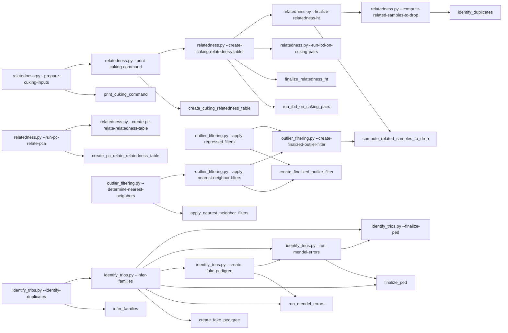
## annotations:
```mermaid
flowchart LR;
  classDef node_color fill:#BE4603

  compute-info["generate_variant_qc_annotations.py --compute-info"] --> split_info["split_info"];
  split-info["generate_variant_qc_annotations.py --split-info"] --> create_variant_qc_annotation_ht["create_variant_qc_annotation_ht"];
  generate-trio-stats["generate_variant_qc_annotations.py --generate-trio-stats"] --> create_variant_qc_annotation_ht["create_variant_qc_annotation_ht"];
  generate-sib-stats["generate_variant_qc_annotations.py --generate-sib-stats"] --> create_variant_qc_annotation_ht["create_variant_qc_annotation_ht"];
  compute-info["generate_variant_qc_annotations.py --compute-info"] --> export_info_vcf["export_info_vcf"];
  compute-info["generate_variant_qc_annotations.py --compute-info"] --> export_split_info_vcf["export_split_info_vcf"];
  run-vep["generate_variant_qc_annotations.py --run-vep"] --> validate_vep["validate_vep"];
  finalize-ped["identify_trios.py --finalize-ped"] --> generate_trio_stats["generate_trio_stats"];
  finalize-relatedness-ht["relatedness.py --finalize-relatedness-ht"] --> generate_sib_stats["generate_sib_stats"];
  compute-info["generate_variant_qc_annotations.py --compute-info"] --> split-info["generate_variant_qc_annotations.py --split-info"];
  split-info["generate_variant_qc_annotations.py --split-info"] --> create-variant-qc-annotation-ht["generate_variant_qc_annotations.py --create-variant-qc-annotation-ht"];
  compute-info["generate_variant_qc_annotations.py --compute-info"] --> export-info-vcf["generate_variant_qc_annotations.py --export-info-vcf"];
  compute-info["generate_variant_qc_annotations.py --compute-info"] --> export-split-info-vcf["generate_variant_qc_annotations.py --export-split-info-vcf"];
  run-vep["generate_variant_qc_annotations.py --run-vep"] --> validate-vep["generate_variant_qc_annotations.py --validate-vep"];
  generate-trio-stats["generate_variant_qc_annotations.py --generate-trio-stats"] --> create-variant-qc-annotation-ht["generate_variant_qc_annotations.py --create-variant-qc-annotation-ht"];
  generate-sib-stats["generate_variant_qc_annotations.py --generate-sib-stats"] --> create-variant-qc-annotation-ht["generate_variant_qc_annotations.py --create-variant-qc-annotation-ht"];
  write-split-vds-and-downsampling-ht["generate_freq.py --write-split-vds-and-downsampling-ht"] --> run_freq_and_dense_annotations["run_freq_and_dense_annotations"];
  combine-freq-hts["generate_freq.py --combine-freq-hts"] --> correct_for_high_ab_hets["correct_for_high_ab_hets"];
  correct-for-high-ab-hets["generate_freq.py --correct-for-high-ab-hets"] --> finalize_freq_ht["finalize_freq_ht"];
  write-split-vds-and-downsampling-ht["generate_freq.py --write-split-vds-and-downsampling-ht"] --> run-freq-and-dense-annotations["generate_freq.py --run-freq-and-dense-annotations"];
  run-freq-and-dense-annotations["generate_freq.py --run-freq-and-dense-annotations"] --> combine-freq-hts["generate_freq.py --combine-freq-hts"];
  combine-freq-hts["generate_freq.py --combine-freq-hts"] --> correct-for-high-ab-hets["generate_freq.py --correct-for-high-ab-hets"];
  correct-for-high-ab-hets["generate_freq.py --correct-for-high-ab-hets"] --> finalize-freq-ht["generate_freq.py --finalize-freq-ht"];
  finalize-relatedness-ht["relatedness.py --finalize-relatedness-ht"] --> get_duplicated_to_exomes["get_duplicated_to_exomes"];
  update-annotations["generate_freq_genomes.py --update-annotations"] --> get_callstats_for_updated_samples["get_callstats_for_updated_samples"];
  get-callstats-for-updated-samples["generate_freq_genomes.py --get-callstats-for-updated-samples"] --> join_callstats_for_update["join_callstats_for_update"];
  update-annotations["generate_freq_genomes.py --update-annotations"] --> compute_allele_number_for_new_variants["compute_allele_number_for_new_variants"];
  join-callstats-for-update["generate_freq_genomes.py --join-callstats-for-update"] --> compute_allele_number_for_new_variants["compute_allele_number_for_new_variants"];
  update-annotations["generate_freq_genomes.py --update-annotations"] --> update_release_callstats["update_release_callstats"];
  join-callstats-for-update["generate_freq_genomes.py --join-callstats-for-update"] --> update_release_callstats["update_release_callstats"];
  compute-allele-number-for-new-variants["generate_freq_genomes.py --compute-allele-number-for-new-variants"] --> update_release_callstats["update_release_callstats"];
  compute-allele-number-for-pop-diff["generate_freq_genomes.py --compute-allele-number-for-pop-diff"] --> update_release_callstats["update_release_callstats"];
  update-annotations["generate_freq_genomes.py --update-annotations"] --> apply_patch_to_freq_ht["apply_patch_to_freq_ht"];
  update-release-callstats["generate_freq_genomes.py --update-release-callstats"] --> apply_patch_to_freq_ht["apply_patch_to_freq_ht"];
  update-annotations["generate_freq_genomes.py --update-annotations"] --> compute_allele_number_for_pop_diff["compute_allele_number_for_pop_diff"];
  join-callstats-for-update["generate_freq_genomes.py --join-callstats-for-update"] --> compute_allele_number_for_pop_diff["compute_allele_number_for_pop_diff"];
  update-annotations["generate_freq_genomes.py --update-annotations"] --> get-callstats-for-updated-samples["generate_freq_genomes.py --get-callstats-for-updated-samples"];
  get-callstats-for-updated-samples["generate_freq_genomes.py --get-callstats-for-updated-samples"] --> join-callstats-for-update["generate_freq_genomes.py --join-callstats-for-update"];
  join-callstats-for-update["generate_freq_genomes.py --join-callstats-for-update"] --> compute-allele-number-for-new-variants["generate_freq_genomes.py --compute-allele-number-for-new-variants"];
  compute-allele-number-for-new-variants["generate_freq_genomes.py --compute-allele-number-for-new-variants"] --> update-release-callstats["generate_freq_genomes.py --update-release-callstats"];
  update-release-callstats["generate_freq_genomes.py --update-release-callstats"] --> apply-patch-to-freq-ht["generate_freq_genomes.py --apply-patch-to-freq-ht"];
  join-callstats-for-update["generate_freq_genomes.py --join-callstats-for-update"] --> compute-allele-number-for-pop-diff["generate_freq_genomes.py --compute-allele-number-for-pop-diff"];
  compute-allele-number-for-pop-diff["generate_freq_genomes.py --compute-allele-number-for-pop-diff"] --> update-release-callstats["generate_freq_genomes.py --update-release-callstats"];
  join-callstats-for-update["generate_freq_genomes.py --join-callstats-for-update"] --> update-release-callstats["generate_freq_genomes.py --update-release-callstats"];
  update-annotations["generate_freq_genomes.py --update-annotations"] --> compute-allele-number-for-new-variants["generate_freq_genomes.py --compute-allele-number-for-new-variants"];
  update-annotations["generate_freq_genomes.py --update-annotations"] --> compute-allele-number-for-pop-diff["generate_freq_genomes.py --compute-allele-number-for-pop-diff"];
  update-annotations["generate_freq_genomes.py --update-annotations"] --> update-release-callstats["generate_freq_genomes.py --update-release-callstats"];
  update-annotations["generate_freq_genomes.py --update-annotations"] --> apply-patch-to-freq-ht["generate_freq_genomes.py --apply-patch-to-freq-ht"];
  compute-coverage-ht["compute_coverage.py --compute-coverage-ht"] --> export_release_files["export_release_files"];
  compute-coverage-ht["compute_coverage.py --compute-coverage-ht"] --> export-release-files["compute_coverage.py --export-release-files"];
```
## variant_qc:
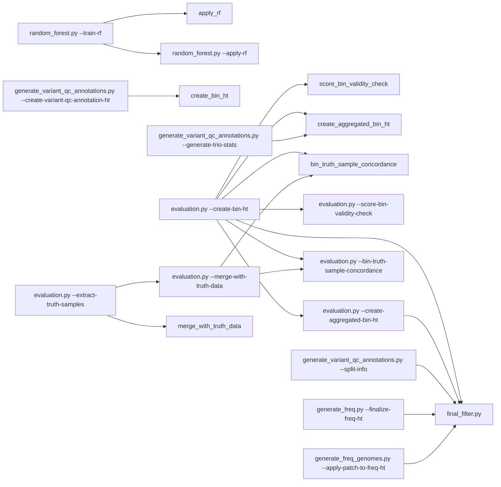
## create_release:
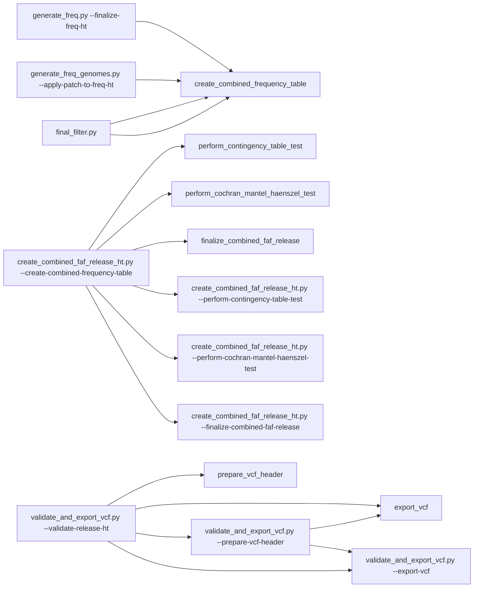
## sample_qc:
### [relatedness.py](https://github.com/broadinstitute/gnomad_qc/tree/main/gnomad_qc/v4/sample_qc/relatedness.py): Script to compute relatedness estimates among pairs of samples in the callset.
```mermaid
flowchart LR;
  classDef node_color fill:#BE4603

  prepare-cuking-inputs["--prepare-cuking-inputs"] --> print_cuking_command["print_cuking_command"];
  print_cuking_command["print_cuking_command"] --> print_cuking_command[["<a href='https://github.com/broadinstitute/gnomad_qc/tree/main/gnomad_qc/v4/sample_qc/relatedness.py#L46'>print_cuking_command</a>"]]:::node_color;
  print-cuking-command["--print-cuking-command"] --> print_cuking_command[["<a href='https://github.com/broadinstitute/gnomad_qc/tree/main/gnomad_qc/v4/sample_qc/relatedness.py#L46'>print_cuking_command</a>"]]:::node_color;
  print_cuking_command[["<a href='https://github.com/broadinstitute/gnomad_qc/tree/main/gnomad_qc/v4/sample_qc/relatedness.py#L46'>print_cuking_command</a>"]]:::node_color --> create_cuking_relatedness_table["create_cuking_relatedness_table"];
  create-cuking-relatedness-table["--create-cuking-relatedness-table"] --> run_ibd_on_cuking_pairs["run_ibd_on_cuking_pairs"];
  run_ibd_on_cuking_pairs["run_ibd_on_cuking_pairs"] --> compute_ibd_on_cuking_pair_subset[["<a href='https://github.com/broadinstitute/gnomad_qc/tree/main/gnomad_qc/v4/sample_qc/relatedness.py#L93'>compute_ibd_on_cuking_pair_subset</a>"]]:::node_color;
  create-cuking-relatedness-table["--create-cuking-relatedness-table"] --> finalize_relatedness_ht["finalize_relatedness_ht"];
  finalize_relatedness_ht["finalize_relatedness_ht"] --> finalize_relatedness_ht[["<a href='https://github.com/broadinstitute/gnomad_qc/tree/main/gnomad_qc/v4/sample_qc/relatedness.py#L175'>finalize_relatedness_ht</a>"]]:::node_color;
  finalize-relatedness-ht["--finalize-relatedness-ht"] --> finalize_relatedness_ht[["<a href='https://github.com/broadinstitute/gnomad_qc/tree/main/gnomad_qc/v4/sample_qc/relatedness.py#L175'>finalize_relatedness_ht</a>"]]:::node_color;
  finalize_relatedness_ht[["<a href='https://github.com/broadinstitute/gnomad_qc/tree/main/gnomad_qc/v4/sample_qc/relatedness.py#L175'>finalize_relatedness_ht</a>"]]:::node_color --> compute_related_samples_to_drop["compute_related_samples_to_drop"];
  compute_related_samples_to_drop["compute_related_samples_to_drop"] --> run_compute_related_samples_to_drop[["<a href='https://github.com/broadinstitute/gnomad_qc/tree/main/gnomad_qc/v4/sample_qc/relatedness.py#L315'>run_compute_related_samples_to_drop</a>"]]:::node_color;
  create-finalized-outlier-filter["outlier_filtering.py --create-finalized-outlier-filter"] --> compute_related_samples_to_drop["compute_related_samples_to_drop"];
  run-pc-relate-pca["--run-pc-relate-pca"] --> create_pc_relate_relatedness_table["create_pc_relate_relatedness_table"];
  prepare-cuking-inputs["--prepare-cuking-inputs"] --> print-cuking-command["--print-cuking-command"];
  print_cuking_command[["<a href='https://github.com/broadinstitute/gnomad_qc/tree/main/gnomad_qc/v4/sample_qc/relatedness.py#L46'>print_cuking_command</a>"]]:::node_color --> create-cuking-relatedness-table["--create-cuking-relatedness-table"];
  create-cuking-relatedness-table["--create-cuking-relatedness-table"] --> run-ibd-on-cuking-pairs["--run-ibd-on-cuking-pairs"];
  run-ibd-on-cuking-pairs["--run-ibd-on-cuking-pairs"] --> compute_ibd_on_cuking_pair_subset[["<a href='https://github.com/broadinstitute/gnomad_qc/tree/main/gnomad_qc/v4/sample_qc/relatedness.py#L93'>compute_ibd_on_cuking_pair_subset</a>"]]:::node_color;
  create-cuking-relatedness-table["--create-cuking-relatedness-table"] --> finalize-relatedness-ht["--finalize-relatedness-ht"];
  finalize_relatedness_ht[["<a href='https://github.com/broadinstitute/gnomad_qc/tree/main/gnomad_qc/v4/sample_qc/relatedness.py#L175'>finalize_relatedness_ht</a>"]]:::node_color --> compute-related-samples-to-drop["--compute-related-samples-to-drop"];
  compute-related-samples-to-drop["--compute-related-samples-to-drop"] --> run_compute_related_samples_to_drop[["<a href='https://github.com/broadinstitute/gnomad_qc/tree/main/gnomad_qc/v4/sample_qc/relatedness.py#L315'>run_compute_related_samples_to_drop</a>"]]:::node_color;
  run-pc-relate-pca["--run-pc-relate-pca"] --> create-pc-relate-relatedness-table["--create-pc-relate-relatedness-table"];
```
### [outlier_filtering.py](https://github.com/broadinstitute/gnomad_qc/tree/main/gnomad_qc/v4/sample_qc/outlier_filtering.py): Script to determine sample QC metric outliers that should be filtered.
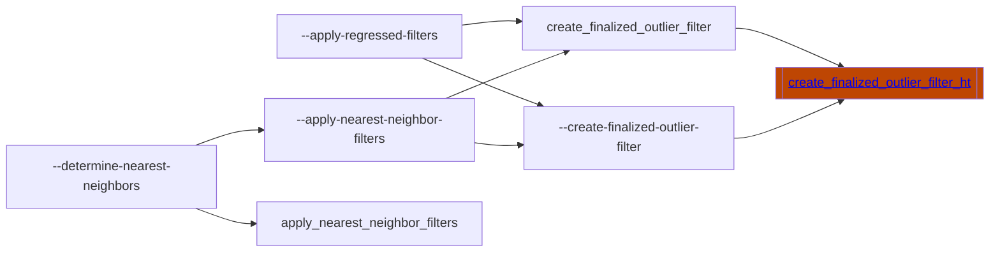
### [identify_trios.py](https://github.com/broadinstitute/gnomad_qc/tree/main/gnomad_qc/v4/sample_qc/identify_trios.py): Script to identify trios from relatedness data and filter based on Mendel errors and de novos.
```mermaid
flowchart LR;
  classDef node_color fill:#BE4603

  compute-related-samples-to-drop["relatedness.py --compute-related-samples-to-drop"] --> identify_duplicates["identify_duplicates"];
  identify-duplicates["--identify-duplicates"] --> infer_families["infer_families"];
  infer_families["infer_families"] --> filter_ped_to_same_platform[["<a href='https://github.com/broadinstitute/gnomad_qc/tree/main/gnomad_qc/v4/sample_qc/identify_trios.py#L188'>filter_ped_to_same_platform</a>"]]:::node_color;
  infer-families["--infer-families"] --> filter_ped_to_same_platform[["<a href='https://github.com/broadinstitute/gnomad_qc/tree/main/gnomad_qc/v4/sample_qc/identify_trios.py#L188'>filter_ped_to_same_platform</a>"]]:::node_color;
  filter_ped_to_same_platform[["<a href='https://github.com/broadinstitute/gnomad_qc/tree/main/gnomad_qc/v4/sample_qc/identify_trios.py#L188'>filter_ped_to_same_platform</a>"]]:::node_color --> create_fake_pedigree["create_fake_pedigree"];
  create_fake_pedigree["create_fake_pedigree"] --> run_create_fake_pedigree[["<a href='https://github.com/broadinstitute/gnomad_qc/tree/main/gnomad_qc/v4/sample_qc/identify_trios.py#L105'>run_create_fake_pedigree</a>"]]:::node_color;
  filter_ped_to_same_platform[["<a href='https://github.com/broadinstitute/gnomad_qc/tree/main/gnomad_qc/v4/sample_qc/identify_trios.py#L188'>filter_ped_to_same_platform</a>"]]:::node_color --> run_mendel_errors["run_mendel_errors"];
  run_mendel_errors["run_mendel_errors"] --> run_mendel_errors[["<a href='https://github.com/broadinstitute/gnomad_qc/tree/main/gnomad_qc/v4/sample_qc/identify_trios.py#L140'>run_mendel_errors</a>"]]:::node_color;
  create-fake-pedigree["--create-fake-pedigree"] --> run_create_fake_pedigree[["<a href='https://github.com/broadinstitute/gnomad_qc/tree/main/gnomad_qc/v4/sample_qc/identify_trios.py#L105'>run_create_fake_pedigree</a>"]]:::node_color;
  run_create_fake_pedigree[["<a href='https://github.com/broadinstitute/gnomad_qc/tree/main/gnomad_qc/v4/sample_qc/identify_trios.py#L105'>run_create_fake_pedigree</a>"]]:::node_color --> run_mendel_errors["run_mendel_errors"];
  filter_ped_to_same_platform[["<a href='https://github.com/broadinstitute/gnomad_qc/tree/main/gnomad_qc/v4/sample_qc/identify_trios.py#L188'>filter_ped_to_same_platform</a>"]]:::node_color --> finalize_ped["finalize_ped"];
  finalize_ped["finalize_ped"] --> filter_ped[["<a href='https://github.com/broadinstitute/gnomad_qc/tree/main/gnomad_qc/v4/sample_qc/identify_trios.py#L218'>filter_ped</a>"]]:::node_color;
  filter_ped[["<a href='https://github.com/broadinstitute/gnomad_qc/tree/main/gnomad_qc/v4/sample_qc/identify_trios.py#L218'>filter_ped</a>"]]:::node_color --> families_to_trios[["<a href='https://github.com/broadinstitute/gnomad_qc/tree/main/gnomad_qc/v4/sample_qc/identify_trios.py#L46'>families_to_trios</a>"]]:::node_color;
  run-mendel-errors["--run-mendel-errors"] --> run_mendel_errors[["<a href='https://github.com/broadinstitute/gnomad_qc/tree/main/gnomad_qc/v4/sample_qc/identify_trios.py#L140'>run_mendel_errors</a>"]]:::node_color;
  run_mendel_errors[["<a href='https://github.com/broadinstitute/gnomad_qc/tree/main/gnomad_qc/v4/sample_qc/identify_trios.py#L140'>run_mendel_errors</a>"]]:::node_color --> finalize_ped["finalize_ped"];
  identify-duplicates["--identify-duplicates"] --> infer-families["--infer-families"];
  filter_ped_to_same_platform[["<a href='https://github.com/broadinstitute/gnomad_qc/tree/main/gnomad_qc/v4/sample_qc/identify_trios.py#L188'>filter_ped_to_same_platform</a>"]]:::node_color --> create-fake-pedigree["--create-fake-pedigree"];
  run_create_fake_pedigree[["<a href='https://github.com/broadinstitute/gnomad_qc/tree/main/gnomad_qc/v4/sample_qc/identify_trios.py#L105'>run_create_fake_pedigree</a>"]]:::node_color --> run-mendel-errors["--run-mendel-errors"];
  run_mendel_errors[["<a href='https://github.com/broadinstitute/gnomad_qc/tree/main/gnomad_qc/v4/sample_qc/identify_trios.py#L140'>run_mendel_errors</a>"]]:::node_color --> finalize-ped["--finalize-ped"];
  finalize-ped["--finalize-ped"] --> filter_ped[["<a href='https://github.com/broadinstitute/gnomad_qc/tree/main/gnomad_qc/v4/sample_qc/identify_trios.py#L218'>filter_ped</a>"]]:::node_color;
  filter_ped_to_same_platform[["<a href='https://github.com/broadinstitute/gnomad_qc/tree/main/gnomad_qc/v4/sample_qc/identify_trios.py#L188'>filter_ped_to_same_platform</a>"]]:::node_color --> run-mendel-errors["--run-mendel-errors"];
  filter_ped_to_same_platform[["<a href='https://github.com/broadinstitute/gnomad_qc/tree/main/gnomad_qc/v4/sample_qc/identify_trios.py#L188'>filter_ped_to_same_platform</a>"]]:::node_color --> finalize-ped["--finalize-ped"];
```
## annotations:
### [generate_variant_qc_annotations.py](https://github.com/broadinstitute/gnomad_qc/tree/main/gnomad_qc/v4/annotations/generate_variant_qc_annotations.py): Script to generate annotations for variant QC on gnomAD v4.
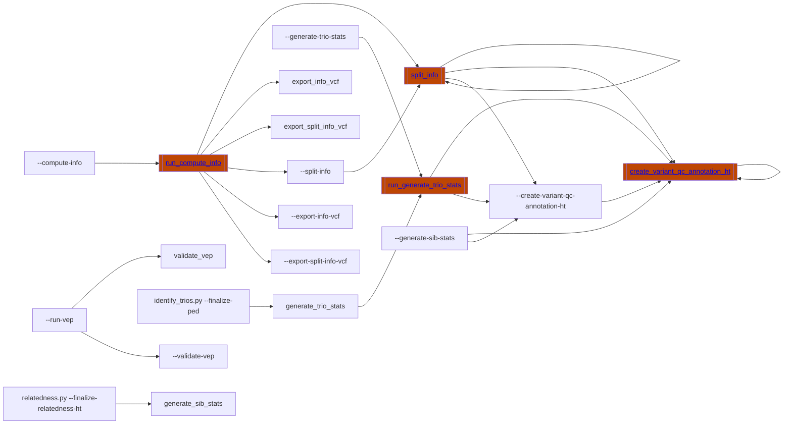
### [generate_freq.py](https://github.com/broadinstitute/gnomad_qc/tree/main/gnomad_qc/v4/annotations/generate_freq.py): Script to generate the frequency data annotations across v4 exomes.
```mermaid
flowchart LR;
  classDef node_color fill:#BE4603

  write-split-vds-and-downsampling-ht["--write-split-vds-and-downsampling-ht"] --> get_vds_for_freq[["<a href='https://github.com/broadinstitute/gnomad_qc/tree/main/gnomad_qc/v4/annotations/generate_freq.py#L202'>get_vds_for_freq</a>"]]:::node_color;
  get_vds_for_freq[["<a href='https://github.com/broadinstitute/gnomad_qc/tree/main/gnomad_qc/v4/annotations/generate_freq.py#L202'>get_vds_for_freq</a>"]]:::node_color --> get_downsampling_ht[["<a href='https://github.com/broadinstitute/gnomad_qc/tree/main/gnomad_qc/v4/annotations/generate_freq.py#L548'>get_downsampling_ht</a>"]]:::node_color;
  get_downsampling_ht[["<a href='https://github.com/broadinstitute/gnomad_qc/tree/main/gnomad_qc/v4/annotations/generate_freq.py#L548'>get_downsampling_ht</a>"]]:::node_color --> run_freq_and_dense_annotations["run_freq_and_dense_annotations"];
  run_freq_and_dense_annotations["run_freq_and_dense_annotations"] --> densify_and_prep_vds_for_freq[["<a href='https://github.com/broadinstitute/gnomad_qc/tree/main/gnomad_qc/v4/annotations/generate_freq.py#L505'>densify_and_prep_vds_for_freq</a>"]]:::node_color;
  densify_and_prep_vds_for_freq[["<a href='https://github.com/broadinstitute/gnomad_qc/tree/main/gnomad_qc/v4/annotations/generate_freq.py#L505'>densify_and_prep_vds_for_freq</a>"]]:::node_color --> generate_freq_ht[["<a href='https://github.com/broadinstitute/gnomad_qc/tree/main/gnomad_qc/v4/annotations/generate_freq.py#L395'>generate_freq_ht</a>"]]:::node_color;
  generate_freq_ht[["<a href='https://github.com/broadinstitute/gnomad_qc/tree/main/gnomad_qc/v4/annotations/generate_freq.py#L395'>generate_freq_ht</a>"]]:::node_color --> get_downsampling_ht[["<a href='https://github.com/broadinstitute/gnomad_qc/tree/main/gnomad_qc/v4/annotations/generate_freq.py#L548'>get_downsampling_ht</a>"]]:::node_color;
  get_downsampling_ht[["<a href='https://github.com/broadinstitute/gnomad_qc/tree/main/gnomad_qc/v4/annotations/generate_freq.py#L548'>get_downsampling_ht</a>"]]:::node_color --> mt_hists_fields[["<a href='https://github.com/broadinstitute/gnomad_qc/tree/main/gnomad_qc/v4/annotations/generate_freq.py#L636'>mt_hists_fields</a>"]]:::node_color;
  combine-freq-hts["--combine-freq-hts"] --> combine_freq_hts[["<a href='https://github.com/broadinstitute/gnomad_qc/tree/main/gnomad_qc/v4/annotations/generate_freq.py#L667'>combine_freq_hts</a>"]]:::node_color;
  combine_freq_hts[["<a href='https://github.com/broadinstitute/gnomad_qc/tree/main/gnomad_qc/v4/annotations/generate_freq.py#L667'>combine_freq_hts</a>"]]:::node_color --> update_non_ukb_freq_ht[["<a href='https://github.com/broadinstitute/gnomad_qc/tree/main/gnomad_qc/v4/annotations/generate_freq.py#L570'>update_non_ukb_freq_ht</a>"]]:::node_color;
  update_non_ukb_freq_ht[["<a href='https://github.com/broadinstitute/gnomad_qc/tree/main/gnomad_qc/v4/annotations/generate_freq.py#L570'>update_non_ukb_freq_ht</a>"]]:::node_color --> correct_for_high_ab_hets["correct_for_high_ab_hets"];
  correct_for_high_ab_hets["correct_for_high_ab_hets"] --> correct_for_high_ab_hets[["<a href='https://github.com/broadinstitute/gnomad_qc/tree/main/gnomad_qc/v4/annotations/generate_freq.py#L754'>correct_for_high_ab_hets</a>"]]:::node_color;
  correct_for_high_ab_hets[["<a href='https://github.com/broadinstitute/gnomad_qc/tree/main/gnomad_qc/v4/annotations/generate_freq.py#L754'>correct_for_high_ab_hets</a>"]]:::node_color --> generate_faf_grpmax[["<a href='https://github.com/broadinstitute/gnomad_qc/tree/main/gnomad_qc/v4/annotations/generate_freq.py#L815'>generate_faf_grpmax</a>"]]:::node_color;
  generate_faf_grpmax[["<a href='https://github.com/broadinstitute/gnomad_qc/tree/main/gnomad_qc/v4/annotations/generate_freq.py#L815'>generate_faf_grpmax</a>"]]:::node_color --> compute_inbreeding_coeff[["<a href='https://github.com/broadinstitute/gnomad_qc/tree/main/gnomad_qc/v4/annotations/generate_freq.py#L882'>compute_inbreeding_coeff</a>"]]:::node_color;
  correct-for-high-ab-hets["--correct-for-high-ab-hets"] --> correct_for_high_ab_hets[["<a href='https://github.com/broadinstitute/gnomad_qc/tree/main/gnomad_qc/v4/annotations/generate_freq.py#L754'>correct_for_high_ab_hets</a>"]]:::node_color;
  compute_inbreeding_coeff[["<a href='https://github.com/broadinstitute/gnomad_qc/tree/main/gnomad_qc/v4/annotations/generate_freq.py#L882'>compute_inbreeding_coeff</a>"]]:::node_color --> finalize_freq_ht["finalize_freq_ht"];
  finalize_freq_ht["finalize_freq_ht"] --> create_final_freq_ht[["<a href='https://github.com/broadinstitute/gnomad_qc/tree/main/gnomad_qc/v4/annotations/generate_freq.py#L896'>create_final_freq_ht</a>"]]:::node_color;
  get_downsampling_ht[["<a href='https://github.com/broadinstitute/gnomad_qc/tree/main/gnomad_qc/v4/annotations/generate_freq.py#L548'>get_downsampling_ht</a>"]]:::node_color --> run-freq-and-dense-annotations["--run-freq-and-dense-annotations"];
  run-freq-and-dense-annotations["--run-freq-and-dense-annotations"] --> densify_and_prep_vds_for_freq[["<a href='https://github.com/broadinstitute/gnomad_qc/tree/main/gnomad_qc/v4/annotations/generate_freq.py#L505'>densify_and_prep_vds_for_freq</a>"]]:::node_color;
  mt_hists_fields[["<a href='https://github.com/broadinstitute/gnomad_qc/tree/main/gnomad_qc/v4/annotations/generate_freq.py#L636'>mt_hists_fields</a>"]]:::node_color --> combine-freq-hts["--combine-freq-hts"];
  update_non_ukb_freq_ht[["<a href='https://github.com/broadinstitute/gnomad_qc/tree/main/gnomad_qc/v4/annotations/generate_freq.py#L570'>update_non_ukb_freq_ht</a>"]]:::node_color --> correct-for-high-ab-hets["--correct-for-high-ab-hets"];
  compute_inbreeding_coeff[["<a href='https://github.com/broadinstitute/gnomad_qc/tree/main/gnomad_qc/v4/annotations/generate_freq.py#L882'>compute_inbreeding_coeff</a>"]]:::node_color --> finalize-freq-ht["--finalize-freq-ht"];
  finalize-freq-ht["--finalize-freq-ht"] --> create_final_freq_ht[["<a href='https://github.com/broadinstitute/gnomad_qc/tree/main/gnomad_qc/v4/annotations/generate_freq.py#L896'>create_final_freq_ht</a>"]]:::node_color;
```
### [generate_freq_genomes.py](https://github.com/broadinstitute/gnomad_qc/tree/main/gnomad_qc/v4/annotations/generate_freq_genomes.py): Script to create frequencies HT for v4.0 genomes.
```mermaid
flowchart LR;
  classDef node_color fill:#BE4603

  finalize-relatedness-ht["relatedness.py --finalize-relatedness-ht"] --> get_duplicated_to_exomes["get_duplicated_to_exomes"];
  update-annotations["--update-annotations"] --> add_updated_sample_qc_annotations[["<a href='https://github.com/broadinstitute/gnomad_qc/tree/main/gnomad_qc/v4/annotations/generate_freq_genomes.py#L253'>add_updated_sample_qc_annotations</a>"]]:::node_color;
  add_updated_sample_qc_annotations[["<a href='https://github.com/broadinstitute/gnomad_qc/tree/main/gnomad_qc/v4/annotations/generate_freq_genomes.py#L253'>add_updated_sample_qc_annotations</a>"]]:::node_color --> get_callstats_for_updated_samples["get_callstats_for_updated_samples"];
  get_callstats_for_updated_samples["get_callstats_for_updated_samples"] --> get_updated_release_samples[["<a href='https://github.com/broadinstitute/gnomad_qc/tree/main/gnomad_qc/v4/annotations/generate_freq_genomes.py#L398'>get_updated_release_samples</a>"]]:::node_color;
  get_updated_release_samples[["<a href='https://github.com/broadinstitute/gnomad_qc/tree/main/gnomad_qc/v4/annotations/generate_freq_genomes.py#L398'>get_updated_release_samples</a>"]]:::node_color --> get_hgdp_tgp_callstats_for_selected_samples[["<a href='https://github.com/broadinstitute/gnomad_qc/tree/main/gnomad_qc/v4/annotations/generate_freq_genomes.py#L518'>get_hgdp_tgp_callstats_for_selected_samples</a>"]]:::node_color;
  get_hgdp_tgp_callstats_for_selected_samples[["<a href='https://github.com/broadinstitute/gnomad_qc/tree/main/gnomad_qc/v4/annotations/generate_freq_genomes.py#L518'>get_hgdp_tgp_callstats_for_selected_samples</a>"]]:::node_color --> filter_freq_arrays[["<a href='https://github.com/broadinstitute/gnomad_qc/tree/main/gnomad_qc/v4/annotations/generate_freq_genomes.py#L566'>filter_freq_arrays</a>"]]:::node_color;
  get-callstats-for-updated-samples["--get-callstats-for-updated-samples"] --> get_updated_release_samples[["<a href='https://github.com/broadinstitute/gnomad_qc/tree/main/gnomad_qc/v4/annotations/generate_freq_genomes.py#L398'>get_updated_release_samples</a>"]]:::node_color;
  filter_freq_arrays[["<a href='https://github.com/broadinstitute/gnomad_qc/tree/main/gnomad_qc/v4/annotations/generate_freq_genomes.py#L566'>filter_freq_arrays</a>"]]:::node_color --> join_callstats_for_update["join_callstats_for_update"];
  join_callstats_for_update["join_callstats_for_update"] --> join_release_ht_with_subsets[["<a href='https://github.com/broadinstitute/gnomad_qc/tree/main/gnomad_qc/v4/annotations/generate_freq_genomes.py#L652'>join_release_ht_with_subsets</a>"]]:::node_color;
  add_updated_sample_qc_annotations[["<a href='https://github.com/broadinstitute/gnomad_qc/tree/main/gnomad_qc/v4/annotations/generate_freq_genomes.py#L253'>add_updated_sample_qc_annotations</a>"]]:::node_color --> compute_allele_number_for_new_variants["compute_allele_number_for_new_variants"];
  compute_allele_number_for_new_variants["compute_allele_number_for_new_variants"] --> get_group_membership_ht_for_an[["<a href='https://github.com/broadinstitute/gnomad_qc/tree/main/gnomad_qc/v4/annotations/generate_freq_genomes.py#L688'>get_group_membership_ht_for_an</a>"]]:::node_color;
  get_group_membership_ht_for_an[["<a href='https://github.com/broadinstitute/gnomad_qc/tree/main/gnomad_qc/v4/annotations/generate_freq_genomes.py#L688'>get_group_membership_ht_for_an</a>"]]:::node_color --> compute_an_by_group_membership[["<a href='https://github.com/broadinstitute/gnomad_qc/tree/main/gnomad_qc/v4/annotations/generate_freq_genomes.py#L814'>compute_an_by_group_membership</a>"]]:::node_color;
  join-callstats-for-update["--join-callstats-for-update"] --> join_release_ht_with_subsets[["<a href='https://github.com/broadinstitute/gnomad_qc/tree/main/gnomad_qc/v4/annotations/generate_freq_genomes.py#L652'>join_release_ht_with_subsets</a>"]]:::node_color;
  join_release_ht_with_subsets[["<a href='https://github.com/broadinstitute/gnomad_qc/tree/main/gnomad_qc/v4/annotations/generate_freq_genomes.py#L652'>join_release_ht_with_subsets</a>"]]:::node_color --> compute_allele_number_for_new_variants["compute_allele_number_for_new_variants"];
  add_updated_sample_qc_annotations[["<a href='https://github.com/broadinstitute/gnomad_qc/tree/main/gnomad_qc/v4/annotations/generate_freq_genomes.py#L253'>add_updated_sample_qc_annotations</a>"]]:::node_color --> update_release_callstats["update_release_callstats"];
  update_release_callstats["update_release_callstats"] --> generate_v4_genomes_callstats[["<a href='https://github.com/broadinstitute/gnomad_qc/tree/main/gnomad_qc/v4/annotations/generate_freq_genomes.py#L948'>generate_v4_genomes_callstats</a>"]]:::node_color;
  generate_v4_genomes_callstats[["<a href='https://github.com/broadinstitute/gnomad_qc/tree/main/gnomad_qc/v4/annotations/generate_freq_genomes.py#L948'>generate_v4_genomes_callstats</a>"]]:::node_color --> finalize_v4_genomes_callstats[["<a href='https://github.com/broadinstitute/gnomad_qc/tree/main/gnomad_qc/v4/annotations/generate_freq_genomes.py#L1046'>finalize_v4_genomes_callstats</a>"]]:::node_color;
  join_release_ht_with_subsets[["<a href='https://github.com/broadinstitute/gnomad_qc/tree/main/gnomad_qc/v4/annotations/generate_freq_genomes.py#L652'>join_release_ht_with_subsets</a>"]]:::node_color --> update_release_callstats["update_release_callstats"];
  compute-allele-number-for-new-variants["--compute-allele-number-for-new-variants"] --> get_group_membership_ht_for_an[["<a href='https://github.com/broadinstitute/gnomad_qc/tree/main/gnomad_qc/v4/annotations/generate_freq_genomes.py#L688'>get_group_membership_ht_for_an</a>"]]:::node_color;
  compute_an_by_group_membership[["<a href='https://github.com/broadinstitute/gnomad_qc/tree/main/gnomad_qc/v4/annotations/generate_freq_genomes.py#L814'>compute_an_by_group_membership</a>"]]:::node_color --> update_release_callstats["update_release_callstats"];
  compute-allele-number-for-pop-diff["--compute-allele-number-for-pop-diff"] --> compute_an_by_group_membership[["<a href='https://github.com/broadinstitute/gnomad_qc/tree/main/gnomad_qc/v4/annotations/generate_freq_genomes.py#L814'>compute_an_by_group_membership</a>"]]:::node_color;
  compute_an_by_group_membership[["<a href='https://github.com/broadinstitute/gnomad_qc/tree/main/gnomad_qc/v4/annotations/generate_freq_genomes.py#L814'>compute_an_by_group_membership</a>"]]:::node_color --> get_pop_diff_v3_vds_group_membership[["<a href='https://github.com/broadinstitute/gnomad_qc/tree/main/gnomad_qc/v4/annotations/generate_freq_genomes.py#L1221'>get_pop_diff_v3_vds_group_membership</a>"]]:::node_color;
  get_pop_diff_v3_vds_group_membership[["<a href='https://github.com/broadinstitute/gnomad_qc/tree/main/gnomad_qc/v4/annotations/generate_freq_genomes.py#L1221'>get_pop_diff_v3_vds_group_membership</a>"]]:::node_color --> update_release_callstats["update_release_callstats"];
  add_updated_sample_qc_annotations[["<a href='https://github.com/broadinstitute/gnomad_qc/tree/main/gnomad_qc/v4/annotations/generate_freq_genomes.py#L253'>add_updated_sample_qc_annotations</a>"]]:::node_color --> apply_patch_to_freq_ht["apply_patch_to_freq_ht"];
  apply_patch_to_freq_ht["apply_patch_to_freq_ht"] --> patch_v4_genomes_callstats[["<a href='https://github.com/broadinstitute/gnomad_qc/tree/main/gnomad_qc/v4/annotations/generate_freq_genomes.py#L1259'>patch_v4_genomes_callstats</a>"]]:::node_color;
  patch_v4_genomes_callstats[["<a href='https://github.com/broadinstitute/gnomad_qc/tree/main/gnomad_qc/v4/annotations/generate_freq_genomes.py#L1259'>patch_v4_genomes_callstats</a>"]]:::node_color --> finalize_v4_genomes_callstats[["<a href='https://github.com/broadinstitute/gnomad_qc/tree/main/gnomad_qc/v4/annotations/generate_freq_genomes.py#L1046'>finalize_v4_genomes_callstats</a>"]]:::node_color;
  update-release-callstats["--update-release-callstats"] --> generate_v4_genomes_callstats[["<a href='https://github.com/broadinstitute/gnomad_qc/tree/main/gnomad_qc/v4/annotations/generate_freq_genomes.py#L948'>generate_v4_genomes_callstats</a>"]]:::node_color;
  finalize_v4_genomes_callstats[["<a href='https://github.com/broadinstitute/gnomad_qc/tree/main/gnomad_qc/v4/annotations/generate_freq_genomes.py#L1046'>finalize_v4_genomes_callstats</a>"]]:::node_color --> apply_patch_to_freq_ht["apply_patch_to_freq_ht"];
  add_updated_sample_qc_annotations[["<a href='https://github.com/broadinstitute/gnomad_qc/tree/main/gnomad_qc/v4/annotations/generate_freq_genomes.py#L253'>add_updated_sample_qc_annotations</a>"]]:::node_color --> compute_allele_number_for_pop_diff["compute_allele_number_for_pop_diff"];
  compute_allele_number_for_pop_diff["compute_allele_number_for_pop_diff"] --> compute_an_by_group_membership[["<a href='https://github.com/broadinstitute/gnomad_qc/tree/main/gnomad_qc/v4/annotations/generate_freq_genomes.py#L814'>compute_an_by_group_membership</a>"]]:::node_color;
  join_release_ht_with_subsets[["<a href='https://github.com/broadinstitute/gnomad_qc/tree/main/gnomad_qc/v4/annotations/generate_freq_genomes.py#L652'>join_release_ht_with_subsets</a>"]]:::node_color --> compute_allele_number_for_pop_diff["compute_allele_number_for_pop_diff"];
  add_updated_sample_qc_annotations[["<a href='https://github.com/broadinstitute/gnomad_qc/tree/main/gnomad_qc/v4/annotations/generate_freq_genomes.py#L253'>add_updated_sample_qc_annotations</a>"]]:::node_color --> get-callstats-for-updated-samples["--get-callstats-for-updated-samples"];
  filter_freq_arrays[["<a href='https://github.com/broadinstitute/gnomad_qc/tree/main/gnomad_qc/v4/annotations/generate_freq_genomes.py#L566'>filter_freq_arrays</a>"]]:::node_color --> join-callstats-for-update["--join-callstats-for-update"];
  join_release_ht_with_subsets[["<a href='https://github.com/broadinstitute/gnomad_qc/tree/main/gnomad_qc/v4/annotations/generate_freq_genomes.py#L652'>join_release_ht_with_subsets</a>"]]:::node_color --> compute-allele-number-for-new-variants["--compute-allele-number-for-new-variants"];
  compute_an_by_group_membership[["<a href='https://github.com/broadinstitute/gnomad_qc/tree/main/gnomad_qc/v4/annotations/generate_freq_genomes.py#L814'>compute_an_by_group_membership</a>"]]:::node_color --> update-release-callstats["--update-release-callstats"];
  finalize_v4_genomes_callstats[["<a href='https://github.com/broadinstitute/gnomad_qc/tree/main/gnomad_qc/v4/annotations/generate_freq_genomes.py#L1046'>finalize_v4_genomes_callstats</a>"]]:::node_color --> apply-patch-to-freq-ht["--apply-patch-to-freq-ht"];
  apply-patch-to-freq-ht["--apply-patch-to-freq-ht"] --> patch_v4_genomes_callstats[["<a href='https://github.com/broadinstitute/gnomad_qc/tree/main/gnomad_qc/v4/annotations/generate_freq_genomes.py#L1259'>patch_v4_genomes_callstats</a>"]]:::node_color;
  join_release_ht_with_subsets[["<a href='https://github.com/broadinstitute/gnomad_qc/tree/main/gnomad_qc/v4/annotations/generate_freq_genomes.py#L652'>join_release_ht_with_subsets</a>"]]:::node_color --> compute-allele-number-for-pop-diff["--compute-allele-number-for-pop-diff"];
  get_pop_diff_v3_vds_group_membership[["<a href='https://github.com/broadinstitute/gnomad_qc/tree/main/gnomad_qc/v4/annotations/generate_freq_genomes.py#L1221'>get_pop_diff_v3_vds_group_membership</a>"]]:::node_color --> update-release-callstats["--update-release-callstats"];
  join_release_ht_with_subsets[["<a href='https://github.com/broadinstitute/gnomad_qc/tree/main/gnomad_qc/v4/annotations/generate_freq_genomes.py#L652'>join_release_ht_with_subsets</a>"]]:::node_color --> update-release-callstats["--update-release-callstats"];
  add_updated_sample_qc_annotations[["<a href='https://github.com/broadinstitute/gnomad_qc/tree/main/gnomad_qc/v4/annotations/generate_freq_genomes.py#L253'>add_updated_sample_qc_annotations</a>"]]:::node_color --> compute-allele-number-for-new-variants["--compute-allele-number-for-new-variants"];
  add_updated_sample_qc_annotations[["<a href='https://github.com/broadinstitute/gnomad_qc/tree/main/gnomad_qc/v4/annotations/generate_freq_genomes.py#L253'>add_updated_sample_qc_annotations</a>"]]:::node_color --> compute-allele-number-for-pop-diff["--compute-allele-number-for-pop-diff"];
  add_updated_sample_qc_annotations[["<a href='https://github.com/broadinstitute/gnomad_qc/tree/main/gnomad_qc/v4/annotations/generate_freq_genomes.py#L253'>add_updated_sample_qc_annotations</a>"]]:::node_color --> update-release-callstats["--update-release-callstats"];
  add_updated_sample_qc_annotations[["<a href='https://github.com/broadinstitute/gnomad_qc/tree/main/gnomad_qc/v4/annotations/generate_freq_genomes.py#L253'>add_updated_sample_qc_annotations</a>"]]:::node_color --> apply-patch-to-freq-ht["--apply-patch-to-freq-ht"];
```
### [compute_coverage.py](https://github.com/broadinstitute/gnomad_qc/tree/main/gnomad_qc/v4/annotations/compute_coverage.py): Script to compute coverage statistics on gnomAD v4 exomes.
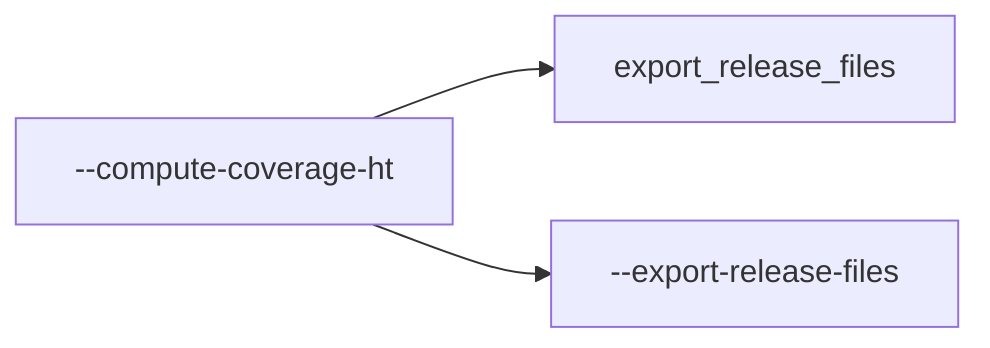
## variant_qc:
### [random_forest.py](https://github.com/broadinstitute/gnomad_qc/tree/main/gnomad_qc/v4/variant_qc/random_forest.py): Script for running random forest model on gnomAD v4 variant QC data.
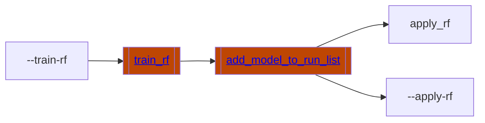
### [evaluation.py](https://github.com/broadinstitute/gnomad_qc/tree/main/gnomad_qc/v4/variant_qc/evaluation.py): Script to create Tables with aggregate variant statistics by variant QC score bins needed for evaluation plots.
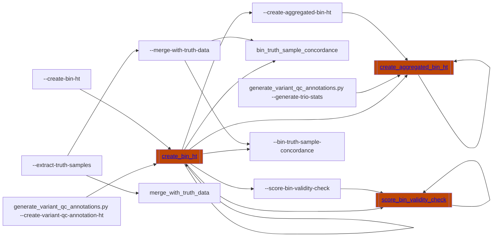
### [final_filter.py](https://github.com/broadinstitute/gnomad_qc/tree/main/gnomad_qc/v4/variant_qc/final_filter.py): Script to create final filter Table for release.
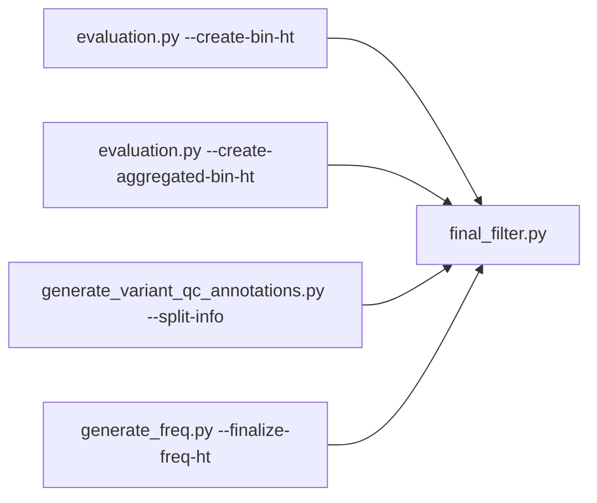
### [final_filter_genomes.py](https://github.com/broadinstitute/gnomad_qc/tree/main/gnomad_qc/v4/variant_qc/final_filter_genomes.py): Script to create final filter Table for v4 genomes release.
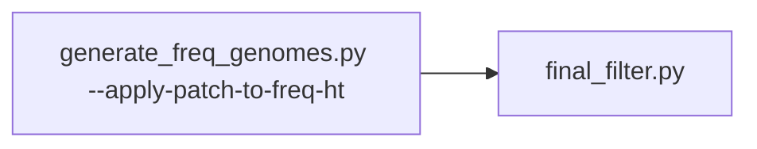
## create_release:
### [create_combined_faf_release_ht.py](https://github.com/broadinstitute/gnomad_qc/tree/main/gnomad_qc/v4/create_release/create_combined_faf_release_ht.py): Create a joint gnomAD v4 exome and genome frequency and FAF.
```mermaid
flowchart LR;
  classDef node_color fill:#BE4603

  finalize-freq-ht["generate_freq.py --finalize-freq-ht"] --> create_combined_frequency_table["create_combined_frequency_table"];
  create_combined_frequency_table["create_combined_frequency_table"] --> extract_freq_info[["<a href='https://github.com/broadinstitute/gnomad_qc/tree/main/gnomad_qc/v4/create_release/create_combined_faf_release_ht.py#L63'>extract_freq_info</a>"]]:::node_color;
  extract_freq_info[["<a href='https://github.com/broadinstitute/gnomad_qc/tree/main/gnomad_qc/v4/create_release/create_combined_faf_release_ht.py#L63'>extract_freq_info</a>"]]:::node_color --> extract_freq_info[["<a href='https://github.com/broadinstitute/gnomad_qc/tree/main/gnomad_qc/v4/create_release/create_combined_faf_release_ht.py#L63'>extract_freq_info</a>"]]:::node_color;
  extract_freq_info[["<a href='https://github.com/broadinstitute/gnomad_qc/tree/main/gnomad_qc/v4/create_release/create_combined_faf_release_ht.py#L63'>extract_freq_info</a>"]]:::node_color --> get_joint_freq_and_faf[["<a href='https://github.com/broadinstitute/gnomad_qc/tree/main/gnomad_qc/v4/create_release/create_combined_faf_release_ht.py#L154'>get_joint_freq_and_faf</a>"]]:::node_color;
  get_joint_freq_and_faf[["<a href='https://github.com/broadinstitute/gnomad_qc/tree/main/gnomad_qc/v4/create_release/create_combined_faf_release_ht.py#L154'>get_joint_freq_and_faf</a>"]]:::node_color --> filter_gene_to_test[["<a href='https://github.com/broadinstitute/gnomad_qc/tree/main/gnomad_qc/v4/create_release/create_combined_faf_release_ht.py#L50'>filter_gene_to_test</a>"]]:::node_color;
  filter_gene_to_test[["<a href='https://github.com/broadinstitute/gnomad_qc/tree/main/gnomad_qc/v4/create_release/create_combined_faf_release_ht.py#L50'>filter_gene_to_test</a>"]]:::node_color --> filter_gene_to_test[["<a href='https://github.com/broadinstitute/gnomad_qc/tree/main/gnomad_qc/v4/create_release/create_combined_faf_release_ht.py#L50'>filter_gene_to_test</a>"]]:::node_color;
  apply-patch-to-freq-ht["generate_freq_genomes.py --apply-patch-to-freq-ht"] --> create_combined_frequency_table["create_combined_frequency_table"];
  final_filter.py["final_filter.py"] --> create_combined_frequency_table["create_combined_frequency_table"];
  create-combined-frequency-table["--create-combined-frequency-table"] --> extract_freq_info[["<a href='https://github.com/broadinstitute/gnomad_qc/tree/main/gnomad_qc/v4/create_release/create_combined_faf_release_ht.py#L63'>extract_freq_info</a>"]]:::node_color;
  filter_gene_to_test[["<a href='https://github.com/broadinstitute/gnomad_qc/tree/main/gnomad_qc/v4/create_release/create_combined_faf_release_ht.py#L50'>filter_gene_to_test</a>"]]:::node_color --> perform_contingency_table_test["perform_contingency_table_test"];
  perform_contingency_table_test["perform_contingency_table_test"] --> perform_contingency_table_test[["<a href='https://github.com/broadinstitute/gnomad_qc/tree/main/gnomad_qc/v4/create_release/create_combined_faf_release_ht.py#L244'>perform_contingency_table_test</a>"]]:::node_color;
  filter_gene_to_test[["<a href='https://github.com/broadinstitute/gnomad_qc/tree/main/gnomad_qc/v4/create_release/create_combined_faf_release_ht.py#L50'>filter_gene_to_test</a>"]]:::node_color --> perform_cochran_mantel_haenszel_test["perform_cochran_mantel_haenszel_test"];
  perform_cochran_mantel_haenszel_test["perform_cochran_mantel_haenszel_test"] --> perform_cmh_test[["<a href='https://github.com/broadinstitute/gnomad_qc/tree/main/gnomad_qc/v4/create_release/create_combined_faf_release_ht.py#L305'>perform_cmh_test</a>"]]:::node_color;
  filter_gene_to_test[["<a href='https://github.com/broadinstitute/gnomad_qc/tree/main/gnomad_qc/v4/create_release/create_combined_faf_release_ht.py#L50'>filter_gene_to_test</a>"]]:::node_color --> finalize_combined_faf_release["finalize_combined_faf_release"];
  filter_gene_to_test[["<a href='https://github.com/broadinstitute/gnomad_qc/tree/main/gnomad_qc/v4/create_release/create_combined_faf_release_ht.py#L50'>filter_gene_to_test</a>"]]:::node_color --> perform-contingency-table-test["--perform-contingency-table-test"];
  perform-contingency-table-test["--perform-contingency-table-test"] --> perform_contingency_table_test[["<a href='https://github.com/broadinstitute/gnomad_qc/tree/main/gnomad_qc/v4/create_release/create_combined_faf_release_ht.py#L244'>perform_contingency_table_test</a>"]]:::node_color;
  filter_gene_to_test[["<a href='https://github.com/broadinstitute/gnomad_qc/tree/main/gnomad_qc/v4/create_release/create_combined_faf_release_ht.py#L50'>filter_gene_to_test</a>"]]:::node_color --> perform-cochran-mantel-haenszel-test["--perform-cochran-mantel-haenszel-test"];
  perform-cochran-mantel-haenszel-test["--perform-cochran-mantel-haenszel-test"] --> perform_cmh_test[["<a href='https://github.com/broadinstitute/gnomad_qc/tree/main/gnomad_qc/v4/create_release/create_combined_faf_release_ht.py#L305'>perform_cmh_test</a>"]]:::node_color;
  filter_gene_to_test[["<a href='https://github.com/broadinstitute/gnomad_qc/tree/main/gnomad_qc/v4/create_release/create_combined_faf_release_ht.py#L50'>filter_gene_to_test</a>"]]:::node_color --> finalize-combined-faf-release["--finalize-combined-faf-release"];
```
### [validate_and_export_vcf.py](https://github.com/broadinstitute/gnomad_qc/tree/main/gnomad_qc/v4/create_release/validate_and_export_vcf.py):
```mermaid
flowchart LR;
  classDef node_color fill:#BE4603

  validate-release-ht["--validate-release-ht"] --> check_globals_for_retired_terms[["<a href='https://github.com/broadinstitute/gnomad_qc/tree/main/gnomad_qc/v4/create_release/validate_and_export_vcf.py#L892'>check_globals_for_retired_terms</a>"]]:::node_color;
  check_globals_for_retired_terms[["<a href='https://github.com/broadinstitute/gnomad_qc/tree/main/gnomad_qc/v4/create_release/validate_and_export_vcf.py#L892'>check_globals_for_retired_terms</a>"]]:::node_color --> prepare_ht_for_validation[["<a href='https://github.com/broadinstitute/gnomad_qc/tree/main/gnomad_qc/v4/create_release/validate_and_export_vcf.py#L481'>prepare_ht_for_validation</a>"]]:::node_color;
  prepare_ht_for_validation[["<a href='https://github.com/broadinstitute/gnomad_qc/tree/main/gnomad_qc/v4/create_release/validate_and_export_vcf.py#L481'>prepare_ht_for_validation</a>"]]:::node_color --> filter_to_test[["<a href='https://github.com/broadinstitute/gnomad_qc/tree/main/gnomad_qc/v4/sample_qc/interval_qc.py#L92'>filter_to_test</a>"]]:::node_color;
  filter_to_test[["<a href='https://github.com/broadinstitute/gnomad_qc/tree/main/gnomad_qc/v4/sample_qc/interval_qc.py#L92'>filter_to_test</a>"]]:::node_color --> prepare_vcf_header["prepare_vcf_header"];
  prepare_vcf_header["prepare_vcf_header"] --> prepare_vcf_header_dict[["<a href='https://github.com/broadinstitute/gnomad_qc/tree/main/gnomad_qc/v4/create_release/validate_and_export_vcf.py#L730'>prepare_vcf_header_dict</a>"]]:::node_color;
  filter_to_test[["<a href='https://github.com/broadinstitute/gnomad_qc/tree/main/gnomad_qc/v4/sample_qc/interval_qc.py#L92'>filter_to_test</a>"]]:::node_color --> export_vcf["export_vcf"];
  export_vcf["export_vcf"] --> format_validated_ht_for_export[["<a href='https://github.com/broadinstitute/gnomad_qc/tree/main/gnomad_qc/v4/create_release/validate_and_export_vcf.py#L808'>format_validated_ht_for_export</a>"]]:::node_color;
  prepare-vcf-header["--prepare-vcf-header"] --> prepare_vcf_header_dict[["<a href='https://github.com/broadinstitute/gnomad_qc/tree/main/gnomad_qc/v4/create_release/validate_and_export_vcf.py#L730'>prepare_vcf_header_dict</a>"]]:::node_color;
  prepare_vcf_header_dict[["<a href='https://github.com/broadinstitute/gnomad_qc/tree/main/gnomad_qc/v4/create_release/validate_and_export_vcf.py#L730'>prepare_vcf_header_dict</a>"]]:::node_color --> export_vcf["export_vcf"];
  filter_to_test[["<a href='https://github.com/broadinstitute/gnomad_qc/tree/main/gnomad_qc/v4/sample_qc/interval_qc.py#L92'>filter_to_test</a>"]]:::node_color --> prepare-vcf-header["--prepare-vcf-header"];
  prepare_vcf_header_dict[["<a href='https://github.com/broadinstitute/gnomad_qc/tree/main/gnomad_qc/v4/create_release/validate_and_export_vcf.py#L730'>prepare_vcf_header_dict</a>"]]:::node_color --> export-vcf["--export-vcf"];
  export-vcf["--export-vcf"] --> format_validated_ht_for_export[["<a href='https://github.com/broadinstitute/gnomad_qc/tree/main/gnomad_qc/v4/create_release/validate_and_export_vcf.py#L808'>format_validated_ht_for_export</a>"]]:::node_color;
  filter_to_test[["<a href='https://github.com/broadinstitute/gnomad_qc/tree/main/gnomad_qc/v4/sample_qc/interval_qc.py#L92'>filter_to_test</a>"]]:::node_color --> export-vcf["--export-vcf"];
```
