# gnomAD v4 production overview:
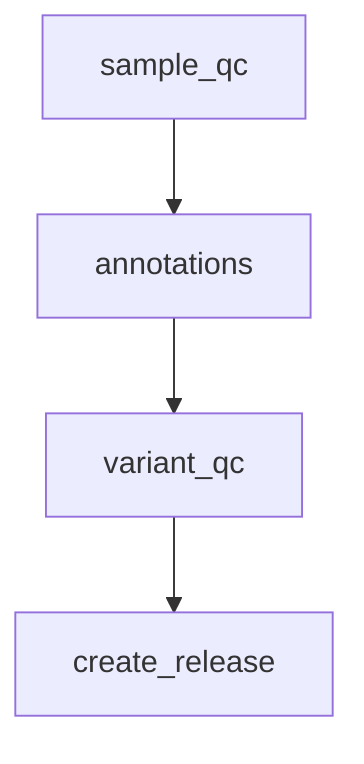
## sample_qc:
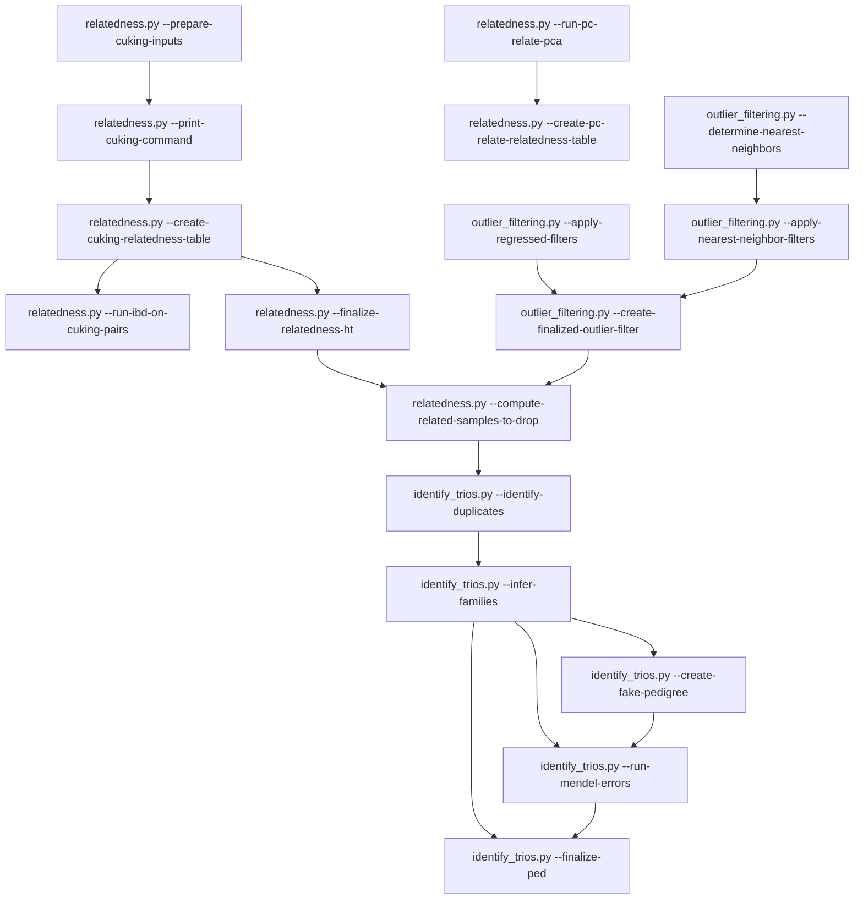
## annotations:
```mermaid
flowchart TD;
  compute-info["generate_variant_qc_annotations.py --compute-info"] --> split-info["generate_variant_qc_annotations.py --split-info"];
  split-info["generate_variant_qc_annotations.py --split-info"] --> create-variant-qc-annotation-ht["generate_variant_qc_annotations.py --create-variant-qc-annotation-ht"];
  generate-trio-stats["generate_variant_qc_annotations.py --generate-trio-stats"] --> create-variant-qc-annotation-ht["generate_variant_qc_annotations.py --create-variant-qc-annotation-ht"];
  generate-sib-stats["generate_variant_qc_annotations.py --generate-sib-stats"] --> create-variant-qc-annotation-ht["generate_variant_qc_annotations.py --create-variant-qc-annotation-ht"];
  compute-info["generate_variant_qc_annotations.py --compute-info"] --> export-info-vcf["generate_variant_qc_annotations.py --export-info-vcf"];
  compute-info["generate_variant_qc_annotations.py --compute-info"] --> export-split-info-vcf["generate_variant_qc_annotations.py --export-split-info-vcf"];
  run-vep["generate_variant_qc_annotations.py --run-vep"] --> validate-vep["generate_variant_qc_annotations.py --validate-vep"];
  finalize-ped["identify_trios.py --finalize-ped"] --> generate-trio-stats["generate_variant_qc_annotations.py --generate-trio-stats"];
  finalize-relatedness-ht["relatedness.py --finalize-relatedness-ht"] --> generate-sib-stats["generate_variant_qc_annotations.py --generate-sib-stats"];
  write-split-vds-and-downsampling-ht["generate_freq.py --write-split-vds-and-downsampling-ht"] --> run-freq-and-dense-annotations["generate_freq.py --run-freq-and-dense-annotations"];
  combine-freq-hts["generate_freq.py --combine-freq-hts"] --> correct-for-high-ab-hets["generate_freq.py --correct-for-high-ab-hets"];
  correct-for-high-ab-hets["generate_freq.py --correct-for-high-ab-hets"] --> finalize-freq-ht["generate_freq.py --finalize-freq-ht"];
  run-freq-and-dense-annotations["generate_freq.py --run-freq-and-dense-annotations"] --> combine-freq-hts["generate_freq.py --combine-freq-hts"];
  finalize-relatedness-ht["relatedness.py --finalize-relatedness-ht"] --> get-duplicated-to-exomes["generate_freq_genomes.py --get-duplicated-to-exomes"];
  update-annotations["generate_freq_genomes.py --update-annotations"] --> get-callstats-for-updated-samples["generate_freq_genomes.py --get-callstats-for-updated-samples"];
  get-callstats-for-updated-samples["generate_freq_genomes.py --get-callstats-for-updated-samples"] --> join-callstats-for-update["generate_freq_genomes.py --join-callstats-for-update"];
  update-annotations["generate_freq_genomes.py --update-annotations"] --> compute-allele-number-for-new-variants["generate_freq_genomes.py --compute-allele-number-for-new-variants"];
  join-callstats-for-update["generate_freq_genomes.py --join-callstats-for-update"] --> compute-allele-number-for-new-variants["generate_freq_genomes.py --compute-allele-number-for-new-variants"];
  update-annotations["generate_freq_genomes.py --update-annotations"] --> update-release-callstats["generate_freq_genomes.py --update-release-callstats"];
  join-callstats-for-update["generate_freq_genomes.py --join-callstats-for-update"] --> update-release-callstats["generate_freq_genomes.py --update-release-callstats"];
  compute-allele-number-for-new-variants["generate_freq_genomes.py --compute-allele-number-for-new-variants"] --> update-release-callstats["generate_freq_genomes.py --update-release-callstats"];
  compute-allele-number-for-pop-diff["generate_freq_genomes.py --compute-allele-number-for-pop-diff"] --> update-release-callstats["generate_freq_genomes.py --update-release-callstats"];
  update-annotations["generate_freq_genomes.py --update-annotations"] --> apply-patch-to-freq-ht["generate_freq_genomes.py --apply-patch-to-freq-ht"];
  update-release-callstats["generate_freq_genomes.py --update-release-callstats"] --> apply-patch-to-freq-ht["generate_freq_genomes.py --apply-patch-to-freq-ht"];
  update-annotations["generate_freq_genomes.py --update-annotations"] --> compute-allele-number-for-pop-diff["generate_freq_genomes.py --compute-allele-number-for-pop-diff"];
  join-callstats-for-update["generate_freq_genomes.py --join-callstats-for-update"] --> compute-allele-number-for-pop-diff["generate_freq_genomes.py --compute-allele-number-for-pop-diff"];
  compute-coverage-ht["compute_coverage.py --compute-coverage-ht"] --> export-release-files["compute_coverage.py --export-release-files"];
```
## variant_qc:
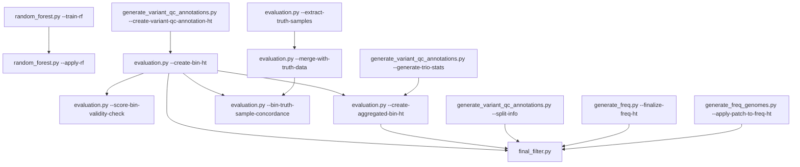
## create_release:
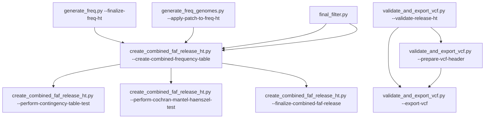
## sample_qc:
### [generate_qc_mt.py](https://github.com/broadinstitute/gnomad_qc/tree/main/gnomad_qc/v4/sample_qc/generate_qc_mt.py):     Generate combined gnomAD v3 and v4 QC MatrixTable for use in relatedness and ancestry inference.
```mermaid
flowchart TD;

```
### [hard_filters.py](https://github.com/broadinstitute/gnomad_qc/tree/main/gnomad_qc/v4/sample_qc/hard_filters.py): Script to determine samples that fail hard filtering thresholds.
```mermaid
flowchart TD;

```
### [platform_inference.py](https://github.com/broadinstitute/gnomad_qc/tree/main/gnomad_qc/v4/sample_qc/platform_inference.py): Script to assign platforms based on per interval fraction of bases over DP 0 PCA results using HDBSCAN.
```mermaid
flowchart TD;

```
### [interval_qc.py](https://github.com/broadinstitute/gnomad_qc/tree/main/gnomad_qc/v4/sample_qc/interval_qc.py): Script to define high quality intervals based on per interval aggregate statistics over samples.
```mermaid
flowchart TD;

```
### [sex_inference.py](https://github.com/broadinstitute/gnomad_qc/tree/main/gnomad_qc/v4/sample_qc/sex_inference.py): Script to impute chromosomal sex karyotype annotation.
```mermaid
flowchart TD;

```
### [hard_filters.py](https://github.com/broadinstitute/gnomad_qc/tree/main/gnomad_qc/v4/sample_qc/hard_filters.py): Script to determine samples that fail hard filtering thresholds.
```mermaid
flowchart TD;

```
### [relatedness.py](https://github.com/broadinstitute/gnomad_qc/tree/main/gnomad_qc/v4/sample_qc/relatedness.py): Script to compute relatedness estimates among pairs of samples in the callset.
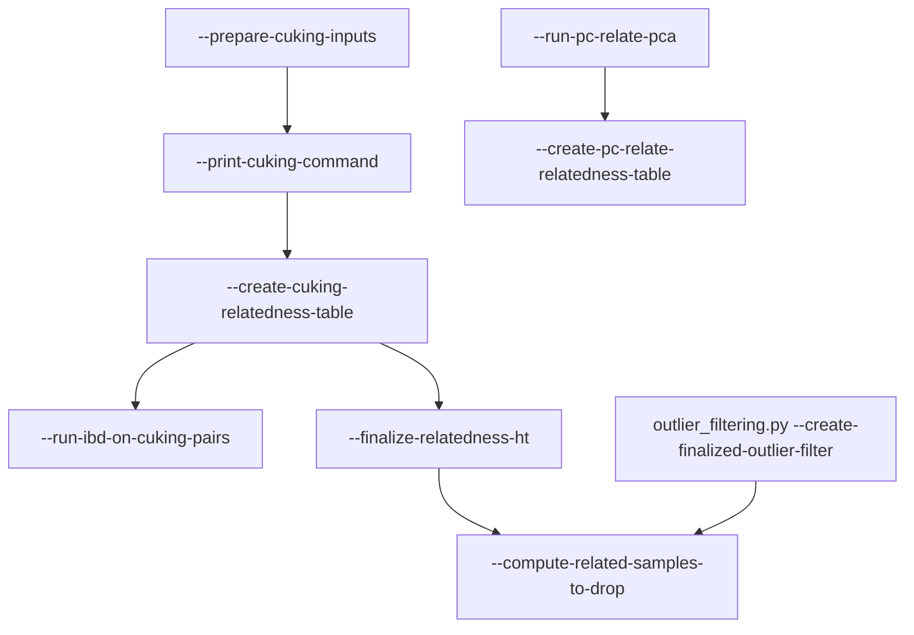
### [assign_ancestry.py](https://github.com/broadinstitute/gnomad_qc/tree/main/gnomad_qc/v4/sample_qc/assign_ancestry.py): Script to assign global ancestry labels to samples using known v3 population labels or TGP and HGDP labels.
```mermaid
flowchart TD;

```
### [outlier_filtering.py](https://github.com/broadinstitute/gnomad_qc/tree/main/gnomad_qc/v4/sample_qc/outlier_filtering.py): Script to determine sample QC metric outliers that should be filtered.
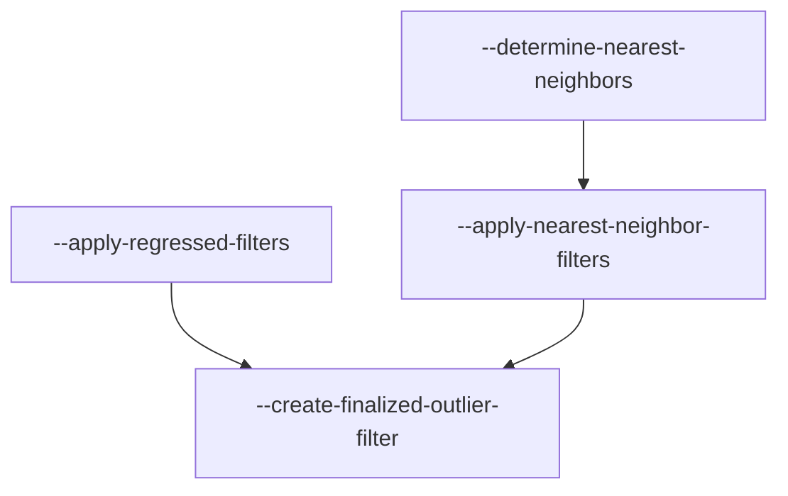
### [identify_trios.py](https://github.com/broadinstitute/gnomad_qc/tree/main/gnomad_qc/v4/sample_qc/identify_trios.py): Script to identify trios from relatedness data and filter based on Mendel errors and de novos.
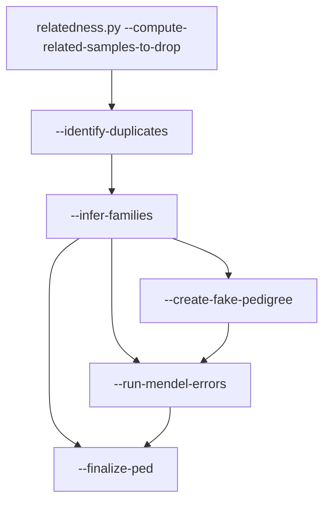
### [create_sample_qc_metadata_ht.py](https://github.com/broadinstitute/gnomad_qc/tree/main/gnomad_qc/v4/sample_qc/create_sample_qc_metadata_ht.py): Script to merge the output of all sample QC modules into a single Table.
```mermaid
flowchart TD;

```
### [create_sample_qc_metadata_ht_genomes.py](https://github.com/broadinstitute/gnomad_qc/tree/main/gnomad_qc/v4/sample_qc/create_sample_qc_metadata_ht_genomes.py): Script to create sample QC metadata HT for genomes.
```mermaid
flowchart TD;

```
## annotations:
### [generate_variant_qc_annotations.py](https://github.com/broadinstitute/gnomad_qc/tree/main/gnomad_qc/v4/annotations/generate_variant_qc_annotations.py): Script to generate annotations for variant QC on gnomAD v4.
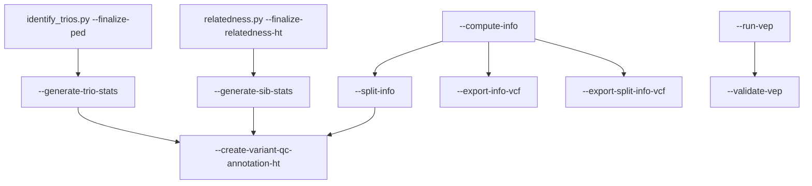
### [generate_freq.py](https://github.com/broadinstitute/gnomad_qc/tree/main/gnomad_qc/v4/annotations/generate_freq.py): Script to generate the frequency data annotations across v4 exomes.
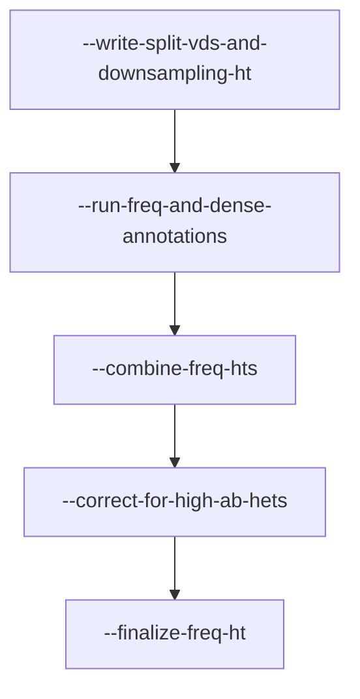
### [generate_freq_genomes.py](https://github.com/broadinstitute/gnomad_qc/tree/main/gnomad_qc/v4/annotations/generate_freq_genomes.py): Script to create frequencies HT for v4.0 genomes.
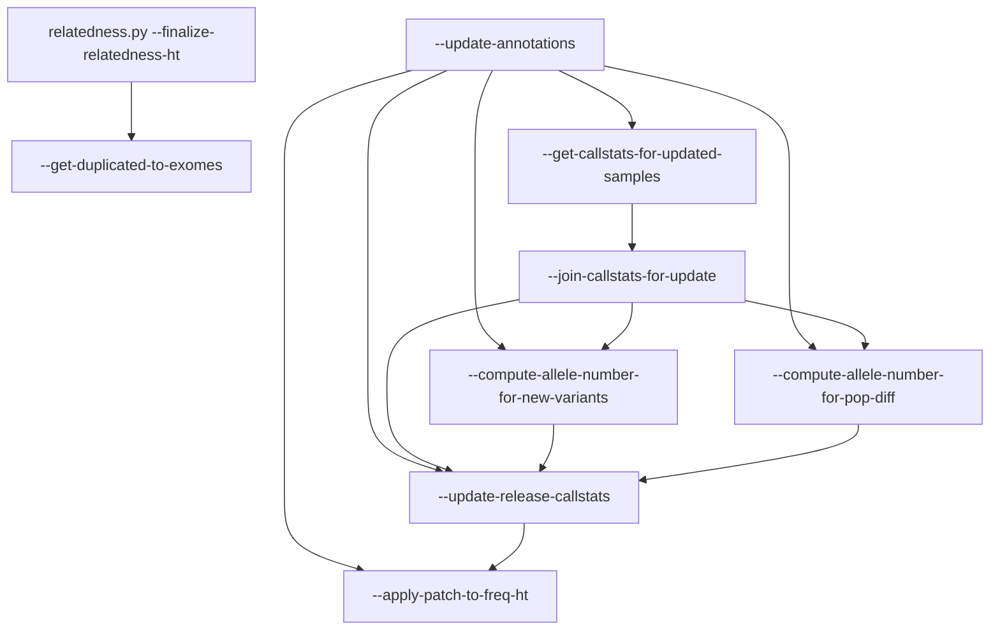
### [vep_context_ht.py](https://github.com/broadinstitute/gnomad_qc/tree/main/gnomad_qc/v4/annotations/vep_context_ht.py): Script to add VEP annotations to the GRCh38 context Table.
```mermaid
flowchart TD;

```
### [vrs_annotation_batch.py](https://github.com/broadinstitute/gnomad_qc/tree/main/gnomad_qc/v4/annotations/vrs_annotation_batch.py): This is a batch script which adds VRS IDs to a Hail Table by creating sharded VCFs, running a vrs-annotation script on each shard, and merging the results into the original Hail Table.
```mermaid
flowchart TD;

```
### [insilico_predictors.py](https://github.com/broadinstitute/gnomad_qc/tree/main/gnomad_qc/v4/annotations/insilico_predictors.py): Script to generate Hail Tables with in silico predictors.
```mermaid
flowchart TD;

```
### [compute_coverage.py](https://github.com/broadinstitute/gnomad_qc/tree/main/gnomad_qc/v4/annotations/compute_coverage.py): Script to compute coverage statistics on gnomAD v4 exomes.
```mermaid
flowchart TD;
  compute-coverage-ht["--compute-coverage-ht"] --> export-release-files["--export-release-files"];
```
## variant_qc:
### [random_forest.py](https://github.com/broadinstitute/gnomad_qc/tree/main/gnomad_qc/v4/variant_qc/random_forest.py): Script for running random forest model on gnomAD v4 variant QC data.
```mermaid
flowchart TD;
  train-rf["--train-rf"] --> apply-rf["--apply-rf"];
```
### [vqsr.py](https://github.com/broadinstitute/gnomad_qc/tree/main/gnomad_qc/v4/variant_qc/vqsr.py): Script to run VQSR on an AS-annotated Sites VCF.
```mermaid
flowchart TD;

```
### [import_variant_qc_vcf.py](https://github.com/broadinstitute/gnomad_qc/tree/main/gnomad_qc/v4/variant_qc/import_variant_qc_vcf.py):     Import variant QC result site VCF into a HT.
```mermaid
flowchart TD;

```
### [evaluation.py](https://github.com/broadinstitute/gnomad_qc/tree/main/gnomad_qc/v4/variant_qc/evaluation.py): Script to create Tables with aggregate variant statistics by variant QC score bins needed for evaluation plots.
```mermaid
flowchart TD;
  create-variant-qc-annotation-ht["generate_variant_qc_annotations.py --create-variant-qc-annotation-ht"] --> create-bin-ht["--create-bin-ht"];
  create-bin-ht["--create-bin-ht"] --> score-bin-validity-check["--score-bin-validity-check"];
  create-bin-ht["--create-bin-ht"] --> create-aggregated-bin-ht["--create-aggregated-bin-ht"];
  generate-trio-stats["generate_variant_qc_annotations.py --generate-trio-stats"] --> create-aggregated-bin-ht["--create-aggregated-bin-ht"];
  create-bin-ht["--create-bin-ht"] --> bin-truth-sample-concordance["--bin-truth-sample-concordance"];
  merge-with-truth-data["--merge-with-truth-data"] --> bin-truth-sample-concordance["--bin-truth-sample-concordance"];
  extract-truth-samples["--extract-truth-samples"] --> merge-with-truth-data["--merge-with-truth-data"];
```
### [final_filter.py](https://github.com/broadinstitute/gnomad_qc/tree/main/gnomad_qc/v4/variant_qc/final_filter.py): Script to create final filter Table for release.
```mermaid
flowchart TD;
  create-bin-ht["evaluation.py --create-bin-ht"] --> final_filter.py["final_filter.py"];
  create-aggregated-bin-ht["evaluation.py --create-aggregated-bin-ht"] --> final_filter.py["final_filter.py"];
  split-info["generate_variant_qc_annotations.py --split-info"] --> final_filter.py["final_filter.py"];
  finalize-freq-ht["generate_freq.py --finalize-freq-ht"] --> final_filter.py["final_filter.py"];
```
### [final_filter_genomes.py](https://github.com/broadinstitute/gnomad_qc/tree/main/gnomad_qc/v4/variant_qc/final_filter_genomes.py): Script to create final filter Table for v4 genomes release.
```mermaid
flowchart TD;
  apply-patch-to-freq-ht["generate_freq_genomes.py --apply-patch-to-freq-ht"] --> final_filter.py["final_filter.py"];
```
## create_release:
### [create_combined_faf_release_ht.py](https://github.com/broadinstitute/gnomad_qc/tree/main/gnomad_qc/v4/create_release/create_combined_faf_release_ht.py): Create a joint gnomAD v4 exome and genome frequency and FAF.
```mermaid
flowchart TD;
  finalize-freq-ht["generate_freq.py --finalize-freq-ht"] --> create-combined-frequency-table["--create-combined-frequency-table"];
  apply-patch-to-freq-ht["generate_freq_genomes.py --apply-patch-to-freq-ht"] --> create-combined-frequency-table["--create-combined-frequency-table"];
  final_filter.py["final_filter.py"] --> create-combined-frequency-table["--create-combined-frequency-table"];
  final_filter.py["final_filter.py"] --> create-combined-frequency-table["--create-combined-frequency-table"];
  create-combined-frequency-table["--create-combined-frequency-table"] --> perform-contingency-table-test["--perform-contingency-table-test"];
  create-combined-frequency-table["--create-combined-frequency-table"] --> perform-cochran-mantel-haenszel-test["--perform-cochran-mantel-haenszel-test"];
  create-combined-frequency-table["--create-combined-frequency-table"] --> finalize-combined-faf-release["--finalize-combined-faf-release"];
```
### [create_release_sites_ht.py](https://github.com/broadinstitute/gnomad_qc/tree/main/gnomad_qc/v4/create_release/create_release_sites_ht.py): Script to create release sites HT for v4.0 exomes and genomes.
```mermaid
flowchart TD;

```
### [validate_and_export_vcf.py](https://github.com/broadinstitute/gnomad_qc/tree/main/gnomad_qc/v4/create_release/validate_and_export_vcf.py):
```mermaid
flowchart TD;
  validate-release-ht["--validate-release-ht"] --> prepare-vcf-header["--prepare-vcf-header"];
  validate-release-ht["--validate-release-ht"] --> export-vcf["--export-vcf"];
  prepare-vcf-header["--prepare-vcf-header"] --> export-vcf["--export-vcf"];
```
### [make_var_annot_hists.py](https://github.com/broadinstitute/gnomad_qc/tree/main/gnomad_qc/v4/create_release/make_var_annot_hists.py):
```mermaid
flowchart TD;

```
